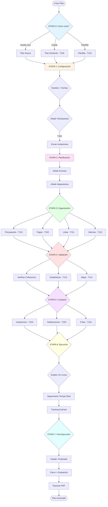

# 🔄 Flujo de Creación de Plan Completo

> Documento de definición del proceso completo para crear un plan

**Estado:** Definición  
**Versión:** 1.1  
**Fecha:** Enero 2025  
**Última actualización:** Análisis completo de impacto en participantes y casos de cambio integrados

---

## 📑 ÍNDICE

1. [🎯 Objetivo y Método](#-objetivo)
2. [📊 VISIÓN GENERAL](#-visión-general)
3. [📋 ETAPAS DEL FLUJO (0-7)](#-etapas-del-flujo)
4. [🎭 IMPACTO DE CAMBIOS EN PARTICIPANTES](#-impacto-de-cambios-en-participantes)
5. [🔐 MATRIZ DE PERMISOS Y ACCIONES](#-matriz-de-permisos-por-acción)
6. [🎯 PRIORIZACIÓN DE TAREAS](#-priorización-sugerida)
7. [🔔 SISTEMA DE NOTIFICACIONES](#-notificaciones-para-cambios)
8. [🤔 DECISIONES PENDIENTES](#-decisiones-necesarias)
9. [✅ ESTADO ACTUAL](#-tareas-creadas-hoy)

---

## 🎯 Objetivo

Definir el flujo completo e ideal para crear un plan desde cero hasta que esté listo para la ejecución, identificando qué existe actualmente, qué falta y qué necesita mejorarse.

**Este documento sirve como:**
- 📚 Guía de desarrollo
- ✅ Checklist de funcionalidades
- 🔍 Identificador de gaps
- 📊 Matriz de decisiones
- 🎯 Priorizador de tareas

---

## 📊 VISIÓN GENERAL

**Progreso actual:** ~40% completado
- ✅ Etapas básicas (crear plan, participantes, eventos)
- ⚠️ Etapas avanzadas (presupuesto, notificaciones, validación)
- ❌ Etapas futuras (mapa, estadísticas, fotos compartidas)

**Próximos hitos:**
1. T121 - Formularios enriquecidos (CRÍTICO)
2. T109 - Estados del plan
3. T104/T105 - Invitaciones y notificaciones

### 🎨 DIAGRAMA DE FLUJO PRINCIPAL

**Nota:** Este diagrama muestra el flujo IDEAL. Algunas etapas aún no están implementadas (ver detalles en cada ETAPA).

### 📊 RESUMEN EJECUTIVO

**Estado por Etapa:**

| Etapa | Estado | Completo | Pendiente | Crítico |
|-------|--------|----------|-----------|---------|
| **ETAPA 0** - Pre-creación | ⚠️ Parcial | Copiar plan (T118) | Plantillas | ⚠️ |
| **ETAPA 1** - Configuración | ✅ Básico | Info básica, Participantes | Estados (T109), Etiquetas | - |
| **ETAPA 2** - Planificación | ⚠️ Básico | Eventos/Alojamientos básicos | **Formularios (T121)** | 🔴 |
| **ETAPA 3** - Organización | ❌ No | - | Presupuesto (T101), Pagos (T102) | 🔴 |
| **ETAPA 4** - Validación | ❌ No | - | Validación, Mapa (T114), Stats (T113) | ⚠️ |
| **ETAPA 5** - Colaboración | ❌ No | - | Invitaciones (T104), Notificaciones (T105) | 🔴 |
| **ETAPA 6** - Ejecución | ⚠️ Parcial | Editar eventos | Estado "En curso", Tracking | ⚠️ |
| **ETAPA 7** - Post-ejecución | ❌ No | - | Cierre, Evaluación, Fotos (T115) | - |

**Prioridad de trabajo:**
1. 🔴 **CRÍTICO:** T121 (Formularios), T101 (Presupuesto), T109 (Estados)
2. 🟡 **ALTA:** T104 (Invitaciones), T105 (Notificaciones), T102 (Pagos)
3. 🟢 **MEDIA:** T111 (Listas), T110 (Alarmas), T114 (Mapa)
4. ⚪ **BAJA:** T113 (Stats), T115 (Fotos), T122 (Plantillas)

---

## 📋 ETAPAS DEL FLUJO

### ETAPA 0: Pre-creación - Decisión y Concepción
**Estado actual:** ⚠️ Parcialmente implementado

#### Opciones de Creación:
- [x] Crear plan desde cero
- [ ] **Copiar plan existente** (Prioridad ALTA - T118)
- [ ] Plantillas predefinidas (Para versiones posteriores)
- [ ] Asistente inteligente de creación (Para versiones posteriores)

**CASOS DE GESTIÓN DE PLAN (parte del flujo normal):**
- **Copiar plan completo:** ✅ Permitido → Copiar estructura, eventos, alojamientos, ajustar fechas a nuevo rango, opcional copiar participantes, guardar como nuevo plan, notificar participantes nuevos (T104)
- **Eliminar plan DURANTE planificación:** ✅ Con confirmación → Eliminar todo, notificar participantes, archivar histórico, cancelar eventos futuros
- **Eliminar plan DURANTE ejecución:** ❌ No permitido → Solo cancelar plan (marcar como cancelado, mantener histórico, notificar, no eliminar)
- **Eliminar plan DESPUÉS de ejecución:** ❌ No eliminar → Archivar plan, mantener histórico completo, bloquear cambios
- **Duplicar plan:** ✅ Permitido → Crear nuevo plan con mismo contenido, ajustar fechas, opcional incluir participantes

**Nota:** Copiar un plan existente es funcionalidad importante que ya existe como T118.

---

### ETAPA 1: Configuración Inicial del Plan
**Objetivo:** Definir la estructura básica del plan

#### 1.1 - Información Básica ✅ Implementado
- [x] Nombre del plan
- [x] Fechas inicio/fin
- [x] Código único (unpId)
- [x] Imagen del plan
- [x] Descripción breve

**Lo que falta:**
- [ ] Presupuesto estimado del plan
- [ ] Etiquetas/Categorías del plan (Vacaciones, Negocios, Boda, etc.)
- [ ] Estado del plan (Planificando, Confirmado, En curso, Finalizado) - T109
- [ ] Destinos principales del plan (para mapa T114)
- [ ] Guardar plan como plantilla (Nueva tarea - plataforma plantillas futura)

#### 1.2 - Participantes ✅ Implementado básicamente
- [x] Añadir participantes en creación
- [x] Rol organizador/participante/observador
- [x] Timezone inicial de cada participante

**PROPUESTAS DE INVITACIÓN INTELIGENTE:**
1. **Por email** (sin app): Invitar por email con link de acceso
2. **Por usuario app**: Invitar usuarios registrados con notificación push
3. **Importar contactos**: Sugerir contactos frecuentes
4. **Agrupación inteligente**: 
   - Crear "grupos" (Familia, Amigos, Compañeros trabajo)
   - Reutilizar grupos en nuevos planes
   - Invitar todo un grupo de una vez

**PROPUESTAS DE ROLES:**
- **Anfitrión** (creador): Permisos totales, propietario del plan
- **Coorganizador**: Puede modificar y gestionar casi todo
- **Invitado**: Ve todo, puede ajustar su parte personal
- **Observador**: Solo lectura

**CASOS DE CAMBIO DE PARTICIPANTES (parte del flujo normal):**
- **Añadir participante DURANTE planificación:** ✅ Permitido → Enviar invitación, crear track, asignar a eventos futuros opcionales
- **Añadir participante DURANTE ejecución:** ⚠️ Permitido → Enviar invitación, crear track, NO asignar a eventos ya ejecutados
- **Eliminar participante DURANTE planificación:** ⚠️ Con confirmación → Eliminar tracks y eventos futuros solo suyos, mantener histórico, notificar
- **Eliminar participante DURANTE ejecución:** ⚠️ Urgente → Eliminar eventos futuros, mantener histórico y eventos ejecutados, recalcular reembolsos si aplica (T102)
- **Cambiar rol de participante:** ✅ Permitido → Actualizar permisos, ajustar tracks si cambio de observador a participante o viceversa

**Lo que falta:**
- [ ] Sistema de invitaciones por email/usuario (T104)
- [ ] Confirmación de asistencia por participantes (Aceptar/Rechazar)
- [ ] Estado de invitación por participante (Pendiente, Aceptada, Rechazada)
- [ ] Límite de participantes (configurable)
- [x] Auto-actualización de timezone al viajar (✅ Ya implementado)
- [ ] Roles personalizados (anfitrión, coorganizador, invitado, observador)
- [ ] Grupos de participantes reutilizables
- [ ] Permisos granulares por participante (T65-T67)
- [ ] Sistema de notificaciones automáticas para cambios de participantes (T105)
- [ ] Historial de cambios de participantes (quién, cuándo, qué cambió)

#### 1.3 - Configuración de Duración ⚠️ Implementado básico
- [x] Fechas inicio/fin
- [x] Cálculo automático columnas

**Lo que falta:**
- [ ] Auto-expansión si eventos salen fuera del rango (T107)
- [ ] Vista previa de días del plan
- [ ] Configurar dias restantes hasta inicio (T112)

---

### ETAPA 2: Planificación de Actividades
**Objetivo:** Añadir eventos, desplazamientos y alojamientos al plan

#### 2.1 - Añadir Eventos ✅ Implementado básico
- [x] Crear eventos básicos
- [x] Asignar a participantes
- [x] Título, fecha, hora, duración
- [x] Timezone de inicio
- [x] Participantes del evento

**LO QUE FALTA (T121 - Revisión Formularios):**
- [ ] Formularios enriquecidos por tipo de evento (según doc `EVENT_FORM_FIELDS.md`)
- [ ] Localización/Mapa integrado
- [ ] Información detallada según tipo (ej: vuelo con asiento, gate, etc.)
- [ ] Documentos adjuntos (ej: ticket, reserva PDF)
- [ ] Costs/Precios por evento (T101 - Presupuesto)
- [ ] Campo "Estado" (Confirmado, Pendiente, Cancelado)
- [ ] Referencias a alojamientos

**CASOS DE CAMBIO DE EVENTOS (parte del flujo normal):**
- **Crear evento DURANTE ejecución:** ✅ Permitido → Asignar participantes, configurar alarma si <2h, notificar
- **Modificar evento DURANTE planificación:** ✅ Permitido → Detectar solapamientos, notificar si cambio significativo
- **Modificar evento DURANTE ejecución (<24h):** ⚠️ Urgente → Notificar a todos, actualizar alarmas, posible cancelación
- **Modificar evento DURANTE ejecución (>24h):** ✅ Permitido → Notificar, actualizar alarmas normalmente
- **Eliminar evento DURANTE planificación:** ✅ Permitido → Eliminar, recalculcar presupuesto (T101), notificar
- **Eliminar evento DURANTE ejecución (<24h):** ⚠️ Urgente → Eliminar, notificar urgente, calcular reembolsos si aplica (T102)
- **Eliminar evento DURANTE ejecución (pasado):** ❌ No permitido → Solo añadir notas post-evento
- **Historial de cambios:** Registro de quién, cuándo y qué cambió en cada evento

**Mejoras necesarias:**
- [ ] Validación de formularios (T51)
- [ ] Eventos recurrentes (T119)
- [ ] Registro participantes por evento (T117)
- [ ] Confirmación asistencia eventos (T120)
- [ ] Plantillas de eventos frecuentes
- [ ] Importar eventos desde calendarios externos
- [ ] Sistema de notificaciones automáticas para cambios de eventos (T105)
- [ ] Historial/auditoría de cambios de eventos

#### 2.2 - Añadir Desplazamientos ⚠️ Implementado parcial
- [x] Crear eventos de tipo desplazamiento
- [x] Taxi, Avión, Tren básico
- [x] Timezone salida/llegada

**LO QUE FALTA:**
- [ ] Formularios específicos para cada tipo (según `EVENT_FORM_FIELDS.md`):
  - Avión: Asiento, gate, número vuelo, terminal, menú especial, asistencia
  - Tren: Vagón, asiento, clase, menú
  - Autobús: Número asiento, planta, locker
  - Taxi: Referencia, tipo vehículo, sillas niños
  - Ferry: Cabina, transporte embarcado
  - Alquiler coche: Conductores, GPS, sillas
- [ ] Cálculo automático de rutas
- [ ] Estimar duración por tipo
- [ ] Comparar precios de opciones
- [ ] Notificaciones de facturación cierre

#### 2.3 - Añadir Alojamientos ✅ Implementado
- [x] Crear alojamientos
- [x] Check-in/check-out
- [x] Asignar participantes

**LO QUE FALTA:**
- [ ] Formularios específicos por tipo (según `EVENT_FORM_FIELDS.md`):
  - Hotel: Número habitación, categoría, servicios, tarifa
  - Apartamento: Anfitrión, código acceso, amenities
  - Hostal: Tipo habitación, género, litera
  - Casa rural: Servicios, mascotas, chimenea
  - Camping: Parcela, tipo, servicios
- [ ] Localización en mapa
- [ ] Información check-in/check-out detallada
- [ ] Recordatorios de check-in/check-out
- [ ] Tracking de pagos de depósito

#### 2.4 - Eventos Recurrentes ❌ No implementado (T119)
**Lo que falta:**
- [ ] Crear eventos que se repiten (ej: desayuno cada día, clases diarias)
- [ ] Configurar frecuencia (diario, semanal, mensual)
- [ ] Definir excepciones (saltar un día)
- [ ] Edición en masa

---

### ETAPA 3: Organización y Detalles
**Objetivo:** Completar la información del plan

#### 3.1 - Presupuesto ❌ No implementado (T101)
**Lo que falta:**
- [ ] Añadir coste a eventos y alojamientos
- [ ] Campo "Coste estimado" y "Coste real"
- [ ] Suma automática del presupuesto total
- [ ] Desglose por tipo de evento
- [ ] Desglose por participante
- [ ] Gráfico de distribución de costes
- [ ] Tracking de gastos reales vs estimado

#### 3.2 - Gestión de Pagos ❌ No implementado (T102)
**Lo que falta:**
- [ ] Registro de pagos por participante
- [ ] Sistema de bote común
- [ ] Tracking de "quién pagó qué"
- [ ] Cálculo de "quién debe pagar/cobrar"
- [ ] Integración con divisores de factura
- [ ] Estado de pagos (Pendiente, Pagado, Reembolsado)

#### 3.3 - Listas del Plan ❌ No implementado (T111)
**Lo que falta:**
- [ ] Crear listas (ej: "Qué traer a la comida", "Checklist equipaje")
- [ ] Items de lista con checkboxes
- [ ] Asignar items a participantes
- [ ] Estado de cada item (por hacer, en curso, hecho)

#### 3.4 - Alarmas y Recordatorios ❌ No implementado (T110)
**Lo que falta:**
- [ ] Añadir alarmas/recordatorios a eventos
- [ ] Configurar tiempo antes (ej: "1 hora antes")
- [ ] Notificaciones push
- [ ] Snooze/Dismiss
- [ ] Recordatorios globales del plan

---

### ETAPA 4: Validación y Verificación
**Objetivo:** Asegurar que el plan es coherente y completo

#### 4.1 - Validación Automática ❌ No implementado
**Lo que falta:**
- [ ] Detectar solapamientos de eventos (ya existe parcialmente)
- [ ] Alertar si un evento sale fuera del rango del plan
- [ ] Detectar "días vacíos" sin actividades
- [ ] Detectar participantes sin eventos asignados
- [ ] Validar timezones consistentes
- [ ] Verificar que check-in se alinea con llegadas
- [ ] Sugerir optimización de rutas

#### 4.2 - Estadísticas y Resumen ❌ No implementado (T113)
**Lo que falta:**
- [ ] Resumen de actividades (Número de eventos, desplazamientos, alojamientos)
- [ ] Duración total del plan
- [ ] Participantes activos vs totales
- [ ] Gráfico de distribución temporal
- [ ] Días con más/menos actividad
- [ ] Estadísticas de presupuesto (gasto promedio por día, por participante)

#### 4.3 - Mapa del Plan ❌ No implementado (T114)
**Lo que falta:**
- [ ] Visualizar todos los eventos en mapa
- [ ] Optimizar ruta de eventos (opcional, avanzado)
- [ ] Ver ruta según orden de eventos
- [ ] Distancia total estimada
- [ ] Tiempo estimado de traslados
- [ ] Alertas de "lugares lejanos"

---

### ETAPA 5: Compartir y Colaborar
**Objetivo:** Permitir que otros participen y vean el plan

#### 5.1 - Invitaciones ❌ No implementado (T104)
**Lo que falta:**
- [ ] Invitar participantes por email
- [ ] Invitar por usuario/nickname
- [ ] Enviar invitación con link
- [ ] Notificaciones de invitación
- [ ] Aceptar/rechazar invitación
- [ ] Estados de invitación (Pendiente, Aceptada, Rechazada)
- [ ] Reminder de invitaciones pendientes

#### 5.2 - Notificaciones ❌ No implementado (T105)
**Lo que falta:**
- [ ] Sistema de avisos/notificaciones unidireccionales
- [ ] Publicar aviso al plan
- [ ] Todos los participantes reciben notificación
- [ ] Historial de avisos
- [ ] Notificación cuando alguien modifica el plan

#### 5.3 - Fotos y Recuerdos ❌ No implementado (T115)
**Lo que falta:**
- [ ] Añadir fotos al plan (no a eventos específicos)
- [ ] Galería del plan
- [ ] Compartir fotos con participantes
- [ ] Slideshow de fotos

---

### ETAPA 6: Ejecución del Plan
**Objetivo:** Durante la ejecución del plan

#### 6.1 - Seguimiento en Tiempo Real ❌ No implementado
**Lo que falta:**
- [ ] Estado del plan cambia a "En curso"
- [ ] Marcador de "día actual" en el calendario
- [ ] Eventos "pasados" vs "próximos"
- [ ] Contador "Próximos eventos hoy"

#### 6.2 - Actualización Dinámica ⚠️ Parcial
**Lo que falta:**
- [ ] Editar eventos durante ejecución
- [ ] Actualizar timezone cuando un participante viaja
- [ ] Cambiar estado de evento (Confirmado → En curso → Completado)
- [ ] Añadir notas post-evento (ej: "Llegamos tarde")

#### 6.3 - Listas de Tareas en Vivo ✅ Implementado parcialmente
**Lo que falta:**
- [ ] Marcar items de listas como completados
- [ ] Notificaciones de "next up"
- [ ] Tracking de progreso

---

### ETAPA 7: Post-Ejecución
**Objetivo:** Después de que termine el plan

#### 7.1 - Cierre del Plan ❌ No implementado
**Lo que falta:**
- [ ] Cambiar estado a "Finalizado"
- [ ] No permitir ediciones
- [ ] Resumen final del plan
- [ ] Exportar plan como PDF
- [ ] Guardar como template

#### 7.2 - Evaluación ❌ No implementado
**Lo que falta:**
- [ ] Valoración del plan por participantes
- [ ] Comentarios generales
- [ ] Estadísticas finales (T113)
- [ ] Comparar presupuesto real vs estimado (T101)
- [ ] Cierre de pagos pendientes (T102)

#### 7.3 - Recuerdos ✅ Implementado parcialmente (fotos)
**Lo que falta:**
- [ ] Añadir fotos de eventos específicos
- [ ] Comentarios en fotos
- [ ] Slideshow automático
- [ ] Descargar todas las fotos

---

## 📋 TAREAS RELACIONADAS CON ESTE FLUJO

### Ya Implementadas ✅
- T40-T45: Timezones básicos
- T68-T70, T72: Sistema de Tracks
- T74-T75: Eventos Parte Común + Personal
- T76: Campos dinámicos (parcial)

### Pendientes de Este Flujo ⏳
- **T51**: Validación de Formularios (CRÍTICO para Etapa 2)
- **T100**: Visualización de Timezones en calendario (Etapa 2)
- **T101**: Sistema de Presupuesto (Etapa 3.1)
- **T102**: Sistema de Pagos y Bote Común (Etapa 3.2)
- **T104**: Sistema de Invitaciones (Etapa 5.1)
- **T105**: Sistema de Notificaciones (Etapa 5.2)
- **T107**: Actualización dinámica de duración del plan (Etapa 2, 6)
- **T108**: Indicador de participación (Etapa 1.2)
- **T109**: Estados del Plan (Etapas 1.1, 6.1, 7.1)
- **T110**: Sistema de Alarmas (Etapa 3.4)
- **T111**: Sistema de Listas (Etapa 3.3)
- **T112**: Indicador de días restantes (Etapa 1.3)
- **T113**: Estadísticas del Plan (Etapas 4.2, 7.2)
- **T114**: Mapa del Plan (Etapa 4.3)
- **T115**: Sistema de Fotos (Etapa 5.3)
- **T116**: Pantalla Resumen/Dashboard móvil (Todas las etapas)
- **T117**: Registro participantes por evento (Etapa 2.1)
- **T119**: Eventos Recurrentes (Etapa 2.4)
- **T120**: Confirmación asistencia eventos (Etapa 2.1)
- **T121**: Enriquecimiento Formularios (CRÍTICO para Etapas 2.1-2.3)

### Tareas de Mejora Continua 🔧
- Copiar y pegar planes completos (T118)
- Validación automática de coherencia (T96-T98)
- Mejoras visuales (T91-T92)

---

## 🎯 PRIORIZACIÓN SUGERIDA

### FASE 1: Crear Plans Básicos Completos (ALTA)
**Tareas necesarias:**
1. **T121** - Enriquecer formularios de eventos/alojamientos (CRÍTICO)
2. **T109** - Estados del plan
3. **T107** - Auto-expansión de duración del plan

### FASE 2: Gestión Financiera (MEDIA)
**Tareas necesarias:**
1. **T101** - Sistema de presupuesto
2. **T102** - Sistema de pagos y bote común

### FASE 3: Colaboración (MEDIA)
**Tareas necesarias:**
1. **T104** - Invitaciones
2. **T105** - Notificaciones
3. **T108** - Indicador de participación

### FASE 4: Mejoras Experiencia (BAJA)
**Tareas necesarias:**
1. **T111** - Listas del plan
2. **T110** - Alarmas
3. **T115** - Fotos del plan

### FASE 5: Análisis y Optimización (BAJA)
**Tareas necesarias:**
1. **T113** - Estadísticas
2. **T114** - Mapa del plan

---

## 🤔 DECISIONES NECESARIAS

### Técnicas
1. ¿Cómo estructuramos campos flexibles en formularios? ¿Map<String, dynamic> o modelo específico?
2. ¿Integración con Google Maps/Places? ¿Coste vs Beneficio?
3. ¿Sistema de plantillas predefinidas o solo creación manual?
4. ¿Cómo validamos cambios durante ejecución vs. "modo planificación"?

### UX
1. ¿Flujo único de creación o paso a paso (wizard)?
2. ¿Modo "borrador" vs "confirmado" con bloqueos?
3. ¿Cómo mostramos "lo que falta" al usuario?
4. ¿Dashboard resumen visible durante creación?

### Participantes (ETAPA 1.2) - CRÍTICO
**Sistema de identificación de usuarios (DECISIÓN NECESARIA):**

1. **¿Cómo identificamos usuarios?**
   - Opción A: Solo por email (actual)
   - Opción B: Email + Username (@juancarlos)
   - **Recomendado: Opción B** - Email como ID único + Username para búsqueda

2. **¿Cómo buscar/invitar usuarios?**
   - Por email (si no tienen username)
   - Por username (@juancarlos)
   - Por nombre (displayName)
   - Por contactos frecuentes (historial)

3. **¿Sistema de invitaciones requiere backend? ¿Link de acceso con token?**
   - Opción A: Invitar solo usuarios registrados (simple)
   - Opción B: Invitar por email con link que crea cuenta automáticamente
   - **Recomendado: Opción B** para facilitar adopción

4. **¿Grupos de participantes: ¿Cómo almacenarlos? ¿Base de datos separada o en plan?**
   - Base de datos separada: `contact_groups` (recomendado)
   - Vinculados al usuario propietario
   - Persistentes entre planes

5. **¿Auto-sugerir grupos según historial de planes anteriores?**
   - Sí, sugerir contactos frecuentes
   - Mostrar "¿Invitar de nuevo a estos participantes?"

6. **¿Límite de participantes por tipo de plan? ¿Quién configura el límite?**
   - Límite default: 50 participantes
   - Configurable por tipo de plan
   - Anfitrión puede cambiar límite

7. **¿Qué hacer cuando un participante no confirma? ¿Recordatorios automáticos?**
   - 1 email al crear
   - Recordatorio 2 días antes
   - Email final 12h antes
   - Botón "Remind" en UI

8. **¿Permitir agregar participantes DURANTE la ejecución del plan?**
   - Sí, siempre se puede añadir
   - Con limitación: "Plan iniciado, se añadirá a eventos futuros"

**DECISIÓN TOMADA ✅: `username` añadido al UserModel**
- Campo `username` (opcional) añadido
- Getter `displayIdentifier` para mostrar "@username" o nombre/email
- Compatibilidad hacia atrás mantenida

---

---

## 🔐 MATRIZ DE PERMISOS POR ACCIÓN

| Acción | Planificación | Confirmado | En Ejecución | Finalizado |
|--------|--------------|------------|--------------|------------|
| **Crear evento** | ✅ Todos | ⚠️ Solo organizador | ⚠️ Solo organizador | ❌ No |
| **Editar evento** | ✅ Participantes | ⚠️ Solo organizador | ⚠️ Solo organizador/urgente | ❌ No |
| **Eliminar evento** | ✅ Organizador | ⚠️ Solo organizador | ❌ No | ❌ No |
| **Añadir participante** | ✅ Organizador | ⚠️ Solo organizador | ⚠️ Solo organizador | ❌ No |
| **Eliminar participante** | ✅ Organizador | ⚠️ Solo organizador | ⚠️ Solo organizador | ❌ No |
| **Modificar presupuesto** | ✅ Organizador | ⚠️ Con confirmación | ❌ No | ❌ No |
| **Eliminar plan** | ✅ Organizador | ⚠️ Con confirmación | ❌ No (solo cancelar) | ❌ No (archivar) |
| **Añadir foto** | ✅ Todos | ✅ Todos | ✅ Todos | ✅ Todos |

---

## 🔔 NOTIFICACIONES PARA CAMBIOS

**Tipos de cambios que requieren notificación (T105):**
1. ✅ Cambio de hora de evento (<24h antes)
2. ✅ Cambio de ubicación de evento
3. ✅ Cancelo de evento
4. ✅ Participante eliminado del plan
5. ✅ Participante añadido al plan
6. ✅ Cambio de rol de participante
7. ✅ Plan cancelado/completado
8. ✅ Presupuesto cambiado significativamente
9. ✅ Alarma de recordatorio (T110)
10. ✅ Nuevo aviso del organizador

---

## 🎭 IMPACTO DE CAMBIOS EN PARTICIPANTES

> Análisis completo de qué pasa cuando modificamos datos del plan y cómo afecta a participantes

### 🔴 OBJETIVO
Cada cambio en un plan puede tener **repercusión directa** en los participantes. Hay que prever, notificar y gestionar cada escenario.

---

### TIPOS DE CAMBIOS Y SU IMPACTO

#### 1. CAMBIAR FECHAS/HORA DE UN EVENTO

**Escenarios:**
- ✅ **Cambio leve (<1h):** Notificar, actualizar alarmas (T110), participantes siguen confirmados
- ⚠️ **Cambio significativo (1-4h):** Notificar urgente, pedir reconfirmación opcional, actualizar alarmas
- 🔴 **Cambio drástico (>4h o cambio de día):** Notificar urgente, PEDIR RECONFIRMACIÓN OBLIGATORIA, posibles conflictos con otros eventos
- ❌ **Cambio a día pasado:** Cancelar evento, marcar como "no realizado", recalcular presupuesto (T101)

**Acciones:**
1. Detectar conflicto con otros eventos del participante
2. Actualizar alarmas (T110)
3. Notificar a participantes afectados
4. Opcional: Solicitar reconfirmación según magnitud del cambio
5. Actualizar calendario en tiempo real

#### 2. CAMBIAR UBICACIÓN DE UN EVENTO

**Escenarios:**
- ✅ **Cambio leve (mismo sitio, distinta sala):** Notificar, actualizar mapa (T114)
- ⚠️ **Cambio significativo (nuevo sitio cercano):** Notificar, actualizar mapa, verificar accesibilidad, tiempo de traslado
- 🔴 **Cambio drástico (nuevo sitio lejano):** Notificar urgente, RECALCULAR ruta (T114), verificar tiempo de traslado, alertar si <2h de diferencia
- ❌ **Cambio a otro país/ciudad:** PEDIR RECONFIRMACIÓN, recalcular presupuesto (T101), posible cancelación

**Acciones:**
1. Actualizar ubicación en mapa (T114)
2. Calcular tiempo de traslado desde evento anterior
3. Detectar si rompe cadena de eventos siguientes
4. Notificar a participantes
5. Si cambio drástico: Solicitar reconfirmación

#### 3. AÑADIR/ELIMINAR PARTICIPANTES DE UN EVENTO

**Escenarios:**
- ✅ **Añadir participante:** Asignar a track, notificar al añadido, notificar a otros si es evento privado
- ✅ **Eliminar participante:** Desasignar de track, notificar al eliminado, recalculcar coste si aplica (T101)
- 🔴 **Eliminar participante de evento con coste pagado:** Calcular reembolso (T102), notificar, actualizar presupuesto

**Impacto en participantes:**
- **Se desapunta:** Ya no tiene acceso al evento, notificar, recalcular presupuesto si pagó
- **Otros se pueden apuntar:** Si hay límite de plazas (ej: restaurante 10 personas), ahora hay 1 plaza libre

**Acciones:**
1. Actualizar tracks de participantes
2. Recalcular presupuesto si hay coste por persona (T101)
3. Notificar a todos los afectados
4. Si evento con límite: Notificar que hay plaza disponible
5. Actualizar calendario en tiempo real

#### 4. MODIFICAR PRESUPUESTO DEL PLAN

**Escenarios:**
- ✅ **Aumento pequeño (<10%):** Notificar, recalcular presupuesto por participante (T101)
- ⚠️ **Aumento significativo (10-50%):** Notificar urgente, RECALCULAR presupuesto, posible desapuntarse de participantes
- 🔴 **Aumento drástico (>50%):** Notificar crítico, PEDIR RECONFIRMACIÓN, calcular nuevo "quién debe pagar" (T102)
- ❌ **Reducción significativa:** Notificar, ajustar eventos posibles, calcular reembolsos (T102)

**Impacto:**
- **Posibles desapuntarse:** Participantes con presupuesto limitado
- **Cambios en distribución de pagos:** T102 necesita recalcular
- **Cancelaciones:** Si presupuesto supera capacidad de algunos participantes

**Acciones:**
1. Recalcular presupuesto total del plan (T101)
2. Recalcular presupuesto por participante
3. Recalcular "quién debe pagar/cobrar" (T102)
4. Notificar cambios significativos
5. Opcional: Solicitar confirmación de asistencia si cambio >20%

#### 5. ELIMINAR/CANCELAR EVENTO

**Escenarios:**
- ✅ **Eliminar evento futuro lejano (>7 días):** Eliminar, notificar, recalcular presupuesto (T101), posible reembolso (T102)
- ⚠️ **Eliminar evento cercano (1-7 días):** Eliminar, notificar urgente, calcular reembolsos completos (T102), actualizar plan
- 🔴 **Eliminar evento muy cercano (<24h):** Eliminar, notificar crítico, reembolsar inmediatamente (T102), posible reemplazo urgente
- ❌ **Eliminar evento en curso:** No permitir, solo cancelar, notificar, marcar como "no realizado"

**Impacto:**
- **Participantes ya no se apuntan a nada:** Quedan sin ese evento
- **Otros eventos afectados:** Si el evento era "puente" (ej: taxis aeropuerto), eventos siguientes pueden quedar descolgados
- **Dinero pendiente:** Calcular reembolsos (T102)
- **Bloqueo temporal:** Si evento cancelado causa que no haya transporte entre puntos

**Acciones:**
1. Eliminar de calendario
2. Recalcular presupuesto (T101)
3. Calcular reembolsos si pagado (T102)
4. Detectar eventos dependientes (siguientes en la cadena)
5. Notificar urgente a participantes
6. Actualizar estadísticas del plan (T113)

#### 6. CAMBIAR ESTADO DE PLAN

**Escenarios:**

**Planificando → Confirmado:**
- 🔒 Bloquear cambios importantes (fechas principales, número participantes principal)
- ⚠️ Permitir ajustes menores (cambio de hora, ubicación dentro del mismo día)
- ✅ Todos pueden ver plan
- ✅ Participantes pueden ajustar su parte personal

**Confirmado → En Curso:**
- 🔒 Bloquear cambios en estructura (fechas inicio/fin, añadir/eliminar participantes)
- ⚠️ Permitir cambios urgentes (cambiar hora evento <24h, cancelar evento)
- ✅ Cambiar UI a "modo ejecución"
- ✅ Mostrar "día actual" en calendario
- ✅ Activar seguimiento tiempo real

**En Curso → Finalizado:**
- ❌ BLOQUEAR TODOS LOS CAMBIOS
- ✅ Archivar plan
- ✅ Bloquear edición de eventos
- ✅ Permitir solo añadir fotos y notas
- ✅ Calcular pagos finales (T102)
- ✅ Generar resumen final (T113)

**Planificando → Cancelado:**
- ❌ Cancelar todo
- ✅ Notificar a todos los participantes
- ✅ Calcular reembolsos (T102)
- ✅ Archivar histórico

**Impacto:**
- Cada cambio de estado NOTIFICA a todos los participantes
- Cambios de permisos inmediatos
- Bloqueos progresivos según estado

---

### 🎯 MATRIZ DE IMPACTO POR TIPO DE CAMBIO

| Tipo de Cambio | Impacto en Participantes | Urgencia | Reconocimiento Requerido | Reembolso |
|----------------|-------------------------|----------|--------------------------|-----------|
| **Hora evento (<1h)** | Menor | Normal | No | No |
| **Hora evento (1-4h)** | Medio | Alta | Opcional | No |
| **Hora evento (>4h)** | Alto | Crítica | ✅ Sí | No |
| **Cambio día evento** | Muy alto | Crítica | ✅ Sí | Si pagado |
| **Ubicación misma ciudad** | Menor | Normal | No | No |
| **Ubicación cercana** | Medio | Alta | Opcional | No |
| **Ubicación lejana** | Alto | Crítica | ✅ Sí | No |
| **Añadir participante** | Menor | Normal | No | No |
| **Eliminar participante** | Medio | Alta | No | Si pagó |
| **Aumento presupuesto <10%** | Menor | Normal | No | No |
| **Aumento presupuesto 10-50%** | Medio | Alta | ✅ Sí | No |
| **Aumento presupuesto >50%** | Alto | Crítica | ✅ Sí | No |
| **Eliminar evento (>7 días)** | Menor | Normal | No | Si pagado |
| **Eliminar evento (1-7 días)** | Alto | Crítica | No | ✅ Sí |
| **Eliminar evento (<24h)** | Muy alto | Urgente | No | ✅ Sí |
| **Cancelar plan** | Crítico | Urgente | No | ✅ Sí |

---

### 🚨 ACCIONES CRÍTICAS

**Cuando NUNCA permitir sin confirmación:**
1. ❌ Eliminar evento <24h antes
2. ❌ Cambiar hora >4h de diferencia
3. ❌ Cambiar a otra ciudad/país
4. ❌ Aumentar presupuesto >50%
5. ❌ Eliminar plan durante ejecución
6. ❌ Eliminar participante si tiene eventos pagados sin reembolsar
7. ❌ Cambiar estado a "Finalizado" si hay eventos futuros

**Cuando SIEMPRE calcular reembolsos:**
1. 💰 Eliminar evento pagado
2. 💰 Cancelar plan con eventos pagados
3. 💰 Eliminar participante con eventos pagados
4. 💰 Reducir presupuesto significativamente

**Cuando SIEMPRE notificar urgente:**
1. 🔔 Eliminar evento <7 días
2. 🔔 Cambiar hora >1h
3. 🔔 Cambiar ubicación significativamente
4. 🔔 Aumentar presupuesto >10%
5. 🔔 Añadir/eliminar participante
6. 🔔 Cancelar plan
7. 🔔 Cambiar estado de plan

---

### 📊 SISTEMA DE RECONFIRMACIÓN

**Necesita reconfirmación cuando:**
- Cambio de hora >4h
- Cambio de día del evento
- Cambio a ubicación lejana (>5km)
- Aumento de presupuesto >20%
- Cambio de país/ciudad

**Flujo de reconfirmación:**
1. Detectar cambio que requiere reconfirmación
2. Bloquear evento hasta reconfirmación
3. Notificar a participantes
4. Mostrar UI de "confirmar asistencia" (T120)
5. Esperar confirmación de >80% participantes
6. Desbloquear evento automáticamente

---

## 📝 PRÓXIMOS PASOS INMEDIATOS

1. ✅ **Completar** este documento con feedback del usuario
2. ✅ **Crear** tareas nuevas si faltan elementos del flujo (T121, T122, T123, T124)
3. ✅ **Integrar** casos de cambio en cada etapa del flujo
4. ✅ **Priorizar** tareas existentes según flujo
5. 🔄 **Empezar** con FASE 1 (Formularios enriquecidos - T121)

---

## ✅ TAREAS CREADAS HOY

1. **T121** - Revisión y Enriquecimiento de Formularios
2. **T122** - Guardar Plan como Plantilla
3. **T123** - Sistema de Grupos de Participantes
4. **T124** - Dashboard Administrativo de Plataforma
5. ✅ **Username añadido al UserModel**
6. ✅ **Flujo completo con casos integrados**

---

*Documento creado para definir el flujo completo de creación de planes*  
*Última actualización: Enero 2025*

