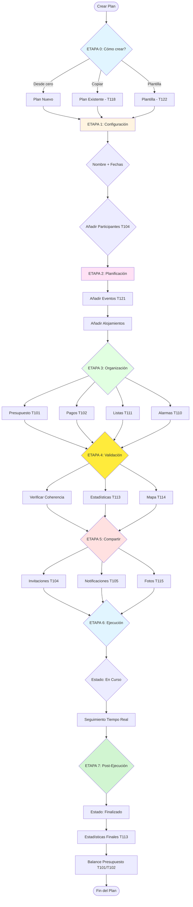

# 📑 Índice del Sistema de Planes

> Índice general y visión completa del sistema de creación y gestión de planes

**Estado:** Índice  
**Versión:** 2.0  
**Fecha:** Enero 2025  
**Última actualización:** División en flujos específicos

---

## 📑 ÍNDICE DEL SISTEMA

Este documento ha sido dividido en **10 flujos específicos** más **guías de referencia** para facilitar la consulta y el desarrollo:

### 📚 Documentos de Flujos

| Documento | Descripción | Tareas Relacionadas |
|-----------|-------------|---------------------|
| **[FLUJO_CRUD_PLANES.md](./flujos/FLUJO_CRUD_PLANES.md)** | 🆕 Ciclo de vida completo CRUD de planes | T109, T107, T118, T122 |
| **[FLUJO_ESTADOS_PLAN.md](./flujos/FLUJO_ESTADOS_PLAN.md)** | Transiciones entre estados | T109 |
| **[FLUJO_GESTION_PARTICIPANTES.md](./flujos/FLUJO_GESTION_PARTICIPANTES.md)** | Invitaciones, confirmaciones, grupos | T104, T117, T120, T123 |
| **[FLUJO_CRUD_EVENTOS.md](./flujos/FLUJO_CRUD_EVENTOS.md)** | Ciclo de vida completo de eventos | T121, T105, T110, T101, T102 |
| **[FLUJO_CRUD_ALOJAMIENTOS.md](./flujos/FLUJO_CRUD_ALOJAMIENTOS.md)** | 🆕 Ciclo de vida completo de alojamientos | T121, T105, T110, T101, T102 |
| **[FLUJO_PRESUPUESTO_PAGOS.md](./flujos/FLUJO_PRESUPUESTO_PAGOS.md)** | Presupuesto y sistema de pagos | T101, T102 |
| **[FLUJO_INVITACIONES_NOTIFICACIONES.md](./flujos/FLUJO_INVITACIONES_NOTIFICACIONES.md)** | Invitaciones y notificaciones | T104, T105, T110, T120 |
| **[FLUJO_VALIDACION.md](./flujos/FLUJO_VALIDACION.md)** | Validación y verificación | T113, T114, T107 |
| **[FLUJO_CRUD_USUARIOS.md](./flujos/FLUJO_CRUD_USUARIOS.md)** | Registro, login y gestión de usuarios | T47, T49, T50, T124 |
| **[FLUJO_CONFIGURACION_APP.md](./flujos/FLUJO_CONFIGURACION_APP.md)** | Configuración de usuario, app y planes | T50, T105, T124 |

**📚 Guías de Referencia:**
| **[GUIA_SEGURIDAD.md](./GUIA_SEGURIDAD.md)** | Seguridad, autenticación y protección de datos | T51, T52, T53, T65-T67, T125-T129 |
| **[GUIA_ASPECTOS_LEGALES.md](./GUIA_ASPECTOS_LEGALES.md)** | Términos, privacidad, cookies y cumplimiento legal | T50, T129, GDPR, COPPA |

---

## 🎯 Visión General del Sistema

El sistema de creación y gestión de planes comprende **7 etapas principales**:

```
ETAPA 0: Cómo crear el plan
├─ Desde cero
├─ Copiar plan existente (T118)
└─ Usar plantilla (T122)

ETAPA 1: Configuración inicial
├─ Nombre, fechas, timezones
├─ Presupuesto estimado (T101)
├─ Etiquetas/categorías
├─ Estado del plan (T109)
├─ Destinos principales (T114)
└─ Invitar participantes (T104)

ETAPA 2: Planificación de actividades
├─ Crear eventos (T121)
├─ Añadir alojamientos
├─ Asignar participantes
├─ Gestionar timezones
└─ Configurar alarmas (T110)

ETAPA 3: Organización y detalles
├─ Presupuesto detallado (T101)
├─ Pagos y bote común (T102)
├─ Listas del plan (T111)
└─ Alarmas (T110)

ETAPA 4: Validación y verificación
├─ Verificar coherencia del plan
├─ Detectar solapamientos
├─ Estadísticas (T113)
└─ Mapa del plan (T114)

ETAPA 5: Compartir y colaborar
├─ Invitaciones (T104)
├─ Notificaciones (T105)
├─ Avisos del plan
└─ Fotos (T115)

ETAPA 6: Ejecución del plan
├─ Estado: En Curso
├─ Seguimiento en tiempo real
├─ Actualizaciones urgentes
└─ Check-ins

ETAPA 7: Post-ejecución
├─ Estado: Finalizado
├─ Estadísticas finales
├─ Balance presupuesto (T101/T102)
└─ Fotos del plan (T115)
```

---

## 🎭 Diagrama de Flujo Principal



---

## 📊 Progreso del Sistema

**Estado actual:** ⚠️ ~40% completado

### ✅ Completado
- Creación básica de planes
- Gestión básica de participantes
- Creación básica de eventos
- Sistema de tracks
- Timezone dinámica (T40)
- Sistema de solapamientos básico

### ⚠️ En Progreso
- Formularios enriquecidos (T121)
- Estados del plan (T109)
- Sistema de validación completo

### ❌ Pendiente (Críticas)
- Invitaciones y notificaciones (T104, T105)
- Presupuesto y pagos (T101, T102)
- Validación avanzada (T113, T114)
- Alarmas (T110)
- Mapa y rutas (T114)

---

## 🎯 Próximos Hitos

### Prioridad Alta
1. **T121** - Formularios enriquecidos de eventos y alojamientos
2. **T109** - Sistema de estados del plan
3. **T104/T105** - Invitaciones y notificaciones

### Prioridad Media
4. **T101/T102** - Sistema de presupuesto y pagos
5. **T110** - Sistema de alarmas
6. **T113** - Estadísticas del plan

### Prioridad Baja
7. **T114** - Mapa y rutas
8. **T115** - Sistema de fotos
9. **T118** - Copiar planes completos

---

## 🔐 Matriz de Permisos por Rol

| Acción | Organizador | Coorganizador | Participante | Observador |
|--------|-------------|---------------|--------------|------------|
| Crear evento | ✅ | ✅ | ❌ | ❌ |
| Modificar evento | ✅ | ✅ | ⚠️ Solo su parte | ❌ |
| Eliminar evento | ✅ | ✅ | ❌ | ❌ |
| Invitar participantes | ✅ | ✅ | ❌ | ❌ |
| Añadir al participante a evento | ✅ | ✅ | ❌ | ❌ |
| Configurar presupuesto | ✅ | ⚠️ Ver solo | ❌ | ❌ |
| Registrar pagos | ✅ | ⚠️ Ver solo | ✅ | ❌ |
| Configurar alarmas | ✅ | ✅ | ⚠️ Solo suyas | ❌ |
| Cancelar plan | ✅ | ❌ | ❌ | ❌ |

---

## 📋 Tareas por Etapa

### ETAPA 0 - Cómo crear
- T118: Copiar plan existente
- T122: Guardar como plantilla

### ETAPA 1 - Configuración
- T109: Estados del plan
- T104: Invitaciones
- T123: Grupos de participantes

### ETAPA 2 - Planificación
- T121: Formularios enriquecidos
- T110: Alarmas
- T117: Registro de participación por evento

### ETAPA 3 - Organización
- T101: Sistema de presupuesto
- T102: Sistema de pagos y bote común
- T111: Listas del plan

### ETAPA 4 - Validación
- T113: Estadísticas
- T114: Mapa del plan
- T107: Actualización dinámica de duración

### ETAPA 5 - Compartir
- T104: Invitaciones
- T105: Notificaciones
- T115: Fotos

### ETAPA 6/7 - Ejecución/Post
- T112: Indicador de días restantes
- T108: Indicador de participación

---

## 🤔 Decisiones Pendientes

### Técnicas
- Integración con Google Maps (coste API vs beneficio)
- Sistema de notificaciones push (Firebase Cloud Messaging)
- Almacenamiento de fotos (Firebase Storage vs optimización)

### UX
- Flujo de copiar pegar planes (UIs complejos)
- Gestión de lista de espera en eventos (UX de lista)
- Dashboard para móvil (qué priorizar en pantalla pequeña)

---

## ✅ Estado Actual

**Última revisión:** Enero 2025

**Documentos creados:**
- ✅ 9 flujos específicos en `docs/flujos/`
- ✅ Índice actualizado
- ✅ Referencias cruzadas entre documentos
- ✅ Diagramas Mermaid en todos los flujos CRUD

**Próxima acción:**
Revisar cada flujo individualmente para refinamiento y detección de gaps.

---

*Documento índice del sistema completo de planes*  
*Última actualización: Enero 2025*
