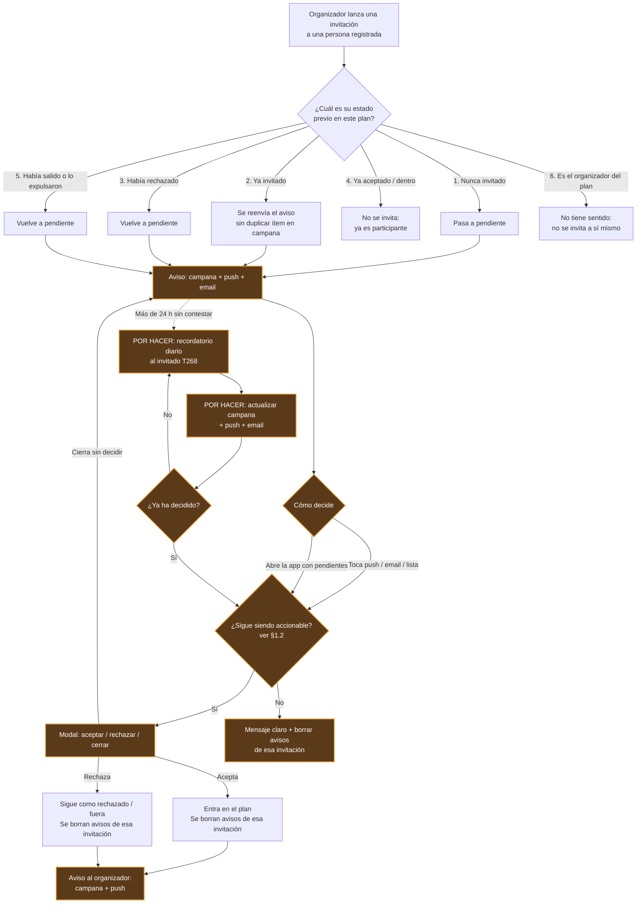
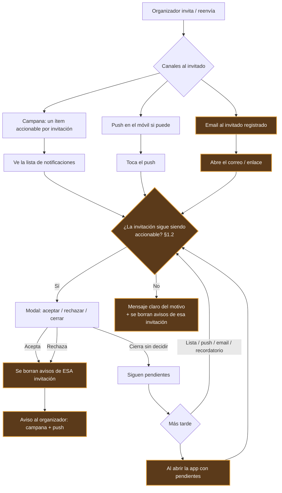
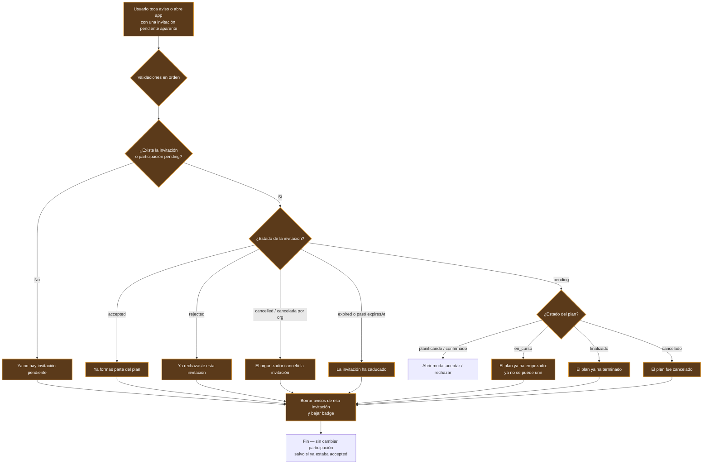
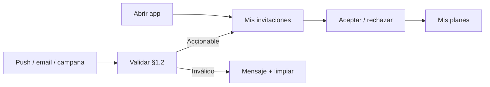
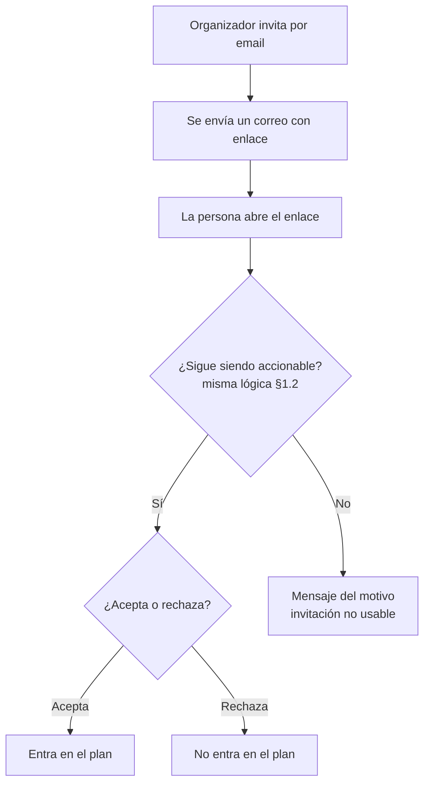
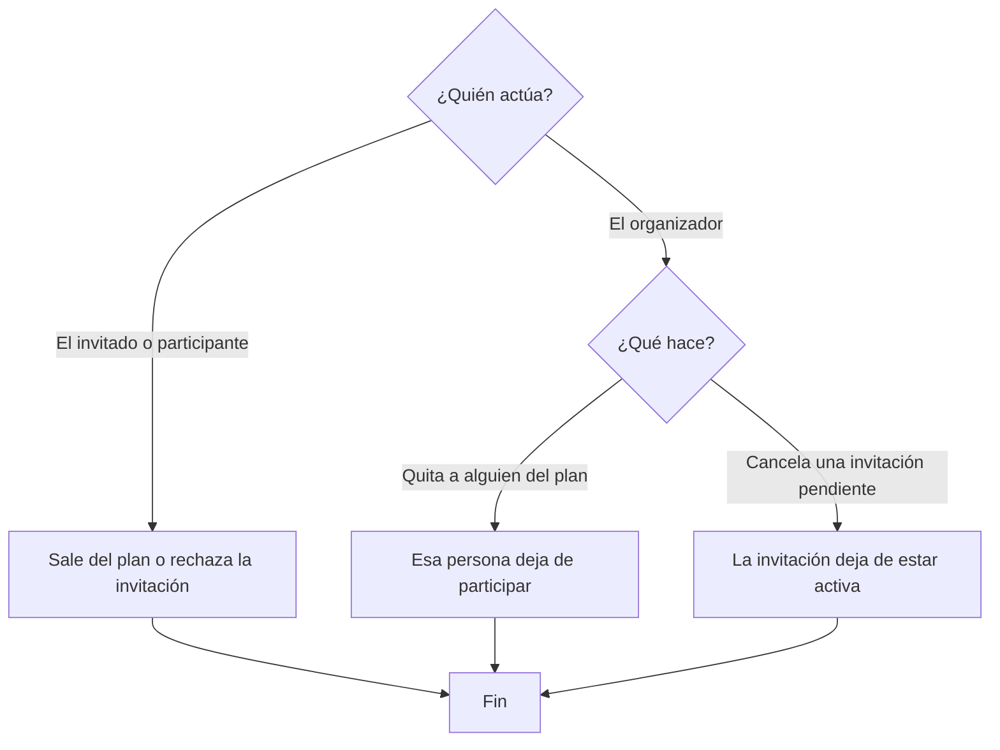

# Diagrama: altas y bajas en un plan

> Visión de **proceso** (qué hace cada persona), sin detalles técnicos.  
> Prosa: [`FLUJO_GESTION_PARTICIPANTES.md`](./FLUJO_GESTION_PARTICIPANTES.md) · Mapa: [`MAPA_FLUJOS.md`](./MAPA_FLUJOS.md)  
> **Estado:** borrador — pendiente acuerdo.

**Leyenda del diagrama**
- Cajas normales = **ya implementado**
- Cajas con borde/estilo “por hacer” = **aún no implementado** (acordado o a acordar)

**Cómo usarlo:** editar hasta marcar **Acordado**; luego se implementa según este contrato.

---

## 1. Alta — invitar a alguien que **ya usa Planazoo**

El flujo empieza siempre igual: **el organizador lanza una invitación**.  
Lo que cambia es el **estado previo** de esa persona en el plan.  
Detalle de canales y ciclo de vida de avisos → **§1.1**.

> **Nota de leyenda:** nodos de aviso / validación / modal al abrir en estilo POR HACER = contrato §1.1–§1.2 aún incompleto en app. Participación `pending` y aceptar/rechazar básico sí existen; **no** se valida hoy estado del plan ni caducidad al aceptar.

**Casos al lanzar la invitación**

| # | Estado previo | Participación | Avisos (§1.1) |
|---|---------------|---------------|---------------|
| 1 | Nunca invitado | Pendiente — implementado | Campana+push sí · email POR HACER |
| 2 | Ya invitado | Sigue pending — implementado | Reenviar sin duplicar campana POR HACER · push sí · email POR HACER |
| 3 | Había rechazado | Vuelve a pending — implementado | Igual que invitar (email POR HACER) |
| 4 | Ya aceptado | No se invita — implementado | — |
| 5 | Había salido / expulsado | Vuelve a pending — a revisar en app | Igual que invitar |
| 6 | Es el organizador | No se invita — a revisar en app | — |

**Después de responder**
- Acepta → dentro del plan · se **borran** avisos de esa invitación · organizador: campana + push.  
- Rechaza → visible como «fuera» · se **borran** avisos de esa invitación · organizador: campana + push · se puede volver a invitar (caso 3).  
- Cierra sin decidir → avisos siguen · al reabrir la app (o tocar aviso) vuelve el modal.

**Mientras no responde**
- Cada 24 h: recordatorio (actualizar campana + push + email) hasta decidir → **T268 (por hacer)**.
- Al abrir la app con pendientes → modal automático → **POR HACER (§1.1)**.

**Efectos en datos (borrador — para ver el formato)**

| Paso del diagrama | Efecto en datos |
|-------------------|-----------------|
| 1. Nunca invitado → pendiente | Crea `plan_participations` con `status: pending`, `isActive: true` · aviso campana + push + email al invitado |
| 2. Ya invitado → reenviar aviso | No cambia el `status` (sigue `pending`) · actualiza el aviso accionable de campana · push + email nuevos |
| 3. Había rechazado → vuelve a pendiente | Actualiza `plan_participations`: `rejected` → `pending` · aviso campana + push + email |
| 4. Ya aceptado | Sin escritura de invitación |
| 5. Había salido / expulsado → pendiente | Reactiva o recrea participación `pending` *(a confirmar: hoy al salir se borra el doc)* · aviso |
| 6. Es el organizador | Sin escritura |
| Acepta | `plan_participations.status` → `accepted` · **borra** avisos de esa invitación · campana + push al organizador |
| Rechaza | `plan_participations.status` → `rejected` (sigue visible) · **borra** avisos de esa invitación · campana + push al organizador |
| Recordatorio 24 h (T268) | Sin cambio de `status` · push + email (+ actualizar campana) *(por hacer)* |
| Al abrir la app con pendientes | Muestra modal de decisión *(por hacer)* · antes valida §1.2 |

### 1.1 Avisos de la invitación (invitado registrado)

Contrato de **cómo avisamos** y **qué pasa con esos avisos**.  
El §1 dice *cuándo* se invita; aquí, *cómo se entera* y *cómo decide*.  
**Antes de abrir el modal de decisión** → validar §1.2 (aviso / plan / invitación aún válidos).  
**Decisiones 1–5: acordadas** (ver tabla abajo). Parte del comportamiento aún es POR HACER.

**Decisiones acordadas**

| # | Pregunta | Acuerdo | Implementación |
|---|----------|---------|----------------|
| 1 | Email al invitado ya registrado | **Sí** | POR HACER |
| 2 | Al reabrir la app con pendientes | **Modal automático** | POR HACER |
| 3 | Al aceptar / rechazar | **Borrar** avisos de esa invitación | Implementado (borra tipo `invitation` por plan) |
| 4 | Al reenviar si ya pendiente | **Lo más seguro:** un solo ítem accionable en campana (actualizar/reusar), y **sí** enviar push + email nuevos | POR HACER (hoy crea ítems duplicados) |
| 5 | Aviso al organizador al responder | **Campana + push** | Implementado (campana + `sendPushNotification`) |

**Canales**

| Canal | Al invitar / reenviar | Hoy |
|-------|----------------------|-----|
| Campana (lista notificaciones) | Sí — **un** aviso accionable por plan/invitación | Implementado (puede duplicar) |
| Push móvil | Sí, si hay permiso/token | Implementado |
| Email al registrado | Sí | **No** |

**Dónde ve las pendientes**

| Sitio | Qué ve | Hoy |
|-------|--------|-----|
| Lista de la campana | Ítems de invitación a planes | Implementado |
| Badge de la campana | Solo las que siguen sin resolver | Parcial / a revisar |
| Al abrir la app | Modal automático si hay pendientes | **No** |
| Lista de planes | El plan aparece (participación pendiente) | Implementado |

**Ciclo de vida del aviso**

| Momento | Qué ocurre | Hoy |
|---------|------------|-----|
| Se invita | Campana + push + email | Campana + push; email no |
| Se reenvía (ya pendiente) | Actualiza el ítem de campana · push + email nuevos | Nuevo ítem + push; email no |
| Toca push, email o ítem de lista | Valida §1.2 → modal o mensaje de inválido | Push y lista abren modal **sin** validar plan/caducidad |
| Cierra el modal sin decidir | Aviso **sigue** en la lista | Implementado |
| Vuelve a abrir la app | Modal automático con pendientes | **No** |
| Acepta o rechaza | **Borrar** avisos de esa invitación · badge baja | Implementado (borra tipo invitation) |
| Organizador | Campana + push de la respuesta | Implementado |

**Nota sobre el “caso más seguro” (decisión 4):** no acumular varios ítems pendientes del mismo plan (confunde el badge y la lista). Un único aviso accionable + canales “interruptivos” (push/email) en cada reenvío.

### 1.2 Acceso desde un aviso que ya no es válido

Cuando el usuario entra por **push**, **email**, **ítem de campana** o **modal al abrir la app**, la app **valida primero** si la invitación sigue siendo accionable.  
Si no lo es: **no** muestra aceptar/rechazar; muestra un **mensaje concreto**; **borra** los avisos de esa invitación (misma regla que al decidir).

**Tabla de casos (contrato) — estado del aviso / plan**

| # | Situación al entrar por el aviso | Qué ve el usuario | ¿Modal aceptar/rechazar? | Avisos | Hoy |
|---|----------------------------------|-------------------|--------------------------|--------|-----|
| A | Invitación / participación **pending** y plan `planificando` o `confirmado` | Modal normal | Sí | Siguen hasta decidir | Parcial (modal desde push/lista; sin email/deep link) |
| B | Invitación **ya aceptada** / ya es participante | «Ya formas parte de este plan» (ideal: ir al plan) | No | Se borran | Gap — error genérico o nada |
| C | Invitación **ya rechazada** | «Ya rechazaste esta invitación» | No | Se borran | Gap |
| D | Invitación **cancelada** por el organizador | «El organizador canceló la invitación» | No | Se borran | Gap |
| E | Invitación **caducada** (7 días / `expired`) | «Esta invitación ha caducado» | No | Se borran | Gap — accept puede dejar pasar si sigue `pending` |
| F | Plan **en marcha** (`en_curso`) | «El plan ya ha empezado; ya no puedes unirte» | No | Se borran | Gap — accept no mira estado del plan |
| G | Plan **finalizado** | «Este plan ya ha terminado» | No | Se borran | Gap |
| H | Plan **cancelado** | «Este plan fue cancelado» | No | Se borran | Gap |
| I | Aviso huérfano (plan/invitación borrados) | «Esta invitación ya no está disponible» | No | Se borran | Gap |

**Tabla de casos — identidad, carrera, roles, avisos**

| # | Situación | Qué ve / qué hace la app | Hoy |
|---|-----------|--------------------------|-----|
| J | Sesión actual **≠** email/usuario de la invitación | «Esta invitación es para otra cuenta. Cierra sesión o usa la cuenta invitada.» No aceptar con la sesión equivocada | Gap |
| K | Sin sesión / hay que registrarse (enlace email §2) | Flujo registro/login y luego revalidar §1.2; si el email no coincide, caso J | Gap (deep link roto) |
| L | Usuario **eliminado / desactivado** entre aviso y tap | «Esta cuenta ya no está disponible» · limpiar avisos locales si aplica | Gap |
| M | Misma dirección de email, **cuenta recreada** (otro `userId`) | Solo válido si la invitación apunta al email/userId actual; si no, invitación no aplicable + el org puede reinvitar | Gap |
| N | Aceptó en dispositivo A; luego toca push en B | Caso B («ya formas parte») · limpiar avisos en B | Gap parcial |
| O | Doble tap / aceptar y rechazar a la vez | Una sola operación gana (idempotente); la segunda ve B o C · sin estados corruptos | Gap |
| P | Organizador **cancela o reenvía** con el modal abierto | Al confirmar: revalidar §1.2; si canceló → D; si reenvió → sigue A con datos frescos | Gap |
| Q | Plan cambia a `en_curso` / `finalizado` / `cancelado` con modal abierto | Al confirmar: revalidar → F/G/H · no aceptar a ciegas | Gap |
| R | Cambia el **organizador** / ownership con pendientes | Invitación sigue válida si plan + pending siguen (A); el aviso al responder va al organizador **actual** | A acordar / Gap |
| S | Invitar a quien **ya es co-organizador** u otro rol dentro | Como caso 4 del §1: no reinvitar; si llega aviso viejo → B | Parcial |
| T | Auto-invitación (buscarse a sí mismo) | Bloquear al crear (caso 6 §1); si llega aviso absurdo → «No puedes invitarte a ti mismo» + borrar | A revisar |
| U | Plan **inaccesible** por permisos tras el aviso | «No tienes acceso a este plan» · borrar avisos · no crash | Gap |
| V | Caducidad 7 días: reloj cliente vs servidor | Decidir **siempre por reloj de servidor** (`expiresAt` / CF) | A reforzar |
| W | App reinstalada: push viejo perdido, queda **email** | Abrir email → misma validación §1.2; campana se reconstruye desde datos | Gap (email registrado + deep link) |
| X | Varios recordatorios T268 y responde a uno viejo | Revalidar; si ya decidió → B/C; si sigue pending → A; limpiar avisos de esa invitación | POR HACER con T268 |
| Y | Notificaciones del SO desactivadas | Sigue email + campana + **modal al abrir app** (§1.1); no depender solo del push | Parcial |
| Z | Ítem de campana “leído” pero sigue `pending` (o al revés) | La acción depende del **estado** participación/invitación, no de `isRead`; al decidir o invalidar → borrar | Gap |
| AA | Correo **viejo** tras rechazo + **re-invitación** nueva | Aviso/enlace viejo → C o E; solo el de la invitación **actual** pending → A | Gap |
| AB | Cupo lleno / lista de espera *(si existe en producto)* | «El plan no admite más participantes» · no aceptar | A acordar si hay cupos |
| AC | Unirse en `en_curso` si el org lo permite explícitamente | **Por defecto no** (caso F). Flag futuro “permitir altas en curso” sería excepción documentada | Acorde F |

**Reglas**
- Misma lógica **da igual el canal** (correo viejo, push viejo, campana, abrir app).
- En F/G/H/AB: **no** se puede aceptar aunque la participación siga `pending`.
- Tras mensaje de caso inválido (B–I y J–AC según aplique): **borrar** avisos de esa invitación.
- Antes de confirmar aceptar/rechazar en el modal: **revalidar** (cubre P, Q, O, N).
- Si ya era `accepted` (B/N): no re-aceptar; ideal navegar al plan.
- Recordatorios T268 **solo** si sigue siendo caso A; si pasa a inválido, dejar de recordar y limpiar.
- Identidad (J, K, M): **nunca** aplicar una invitación a la sesión equivocada.

**Efectos en datos (casos inválidos / carrera)**

| Caso | Datos |
|------|--------|
| B–I, F–H, E | No aceptar · no rechazar de nuevo · **borrar** notificaciones · si sigue `pending` y ya no admite altas o caducó → marcar `expired` (o equiv.) |
| J, K, M | Sin escritura sobre la invitación ajena · mensaje · no marcar accepted en la sesión actual |
| O, P, Q | Operación idempotente + revalidación al confirmar |
| A (válido) | Flujo normal §1 / §1.1 |

### 1.3 Espacio para gestionar invitaciones (propuesta)

Las invitaciones son la puerta de entrada al producto: no pueden vivir solo en un push fugaz o un ítem perdido en la campana general.

**Cómo lo veo**
- **Sí hace falta un sitio claro** «Mis invitaciones» (sección fija en Inicio/Dashboard o entrada desde campana): lista de pendientes accionables, con aceptar / rechazar / ver detalle del plan.
- La **campana** sigue siendo el canal de aviso (y de historial corto); el **buzón de invitaciones** es la bandeja de trabajo.
- El **modal al abrir la app** (§1.1) no sustituye ese espacio: es un atajo cuando hay pendientes; si hay varias, mejor ir a la lista.
- En Participantes (lado organizador) ya se gestionan las enviadas; el hueco fuerte es el **lado invitado**.

**Contenido mínimo del buzón (invitado)**

| Elemento | Notas |
|----------|--------|
| Lista de pendientes (caso A) | Plan, quién invita, fecha, caducidad |
| Acciones | Aceptar / Rechazar (con revalidación §1.2) |
| Vacío | Copy claro |
| Opcional: recientes resueltas | Aceptada / Rechazada / Caducada (solo lectura, pocos días) |

**Hoy:** hay piezas (campana unificada, badges, `userPendingInvitationsProvider` incompleto para invites directas). **No** hay un buzón de primera clase para el invitado → **POR HACER** (acordar UX e implementar).

---

## 2. Alta — invitar por **email** a alguien que **aún no tiene cuenta**

**Notas**
- El enlace caduca a los 7 días (caso E del §1.2).
- Si el email ya tenía una invitación pendiente a ese plan: no se duplica.
- Plan en marcha / finalizado / cancelado: mismos mensajes F/G/H del §1.2.
- **Hoy:** el deep link `/invitation/{token}` **no se procesa** en la app (POR HACER recuperar o sustituir por flujo §1.1 tras registro).

---

## 3. Baja — salir, quitar o cancelar invitación

**Pendiente de acordar:** en cada caso, ¿quién recibe aviso y con qué mensaje?

---

## 4. Checklist de acuerdo

- [ ] §1 invitar registrado (casos 1–6 + recordatorio 24 h T268)  
- [x] §1.1 avisos — **decisiones 1–5 acordadas** (varios POR HACER en app)  
- [ ] §1.2 acceso por aviso inválido / carrera / identidad (casos A–AC)  
- [ ] §1.3 buzón «Mis invitaciones» (lado invitado)  
- [ ] §2 invitar por email sin cuenta  
- [ ] §3 bajas (y notificaciones asociadas)  

**Estado:** `Borrador` — marcar casillas cuando esté acordado.
