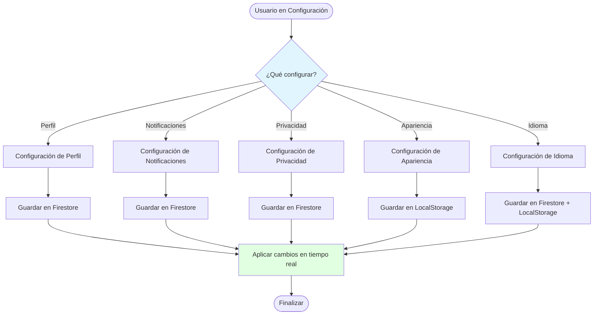

# ⚙️ Flujo de Configuración de la App

> Define qué elementos son configurables por el usuario y por plan

**Relacionado con:** T50, T105, T124  
**Versión:** 1.0  
**Fecha:** Enero 2025

---

## 🎯 Objetivo

Documentar todos los elementos configurables de la app, organizados por categorías: configuración personal del usuario, configuración global de la app, y configuración específica de cada plan.

---

## 📋 CATEGORÍAS DE CONFIGURACIÓN

### 1. CONFIGURACIÓN DE USUARIO (Individual)

#### 1.1 - Perfil

**Elementos configurables:**
- Foto de perfil
- Nombre completo
- Username
- Biografía
- Zona horaria

**Persistencia:** Firestore (`users/{userId}`)

#### 1.2 - Notificaciones

**Elementos configurables:**
- Notificaciones email: Activadas/Desactivadas
- Notificaciones push: Activadas/Desactivadas
- Horarios silencio: Inicio y fin (ej: 22:00 - 08:00)
- Tipos de notificaciones:
  - Invitaciones a planes
  - Cambios en planes
  - Eventos próximos
  - Avisos del plan
  - Recordatorios de alarmas

**Persistencia:** Firestore (`users/{userId}/preferences`)

**Estructura de datos:**
```dart
class NotificationPreferences {
  bool emailEnabled;
  bool pushEnabled;
  Map<String, bool>? notificationTypes;
  QuietHours? quietHours;
  List<String>? disabledPlanIds;
}

class QuietHours {
  TimeOfDay start; // 22:00
  TimeOfDay end;   // 08:00
}
```

#### 1.3 - Privacidad

**Elementos configurables:**
- Perfil público: Sí/No
- Mostrar email en perfil: Sí/No
- Mostrar planes en perfil: Sí/No
- Mostrar solo planes públicos: Sí/No
- Participación visible para otros: Sí/No

**Persistencia:** Firestore (`users/{userId}/preferences`)

#### 1.4 - Sesión

**Elementos configurables:**
- Cerrar sesión
- Cerrar sesión en todos los dispositivos
- Ver sesiones activas
- Gestión de sesiones múltiples

**Persistencia:** Firebase Auth + Firestore (sesiones)

#### 1.5 - Cuenta

**Elementos configurables:**
- Cambiar contraseña
- Cambiar email
- Eliminar cuenta
- Exportar datos personales
- Ver actividad de la cuenta

**Persistencia:** Firestore (`users/{userId}`)

---

### 2. CONFIGURACIÓN DE LA APP (Global/Local)

#### 2.1 - Idioma

**Elementos configurables:**
- Idioma principal: Español / English
- Idioma de la interfaz
- Idioma de fechas (dd/mm/yyyy o mm/dd/yyyy)

**Persistencia:** LocalStorage + Firestore (`users/{userId}/preferences`)

**Implementación:**
- Usar archivos `.arb` en `lib/l10n/`
- Cambio dinámico de idioma sin restart
- Persistir preferencia en Firestore

#### 2.2 - Fecha y Hora

**Elementos configurables:**
- Formato de fecha: dd/mm/yyyy / mm/dd/yyyy / yyyy-mm-dd
- Formato de hora: 12h / 24h
- Zona horaria: Auto-detectada / Manual
- Cambio automático horario verano: Sí/No

**Persistencia:** LocalStorage + Firestore (`users/{userId}/preferences`)

#### 2.3 - Apariencia

**Elementos configurables:**
- Tema: Claro / Oscuro / Seguir sistema
- Densidad de UI: Compacto / Normal / Espacioso
- Tamaño de fuente: Pequeño / Normal / Grande / Muy Grande

**Persistencia:** LocalStorage (puede ser solo local si no es crítico)

**Consideraciones:**
- Flutter tiene soporte nativo para theme y font sizes
- Multi-plataforma: Web/iOS/Android mantienen consistencia

#### 2.4 - Accesibilidad

**Elementos configurables:**
- Alto contraste: Activado/Desactivado
- Animaciones: Activadas / Reducidas / Desactivadas
- Efectos visuales: Completos / Reducidos / Mínimos

**Persistencia:** LocalStorage

---

### 3. CONFIGURACIÓN DE PLAN (Por Plan)

#### 3.1 - Notificaciones del Plan

**Elementos configurables:**
- Notificaciones cuando:
  - Se añade/elimina un evento
  - Se añade/elimina un participante
  - Cambian detalles del plan
  - Se publica un aviso
  - Se acerca una alarma de evento

**Persistencia:** Firestore (`plans/{planId}/userPreferences/{userId}`)

**Consideración especial:**
- Cada participante tiene preferencias independientes para cada plan
- Por defecto: Todas las notificaciones activas
- Usuario puede silenciar un plan específico sin desactivar globalmente

#### 3.2 - Visibilidad del Plan

**Elementos configurables:**
- Plan público: Sí/No
- Permitir ver por usuarios no participantes: Sí/No
- Mostrar en mi perfil: Sí/No

**Persistencia:** Firestore (`plans/{planId}`)

#### 3.3 - Idioma del Plan (Opcional - Futuro)

**Elementos configurables:**
- Idioma de fechas y eventos del plan
- Configuración independiente de idioma del usuario

**Persistencia:** Firestore (`plans/{planId}`)

---

## 📊 ESTRUCTURA DE DATOS

### UserPreferences (Firestore: `users/{userId}/preferences`)

```dart
class UserPreferences {
  // Idioma
  String language; // "es", "en"
  String? dateFormat; // "dd/mm/yyyy", "mm/dd/yyyy"
  
  // Apariencia
  String? theme; // "light", "dark", "system"
  String? fontSize; // "small", "normal", "large", "very_large"
  String? density; // "compact", "normal", "spacious"
  
  // Notificaciones
  NotificationPreferences? notifications;
  
  // Privacidad
  PrivacyPreferences? privacy;
  
  // Fecha/Hora
  String? timezone;
  String? timeFormat; // "12h", "24h"
  
  // Accesibilidad
  bool? highContrast;
  String? animations; // "full", "reduced", "none"
}
```

### PlanUserPreferences (Firestore: `plans/{planId}/userPreferences/{userId}`)

```dart
class PlanUserPreferences {
  String planId;
  String userId;
  
  // Notificaciones para este plan
  bool? notifyEvents;
  bool? notifyParticipants;
  bool? notifyChanges;
  bool? notifyAnnouncements;
  bool? notifyAlarms;
  
  // Silenciado completamente
  bool? muted;
  
  DateTime? mutedUntil; // Silenciar hasta fecha específica
}
```

---

## 🔄 FLUJOS PRINCIPALES

### Flujo de Configuración Personal



---

## 🎯 VALORES POR DEFECTO

**Usuario nuevo:**
- Idioma: Español (detectado del sistema)
- Tema: Seguir sistema
- Notificaciones: Todas activadas
- Privacidad: Perfil público, email oculto
- Zona horaria: Detectada automáticamente

**Plan nuevo:**
- Notificaciones: Todas activadas
- Visibilidad: Privado por defecto
- Permitir ver por otros: No

---

## ✅ IMPLEMENTACIÓN SUGERIDA

**Archivos a crear:**
- `lib/features/preferences/domain/models/user_preferences.dart`
- `lib/features/preferences/domain/models/plan_user_preferences.dart`
- `lib/features/preferences/domain/services/preferences_service.dart`
- `lib/features/preferences/presentation/providers/preferences_providers.dart`
- `lib/features/preferences/presentation/pages/settings_page.dart`
- `lib/features/preferences/presentation/widgets/preferences_section.dart`

**Prioridad:**
- **Alta:** Notificaciones, Idioma, Tema
- **Media:** Privacidad, Apariencia, Zona horaria
- **Baja:** Accesibilidad avanzada

---

*Documento de flujo de configuración de la app*  
*Última actualización: Enero 2025*

