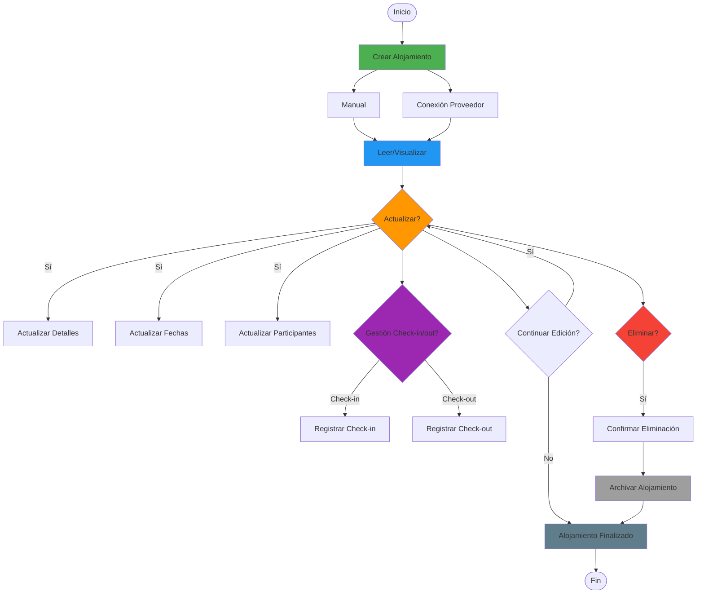

# 🏨 Flujo de Vida Completa de Alojamientos (CRUD)

> Define todo el ciclo de vida de un alojamiento: crear, leer, actualizar y eliminar

**Relacionado con:** T51 - Validación de formularios (✅), T101, T102, T105, T110, T120, T134 - Importación desde Email, T146 - Oráculo de Delfos, T147 - Valoraciones  
**Versión:** 1.2  
**Fecha:** Enero 2025 (Actualizado - Validaciones implementadas)

---

## 🎯 Objetivo

Documentar todos los escenarios del ciclo de vida completo de un alojamiento: desde su creación hasta su eliminación, incluyendo lectura, visualización, actualizaciones, validaciones y gestión de check-in/check-out.

**Nota:** Los alojamientos son una entidad separada de los eventos, con su propio modelo `Accommodation` y características específicas (rango de fechas, check-in/check-out, duración en días).

---

## 🔄 Diagrama del Ciclo de Vida de Alojamientos



---

## 📊 ESTADOS DE ALOJAMIENTOS

| Estado | Descripción | Editable | Eliminable | Visible Para | Parte Personal Editable |
|--------|-------------|----------|------------|--------------|-------------------------|
| **Borrador** | Alojamiento en creación | ✅ Todo | ✅ Sí | Solo creador | ✅ Sí |
| **Reservado** | Alojamiento confirmado | ⚠️ Limitado | ⚠️ Con confirmación | Asignados + organizador | ✅ Sí |
| **Check-in Realizado** | Ya se hizo check-in | ⚠️ Solo actualizaciones | ❌ No | Todos | ⚠️ Solo notas |
| **Check-out Realizado** | Ya se hizo check-out | ❌ No | ❌ No | Todos | ❌ No |
| **Cancelado** | Alojamiento cancelado | ❌ No | ❌ No | Todos | ❌ No |

**Nota:** La estructura **Parte Común/Parte Personal** permite que cada participante tenga información específica:
- **AccommodationCommonPart**: Nombre hotel, check-in/check-out, dirección, servicios, capacidad
- **AccommodationPersonalPart** (por participante): Número de habitación, tipo de cama, preferencias personales, notas

La parte personal (habitaciones, preferencias) es editable hasta el check-in, excepto notas que pueden añadirse durante la estancia.

---

## 📋 CICLO DE VIDA DE ALOJAMIENTOS

### 1. CREAR ALOJAMIENTO

#### 1.1 - Creación Manual (Durante Planificación)

**Cuándo:** Durante planificación normal del plan  
**Quién:** Organizador o participante con permisos

**Flujo completo:**
```
Usuario → "Añadir alojamiento"
  ↓
Opciones de creación:
- "Crear manualmente" (formulario)
- "Importar desde email" (T134)
- "💡 Sugerencias inteligentes" (T146 - Oráculo de Delfos) [Opcional - si está disponible]
  ↓
Si selecciona "Crear manualmente":
  ↓
Mostrar sugerencias contextuales del Oráculo de Delfos (T146) si disponible:
- Alojamientos recomendados en la zona
- Hoteles mejor valorados por usuarios similares
- Sugerencias basadas en presupuesto y fechas del plan
  ↓
Abrir formulario de alojamiento
  ↓
Completar campos:
- Nombre del hotel/alojamiento (requerido)
- Check-in: Fecha y hora (requerido)
- Check-out: Fecha y hora (requerido)
- Tipo (Hotel/Airbnb/Hostal/Apartamento/etc.)
- Subtipo (Suite/Dormitorio/Estudio/etc.)
- Participantes asignados (quién se aloja)
- Descripción (opcional, máximo 1000 caracteres)
- Dirección y contacto (opcional)
- Servicios/amenities (opcional)
- Capacidad máxima (opcional)
- Color (opcional, para visualización)
- Presupuesto (T101)
- Coste total o por persona (T101)
  ↓
Si hay múltiples participantes:
- ¿Seleccionar habitaciones individuales? [Checkbox]
- Si sí: Configurar parte personal por participante:
  - Número de habitación por participante (ej: "203", "Suite 501")
  - Tipo de cama por participante
  - Preferencias personales (piso alto, sin ruido, vista al mar, etc.)
  - Notas personales
  ↓
Validaciones (T51):
- Nombre no vacío
- Check-in y check-out dentro del rango del plan
- Check-out posterior a check-in
- Duración mínima 1 día
- Participantes existen en el plan
- No solapamiento con otros alojamientos del mismo grupo
  ↓
Guardar alojamiento en Firestore:
- Crear Accommodation document con todos los campos base
- Crear AccommodationCommonPart con información compartida:
  - hotelName, checkIn, checkOut, description
  - address, contactInfo, amenities, maxCapacity
  - participantIds, isForAllParticipants
- Si hay parte personal: Crear AccommodationPersonalPart para cada participante:
  - roomNumber, bedType, preferences, notes, fields
- Asignar accommodationId único
- Establecer planId del plan actual
- Establecer userId del creador
- Estado: "Reservado" o "Borrador" según configuración
  ↓
Validar permisos de creación:
- ¿Usuario tiene permisos para crear alojamientos en este plan?
- ¿Plan no está "Finalizado" ni "Cancelado"?
- ¿Plan está en estado editable?
  ↓
Asignar a tracks de participantes (participantTrackIds)
  ↓
Detectar solapamientos con eventos:
- ¿Hay eventos que se solapan con el alojamiento?
- ¿Hay eventos de check-in/check-out necesarios?
- Mostrar advertencia si hay conflictos (opcional)
  ↓
Crear alojamiento en calendario
  ↓
Notificar a participantes asignados (T105):
- Email estándar de notificación
- Incluir detalles del alojamiento (check-in/check-out)
  ↓
Actualizar presupuesto del plan (T101):
- Recalcular presupuesto total
- Actualizar coste por persona si aplica
  ↓
Estado: "Reservado" o "Borrador" según configuración automática
```

**Campos del modelo Accommodation:**
- `id` - ID único del alojamiento
- `planId` - ID del plan al que pertenece
- `checkIn` - Fecha/hora de check-in
- `checkOut` - Fecha/hora de check-out
- `hotelName` - Nombre del alojamiento
- `description` - Descripción adicional
- `color` - Color para visualización
- `typeFamily` - Tipo (hotel, airbnb, etc.)
- `typeSubtype` - Subtipo (suite, dormitorio, etc.)
- `participantTrackIds` - Participantes asignados
- `createdAt` - Timestamp de creación
- `updatedAt` - Timestamp de última actualización
- `commonPart` - **[NUEVO]** Parte común del alojamiento (similar a eventos)
- `personalParts` - **[NUEVO]** Parte personal por participante (habitación, preferencias, etc.)

**Estructura parte común (AccommodationCommonPart):**
- `hotelName` - Nombre del hotel
- `checkIn`, `checkOut` - Fechas de check-in/check-out
- `description` - Descripción general
- `address`, `contactInfo` - Ubicación y contacto
- `amenities` - Servicios del hotel (wifi, piscina, etc.)
- `maxCapacity` - Capacidad máxima
- `participantIds` - Participantes incluidos
- `isForAllParticipants` - Si aplica a todos

**Estructura parte personal (AccommodationPersonalPart) - por participante:**
- `participantId` - ID del participante
- `roomNumber` - **Número de habitación individual** (ej: "203", "Suite 501")
- `bedType` - Tipo de cama (individual, matrimonio, litera, etc.)
- `preferences` - Preferencias (piso alto, sin ruido, vista al mar, etc.)
- `notes` - Notas personales del alojamiento
- `fields` - Campos adicionales específicos

**Ejemplo de uso:**
```dart
AccommodationPersonalPart(
  participantId: "user123",
  roomNumber: "203",
  bedType: "matrimonio",
  preferences: {"floor": "alto", "view": "mar", "quiet": true},
  notes: "Vista al mar solicitada",
  fields: {"earlyCheckIn": true, "lateCheckOut": false}
)
```

#### 1.2 - Creación desde Email de Confirmación (T134)

**Cuándo:** Usuario quiere importar información de un email de confirmación de alojamiento  
**Quién:** Organizador o participante con permisos

**Flujo:**
```
Usuario → "Añadir alojamiento" → "Importar desde email"
  ↓
Mostrar opciones de entrada:
- "Pegar contenido del email"
- "Subir archivo .eml" (si es posible)
  ↓
Usuario pega/sube contenido del email
  ↓
Sistema detecta proveedor:
- Analiza contenido (texto/HTML)
- Identifica proveedor: Booking.com, Airbnb, Hotels.com, etc.
- Selecciona parser correspondiente
  ↓
Parser extrae información:
- Nombre del hotel/alojamiento
- Fechas de check-in y check-out
- Dirección y contacto
- Número de reserva
- Detalles del alojamiento
  ↓
Mapear a modelo Accommodation:
- Rellenar AccommodationCommonPart:
  - hotelName: Nombre extraído
  - checkIn, checkOut: Fechas extraídas
  - address: Dirección extraída
  - description: Detalles adicionales
- Crear AccommodationPersonalPart si hay información personal (nº habitación, preferencias)
  ↓
Mostrar previsualización:
┌─────────────────────────────────────┐
│ 📧 Alojamiento sugerido desde email│
│                                     │
│ 🏨 Hotel Hilton Paris              │
│ 📅 Check-in:  15/11/2025 14:00h   │
│ 📅 Check-out: 21/11/2025 11:00h   │
│ 📍 123 Calle Principal, Paris     │
│ 🎫 Nº Reserva: BKG123456          │
│                                     │
│ [Editar campos] [Crear alojamiento]│
│ [Cancelar]                         │
└─────────────────────────────────────┘
  ↓
Usuario puede editar/corregir campos antes de crear
  ↓
Si confirma: Crear alojamiento normalmente (como creación manual)
  ↓
Alojamiento creado en el plan
  ↓
Si error o email no reconocido:
  ↓
Mostrar mensaje: "No se pudo reconocer el email. 
Puedes crear el alojamiento manualmente o intentar con otro formato."
  ↓
Opción: Crear manualmente con datos sugeridos si hubo extracción parcial
```

**Proveedores soportados (MVP):**
- Booking.com: nombre hotel, check-in/check-out, dirección, número de reserva
- Airbnb: nombre, fechas, dirección, detalles
- Hotels.com: similar a Booking.com

**Notas:**
- Parsing determinístico por patrones (regex/plantillas) en MVP
- Internacionalización: plantillas EN/ES
- Sanitización de HTML antes de procesar
- No almacenar el cuerpo completo del email por privacidad
- Ver T134 para detalles técnicos completos

#### 1.3 - Creación con Conexión a Proveedor

**Cuándo:** Al crear alojamiento, decidir si conectarlo con proveedor externo (Booking.com, Airbnb, etc.)  
**Quién:** Usuario creando el alojamiento

**Flujo:**
```
Usuario → "Añadir alojamiento"
  ↓
Formulario de creación normal
  ↓
Campo adicional: "Conectar con proveedor" [checkbox]
  ↓
Si marca checkbox:
  ↓
Buscar proveedor:
- "Booking.com" (hoteles)
- "Airbnb" (apartamentos)
- "Hotels.com" (hoteles)
  ↓
Seleccionar proveedor
  ↓
Autorizar conexión:
"El proveedor podrá actualizar automáticamente:
- Horario de check-in/check-out
- Cancelaciones
- Cambios de precio
- Otros cambios

¿Autorizar?"
  ↓
Guardar alojamiento + configuración API
  ↓
Alojamiento creado con sincronización activa
  ↓
Badge visible: "✅ Actualizado por Booking.com"
```

---

### 2. LEER/VISUALIZAR ALOJAMIENTO

#### 2.1 - Vista Detallada del Alojamiento

**Flujo:**
```
Usuario hace click en alojamiento
  ↓
Validar permisos de lectura:
- ¿Usuario tiene acceso al plan?
- ¿Usuario puede ver este alojamiento? (PlanParticipation activa)
  ↓
Verificar estado del alojamiento:
- Si alojamiento está "Cancelado": mostrar vista con estado cancelado
- Si check-out realizado: mostrar vista de solo lectura
  ↓
Mostrar modal/detalle completo:
┌────────────────────────────────────┐
│ Hotel Hilton Paris                 │
│ ━━━━━━━━━━━━━━━━━━━━━━━━━━━━━━━   │
│                                    │
│ 📅 Check-in:  15/11/2025 14:00h   │
│ 📅 Check-out: 21/11/2025 11:00h   │
│ ⏱️ Duración: 6 noches             │
│                                    │
│ 👥 Huéspedes:                      │
│    • Juan (organizador) - Hab 203 │
│    • María - Hab 204              │
│    • Pedro - Hab 205              │
│                                    │
│ 🏨 Ubicación: 123 Calle Principal │
│ 📞 Contacto: +34 123 456 789      │
│ ☕ Servicios: Wifi, Piscina        │
│                                    │
│ 💰 Coste: €1,200 (€200/noche)     │
│ 🔄 Actualizado por: Booking.com  │
│                                    │
│ [Editar] [Check-in] [Check-out]   │
│ [Eliminar] [Ver mapa]             │
│ [Ver detalles por habitación]     │
└────────────────────────────────────┘

Detalles por habitación (si existe parte personal):
- Juan - Hab 203: Matrimonio, Piso 2, Vista al mar
- María - Hab 204: Individual, Piso 2, Vista jardín
- Pedro - Hab 205: Matrimonio, Piso 3, Vista al mar
```

#### 2.2 - Información Contextual y Visualización de Partes

**Estructura de visualización:**
```
┌────────────────────────────────────┐
│ Hotel Hilton Paris                 │ ← Parte Común
│ ━━━━━━━━━━━━━━━━━━━━━━━━━━━━━━━   │
│ 📅 Check-in/Check-out              │ ← Parte Común
│ 📍 Dirección, Contacto, Servicios │ ← Parte Común
│ 👥 Huéspedes:                      │
│    • Juan - Hab 203 ← Parte Personal
│    • María - Hab 204 ← Parte Personal
│    • Pedro - Hab 205 ← Parte Personal
│ 💰 Coste total                     │ ← Parte Común
└────────────────────────────────────┘
```

**Campos mostrados (parte común):**
- Nombre del alojamiento
- Fechas de check-in y check-out
- Duración en días/noches
- Dirección y contacto
- Servicios/amenities
- Capacidad máxima
- Coste y presupuesto (T101)
- Estado (Borrador, Reservado, Check-in, Check-out)
- Historial de cambios automáticos desde proveedor

**Campos mostrados (parte personal):**
- Número de habitación por participante
- Tipo de cama por participante
- Preferencias personales
- Notas personales del alojamiento
- Próximo evento relacionado

---

### 3. ACTUALIZAR ALOJAMIENTO

#### 3.1 - Actualizar Fechas de Check-in/Check-out

**Escenarios según cambios:**

##### Cambio Leve (<1 día)
```
Editar check-in: 14:00 → 15:00
Editar check-out: 11:00 → 12:00

Acción: Editar y guardar
Notificación: Email estándar
Reconfirmación: No requerida
```

##### Cambio Significativo (1-2 días)
```
Editar check-in: 15/11 → 16/11

Acción: Modal de confirmación
Notificación: Email + Push urgente
Reconfirmación: Opcional
```

##### Cambio Drástico (>2 días)
```
Editar: Check-in 15/11 → 20/11
Check-out 21/11 → 26/11

Acción: Modal de confirmación crítica
Notificación: Email + Push críticos
Reconfirmación: OBLIGATORIA
```

#### 3.2 - Actualizar Participantes

**Añadir participante:**
- Actualizar participantTrackIds
- Notificar participante añadido
- Notificar a otros si límite de capacidad
- Recalcular presupuesto por persona

**Eliminar participante:**
- Actualizar participantTrackIds
- Notificar participante eliminado
- Calcular reembolso si pagó (T102)
- Recalcular presupuesto total

#### 3.3 - Actualizar Parte Personal (Habitaciones)

**Flujo:**
```
Usuario → Alojamiento → "Editar habitaciones"
  ↓
Formulario por participante:
- Seleccionar participante
- Número de habitación (ej: "203")
- Tipo de cama (individual, matrimonio, litera)
- Preferencias personales:
  - Piso preferido
  - Vista (mar, jardín, ciudad)
  - Servicios adicionales
  - Restricciones (sin ruido, piso alto, etc.)
- Notas personales sobre el alojamiento
  ↓
Guardar cambios en personalParts
  ↓
Actualizar timestamp updatedAt
  ↓
Notificar a participante si cambio de habitación
```

#### 3.4 - Gestionar Check-in/Check-out

**Check-in:**
```
Alojamiento en estado "Reservado"
  ↓
Usuario → Alojamiento → "Realizar check-in"
  ↓
Modal de confirmación:
"¿Confirmar check-in en [Hotel]?
Fecha: [Fecha actual]
Hora: [Hora actual]"
  ↓
Confirmar
  ↓
Actualizar estado a "Check-in Realizado"
Actualizar checkInActual: Timestamp
  ↓
Crear evento automático de "Check-in completado"
Notificar a todos los participantes (T105)
Actualizar alarmas (T110)
```

**Check-out:**
```
Alojamiento en estado "Check-in Realizado"
  ↓
Usuario → Alojamiento → "Realizar check-out"
  ↓
Modal de confirmación:
"¿Confirmar check-out en [Hotel]?
Fecha: [Fecha actual]
Hora: [Hora actual]

Asegúrate de haber recogido todas tus pertenencias."
  ↓
Confirmar
  ↓
Actualizar estado a "Check-out Realizado"
Actualizar checkOutActual: Timestamp
  ↓
Crear evento automático de "Check-out completado"
Calcular estadísticas de estancia
Notificar a todos los participantes (T105)
Generar resumen de costes finales (T101)
```

#### 3.5 - Actualizar Presupuesto

**Flujo:**
```
Editar coste del alojamiento
  ↓
Actualizar presupuesto total (T101)
  ↓
Recalcular distribución por persona (T102)
  ↓
Notificar si cambio >€100 o >20%
```

#### 3.6 - Conectar/Desconectar Proveedor en Alojamiento Existente

**Conectar proveedor:**
- Buscar proveedor en catálogo
- Autorizar conexión
- Generar API key específica
- Badge visible: "✅ Actualizado por [Proveedor]"

**Desconectar proveedor:**
- Confirmar desconexión
- Evento vuelve a ser manual
- Badge desaparece

---

### 4. ELIMINAR ALOJAMIENTO

#### 4.1 - Eliminar durante Planificación (>7 días antes)

**Flujo simple:**
```
Seleccionar alojamiento
"Eliminar alojamiento"
  ↓
Confirmación
  ↓
Verificar permisos:
- ¿Usuario tiene permisos para eliminar alojamientos?
- ¿Alojamiento está en estado eliminable?
  ↓
Eliminar de Firestore
  ↓
Actualizar tracks de participantes:
- Eliminar de participantTrackIds
- Recalcular tracks afectados
  ↓
Recalcular presupuesto del plan (T101):
- Actualizar presupuesto total
- Recalcular distribución (T102) si hay pagos
  ↓
Notificar a participantes asignados (T105)
```

#### 4.2 - Eliminar cercano a check-in (1-7 días)

**Flujo con advertencia:**
```
Seleccionar alojamiento cercano
  ↓
Modal de advertencia:
"⚠️ ELIMINAR ALOJAMIENTO CERCANO

Check-in en [X] días.

Esto cancelará la reserva.
¿Estás seguro?"

Razón (opcional)
  ↓
Verificar permisos y estado
  ↓
Eliminar de Firestore
  ↓
Calcular reembolsos si hay pagos pendientes (T102)
  ↓
Recalcular presupuesto (T101)
  ↓
Notificar urgentemente a participantes (T105):
- Email urgente de cancelación
- Push notification
- Informar sobre reembolsos si aplica
```

#### 4.3 - Cancelar alojamiento inminente (<24h al check-in)

**NO se puede eliminar, solo cancelar:**
```
Seleccionar alojamiento <24h al check-in
"Eliminar" → BLOQUEADO
  ↓
Mostrar opción: "Cancelar reserva"
  ↓
Modal crítico:
"🚨 CANCELAR RESERVA DE ALOJAMIENTO

El check-in es mañana.

Motivo de cancelación: [obligatorio]

Esto puede conllevar penalizaciones según política del hotel.

¿Cancelar?"
  ↓
Cambiar estado a "Cancelado" (no eliminar):
- Actualizar Accommodation.state en Firestore
- Mantener alojamiento visible en calendario con badge "Cancelado"
  ↓
Calcular reembolsos inmediatos (T102):
- Para cada participante que pagó
- Verificar política de cancelación del hotel
- Generar reembolso según política
- Notificar por email crítico
  ↓
Notificar críticamente a participantes (T105):
- Email crítico de cancelación
- Push urgente
- SMS (si configurado)
- Incluir motivo de cancelación
  ↓
Actualizar presupuesto (T101):
- Recalcular presupuesto total
- Actualizar distribución
```

#### 4.4 - Alojamiento pasado (no se puede eliminar)

```
Intento eliminar alojamiento con check-out realizado
  ↓
Mostrar opciones alternativas:
- Añadir nota sobre la estancia
- Añadir fotos del alojamiento
- Valorar el alojamiento (T147) - Sistema de valoraciones
- Marcar como "no utilizado" si nunca se hizo check-in
```

#### 4.5 - Valorar Alojamiento después de Check-out

**Cuándo:** Después de realizar check-out  
**Quién:** Participantes que se alojaron

**Flujo:**
```
Alojamiento en estado "Check-out Realizado"
  ↓
Sistema detecta: Check-out completado
  ↓
Mostrar prompt de valoración (no intrusivo):
"⭐ ¿Cómo valorarías este alojamiento?

[5 estrellas interactivas]

Aspectos (opcional):
- Comodidad: [estrellas]
- Ubicación: [estrellas]
- Servicios: [estrellas]
- Relación calidad-precio: [estrellas]

[Comentario opcional...]

[Valorar ahora] [Recordar más tarde] [No valorar]"
  ↓
Si usuario valora:
- Guardar valoración (T147)
- Actualizar valoraciones agregadas del alojamiento
- Opcional: Mostrar gracias
  ↓
Valoración disponible para:
- Oráculo de Delfos (T146) - recomendaciones futuras
- Estadísticas del plan
- Visualización en vista del alojamiento (promedio)
```

---

## 📊 ESTADOS ESPECÍFICOS DE CHECK-IN/CHECK-OUT

| Acción | Cuándo | Quién | Validación Requerida |
|--------|--------|-------|----------------------|
| **Check-in** | En o antes del día de check-in | Cualquier participante | Ninguna |
| **Check-out** | Después del check-in | Cualquier participante | Ninguna |
| **Check-in tardío** | Después de fecha programada | Con confirmación | Motivo opcional |
| **Check-out anticipado** | Antes de fecha programada | Con confirmación | Motivo opcional |

---

## 🔄 VALIDACIONES ESPECÍFICAS DE ALOJAMIENTOS

### Validación de Fechas
- Check-in debe ser >= fecha inicio del plan
- Check-out debe ser <= fecha fin del plan
- Check-out debe ser > check-in
- Duración mínima: 1 día
- Duración máxima: Sin límite (dentro del plan)

### Validación de Capacidad
- Verificar número máximo de huéspedes del alojamiento
- Validar que participantes asignados no exceden capacidad
- Mostrar advertencia si se excede capacidad

### Validación de Solapamientos
- No permitir solapamiento de alojamientos para los mismos participantes
- Permitir múltiples alojamientos si participantes diferentes

---

## 📋 TAREAS RELACIONADAS

**Pendientes:**
- T121: Formularios enriquecidos para alojamientos
- T105: Sistema de notificaciones de alojamientos
- T110: Sistema de alarmas para check-in/check-out
- T120: Sistema de reconfirmación para cambios
- T51: Validación de formularios de alojamiento
- T101: Integración con presupuesto
- T102: Integración con pagos y reembolsos
- Historial de cambios de alojamientos
- API de sincronización con proveedores (Booking, Airbnb)

**Completas ✅:**
- Crear alojamientos básicos
- Editar nombre, fechas de check-in/check-out
- Asignar participantes
- Gestionar timezones para fechas

---

## ✅ IMPLEMENTACIÓN ACTUAL

**Estado:** ✅ Core implementado, mejoras pendientes

**Lo que ya funciona:**
- ✅ Crear alojamientos con validaciones (T51)
- ✅ Editar nombre, fechas check-in/check-out con sanitización
- ✅ Validación de fechas (check-out posterior a check-in)
- ✅ Asignar participantes
- ✅ Visualizar alojamientos en calendario
- ✅ Validaciones de formularios:
  - ✅ Nombre del alojamiento: obligatorio, 2-100 caracteres
  - ✅ Descripción: opcional, máximo 1000 caracteres
  - ✅ Tipo de alojamiento: validación de lista predefinida
- ✅ Sanitización de inputs (T127)
- ✅ Confirmación de eliminación con detalles
- ✅ `mounted` checks aplicados en selección de fechas

**Lo que falta (CRÍTICO):**
- ❌ Estados de alojamiento (Borrador, Reservado, Check-in, Check-out)
- ❌ Sistema de check-in/check-out real con registro
- ❌ Validación de capacidad y solapamientos de alojamientos
- ❌ Gestión de habitaciones individuales (T130)
- ❌ Reconfirmación para cambios drásticos (T120)
- ❌ Notificaciones automáticas de check-in/check-out (T105)
- ❌ Sistema de alarmas para fechas (T110)
- ❌ Historial de cambios
- ❌ Integración presupuesto/pagos (T101/T102)
- ❌ API de sincronización con proveedores

---

*Documento de flujo CRUD completo de alojamientos*  
*Última actualización: Enero 2025*

