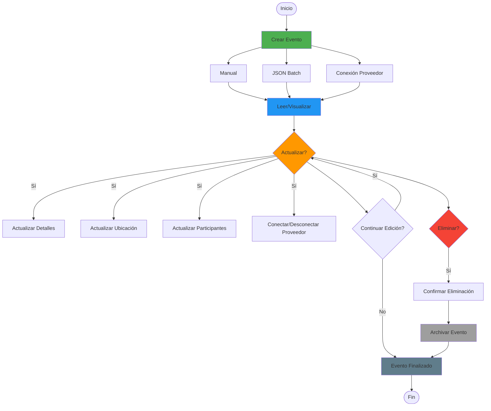

# 📅 Flujo de Vida Completa de Eventos (CRUD)

> Define todo el ciclo de vida de un evento: crear, leer, actualizar y eliminar

**Relacionado con:** T51 - Validación de formularios (✅), T105 (✅ Base), T117 - Registro de participantes por evento (✅ Base), T120 - Confirmación de eventos (✅ Base Fases 1 y 2), T121, T110, T101 ✅, T102 ✅, T153 ✅, T100 ✅, T225 - Google Places (✅), T131 - Calendarios externos, T134 - Importación desde Email, T146 - Oráculo de Delfos, T147 - Valoraciones  
**Nota:** Los eventos comparten estructura **Parte Común/Parte Personal** similar a los alojamientos (ver FLUJO_CRUD_ALOJAMIENTOS)  
**Versión:** 1.5  
**Fecha:** Febrero 2026 (T225 - lugar del evento con Google Places)

---

## 🎯 Objetivo

Documentar todos los escenarios del ciclo de vida completo de un evento: desde su creación hasta su eliminación, incluyendo lectura, visualización, actualizaciones, importación y sincronización con proveedores.

**Estructura Parte Común/Parte Personal:** Los eventos soportan información compartida (EventCommonPart) e individual por participante (EventPersonalPart), similar a los alojamientos.

---

## 🔄 Diagrama del Ciclo de Vida de Eventos


```mermaid
graph TB
    Start([Inicio]) --> CreateEvent[Crear Evento]
    
    CreateEvent --> Manual[Manual]
    CreateEvent --> JSON[JSON Batch]
    CreateEvent --> Provider[Conexión Proveedor]
    
    Manual --> Read[Leer/Visualizar]
    JSON --> Read
    Provider --> Read
    
    Read --> Update{Actualizar?}
    
    Update -->|Sí| UpdateDetails[Actualizar Detalles]
    Update -->|Sí| UpdateLocation[Actualizar Ubicación]
    Update -->|Sí| UpdateParticipants[Actualizar Participantes]
    Update -->|Sí| ConnectProvider[Conectar/Desconectar Proveedor]
    
    Update --> Delete{Eliminar?}
    
    Delete -->|Sí| DeleteConfirm[Confirmar Eliminación]
    DeleteConfirm --> Archive[Archivar Evento]
    
    Update --> Keep{Continuar Edición?}
    Keep -->|Sí| Update
    Keep -->|No| Complete[Evento Finalizado]
    
    Archive --> Complete
    Complete --> End([Fin])
    
    style CreateEvent fill:#4CAF50
    style Read fill:#2196F3
    style Update fill:#FF9800
    style Delete fill:#F44336
    style Archive fill:#9E9E9E
    style Complete fill:#607D8B
```

---

## 📊 ESTADOS DE EVENTOS

| Estado | Descripción | Editable | Eliminable | Visible Para |
|--------|-------------|----------|------------|--------------|
| **Borrador** | Evento en creación | ✅ Todo | ✅ Sí | Solo creador |
| **Pendiente** | Evento creado, no confirmado | ✅ Casi todo | ✅ Sí | Asignados + organizador |
| **Confirmado** | Evento confirmado | ⚠️ Limitado | ⚠️ Con confirmación | Todos |
| **En Curso** | Evento ejecutándose | ⚠️ Solo urgente | ❌ No | Todos |
| **Completado** | Evento terminado | ❌ No | ❌ No | Todos |
| **Cancelado** | Evento cancelado | ❌ No | ❌ No | Todos |

**Nota:** La estructura **Parte Común/Parte Personal** permite que cada participante tenga información específica:
- **EventCommonPart**: Descripción, fecha, hora, ubicación compartida
- **EventPersonalPart** (por participante): Asiento, menú especial, notas, campos personalizados

---

## 📋 CICLO DE VIDA DE EVENTOS

### 1. CREAR EVENTO

#### 1.1 - Creación Manual (Durante Planificación)

**Cuándo:** Durante planificación normal del plan  
**Quién:** Organizador o participante con permisos

**Flujo completo:**
```
Usuario → "Añadir evento"
  ↓
Opciones de creación:
- "Crear manualmente" (formulario)
- "Importar desde email" (T134)
- "💡 Sugerencias inteligentes" (T146 - Oráculo de Delfos) [Opcional - si está disponible]
  ↓
Si selecciona "Crear manualmente":
  ↓
Mostrar sugerencias contextuales del Oráculo de Delfos (T146) si disponible:
- Sugerencias de restaurantes cercanos (si es hora de comida)
- Actividades similares que otros usuarios han añadido
- Complementos naturales (ej: si añades "Museo", sugiere "Café cercano")
  ↓
Abrir formulario (T121)
  ↓
Completar campos:
- Título (requerido)
- Fecha (dentro del rango del plan)
- Hora inicio
- Duración
- Tipo (Desplazamiento/Restauración/Actividad) [Nota: Alojamientos son entidad separada, ver FLUJO_CRUD_ALOJAMIENTOS]
- Subtipo (Avión/Tren/Restaurante/Museo/etc.)
- Participantes asignados
- Ubicación / Lugar (opcional, T225): búsqueda con Google Places; al elegir una sugerencia se rellena el campo Lugar; aparece tarjeta de ubicación con dirección y botón "Abrir en Google Maps". Se guarda en location y en extraData (placeLat, placeLng, placeAddress, placeName). Formulario con estética tipo login.
- Número de vuelo (T246, solo Desplazamiento / Avión): campo opcional "Número de vuelo" (formato IATA, ej. IB6842); botón "Obtener datos del vuelo" llama a Amadeus On-Demand Flight Status vía Cloud Function; se rellenan descripción, fecha, hora de inicio y duración; se guarda en extraData (flightNumber, originIata, destinationIata, departureScheduled, arrivalScheduled, durationMinutes, airlineName). Configuración: docs/configuracion/CONFIGURAR_AMADEUS_FLIGHT_STATUS.md.
- Presupuesto si aplica (T101/T153):
  - Moneda local del coste (EUR/USD/GBP/JPY) (T153)
  - Coste por persona o total (T101)
  - Conversión automática a moneda del plan si diferente (T153)
  ↓
Validaciones (T51):
- Título no vacío
- Fecha dentro del rango del plan
- Participantes existen
- No solapamientos (si no es borrador)
- Timezone válido
- Ubicación coherente con tipo
  ↓
Guardar evento en Firestore:
- Crear Event document con todos los campos
- Asignar eventId único
- Establecer planId del plan actual
- Establecer userId del creador
- Estado: "Pendiente" o "Borrador" según configuración
  ↓
Validar permisos de creación:
- ¿Usuario tiene permisos para crear eventos en este plan?
- ¿Plan no está "Finalizado" ni "Cancelado"?
- ¿Plan está en estado editable?
  ↓
Asignar a tracks de participantes (participantTrackIds)
  ↓
Detectar solapamientos automáticamente:
- ¿Hay conflictos de horario con eventos existentes?
- ¿Participantes ya tienen eventos en ese rango?
- Mostrar advertencia si hay solapamientos (opcional)
  ↓
Crear evento en calendario
  ↓
Notificar a participantes asignados (T105):
- Email estándar de notificación
- Incluir detalles del evento
  ↓
Actualizar presupuesto del plan (T101):
- Recalcular presupuesto total (en moneda del plan)
- Actualizar coste por persona si aplica
- Coste guardado en moneda del plan (convertido si necesario) (T153)
  ↓
Estado: "Pendiente" o "Confirmado" según configuración automática
```

#### 1.2 - Creación desde Email de Confirmación (T134)

**Cuándo:** Usuario quiere importar información de un email de confirmación (vuelo, tren, reserva)  
**Quién:** Organizador o participante con permisos

**Flujo:**
```
Usuario → "Añadir evento" → "Importar desde email"
  ↓
Mostrar opciones de entrada:
- "Pegar contenido del email"
- "Subir archivo .eml" (si es posible)
  ↓
Usuario pega/sube contenido del email
  ↓
Sistema detecta proveedor:
- Analiza contenido (texto/HTML)
- Identifica proveedor: Iberia, Renfe, Booking.com, etc.
- Selecciona parser correspondiente
  ↓
Parser extrae información:
- Fechas y horarios
- Ubicaciones (origen/destino)
- Números de reserva/localizadores
- Detalles específicos (gate, asiento, coche, etc.)
  ↓
Mapear a modelo Event:
- Determinar tipo: "Desplazamiento"
- Determinar subtipo: "Avión" (Iberia) o "Tren" (Renfe)
- Rellenar Parte Común con información extraída
- Campos personales básicos (asiento, número reserva, gate)
  ↓
Mostrar previsualización:
┌─────────────────────────────────────┐
│ 📧 Evento sugerido desde email     │
│                                     │
│ ✈️ Vuelo Madrid → Barcelona        │
│ 📅 15/03/2025, 10:30h - 12:00h    │
│ 🎫 Localizador: ABC123            │
│ 🪑 Asiento: 12A                    │
│ 🚪 Gate: A5                        │
│                                     │
│ [Editar campos] [Crear evento]     │
│ [Cancelar]                         │
└─────────────────────────────────────┘
  ↓
Usuario puede editar/corregir campos antes de crear
  ↓
Si confirma: Crear evento normalmente (como creación manual)
  ↓
Evento creado en el plan
  ↓
Si error o email no reconocido:
  ↓
Mostrar mensaje: "No se pudo reconocer el email. 
Puedes crear el evento manualmente o intentar con otro formato."
  ↓
Opción: Crear manualmente con datos sugeridos si hubo extracción parcial
```

**Proveedores soportados (MVP):**
- Iberia (vuelos): fecha/hora, origen/destino, gate, localizadores, asiento
- Renfe (trenes): fecha/hora, origen/destino, coche/asiento, localizador
- Booking.com (alojamientos → ver FLUJO_CRUD_ALOJAMIENTOS.md)

**Notas:**
- Parsing determinístico por patrones (regex/plantillas) en MVP
- Internacionalización: plantillas EN/ES
- Sanitización de HTML antes de procesar
- No almacenar el cuerpo completo del email por privacidad
- Ver T134 para detalles técnicos completos

#### 1.3 - Creación con Conexión a Proveedor

**Cuándo:** Al crear evento, decidir si conectarlo con proveedor externo  
**Quién:** Usuario creando el evento

**Flujo:**
```
Usuario → "Añadir evento"
  ↓
Formulario de creación normal
  ↓
Campo adicional: "Conectar con proveedor" [checkbox]
  ↓
Si marca checkbox:
  ↓
Buscar proveedor:
- "Iberia" (vuelos)
- "Renfe" (trenes)
- "Restaurante El Jardín" (restauración)
- "Museo del Prado" (actividades)
  ↓
Seleccionar proveedor
  ↓
Autorizar conexión:
"El proveedor podrá actualizar automáticamente:
- Hora de salida/llegada
- Puerta/terminal
- Cancelaciones
- Otros cambios

¿Autorizar?"
  ↓
Guardar evento + configuración API
  ↓
Evento creado con sincronización activa
  ↓
Badge visible: "✅ Actualizado por Iberia"
```

**Sincronización automática después de la creación:**
```
Sistema verifica actualizaciones periódicamente
  ↓
Proveedor tiene cambios
  ↓
Mostrar al usuario: "Cambios pendientes"
  ↓
Usuario acepta/rechaza cambios
  ↓
Actualizar evento si acepta
```

#### 1.3 - Creación de Evento Urgente (Durante Ejecución)

**Cuándo:** Durante ejecución del plan, decisión de último momento  
**Quién:** Solo organizador

**Flujo:**
```
Organizador → "Crear evento urgente"
  ↓
Modal de advertencia: "⚠️ CREAR EVENTO URGENTE

Este evento se ejecutará muy pronto.

¿Continuar?"
  ↓
Formulario simplificado:
- Título
- Hora (próximas 6h)
- Ubicación
- Participantes (auto-asignar a todos)
  ↓
Configurar alarma inmediata (T110)
  ↓
Guardar con estado "Confirmado"
  ↓
Notificar urgentemente a todos (T105)
  ↓
Aparece en calendario en tiempo real
```

---

### 2. LEER/VISUALIZAR EVENTO

#### 2.1 - Vista Detallada del Evento

**Flujo:**
```
Usuario hace click en evento
  ↓
Validar permisos de lectura:
- ¿Usuario tiene acceso al plan?
- ¿Usuario puede ver este evento? (PlanParticipation activa)
- ¿Evento está visible según estado del plan?
  ↓
Verificar estado del evento:
- Si evento está "Cancelado": mostrar vista con estado cancelado
- Si evento está "Completado": mostrar vista de solo lectura
  ↓
Mostrar modal/detalle completo:
┌────────────────────────────────────┐
│ Vuelo Madrid → Sydney              │
│ ━━━━━━━━━━━━━━━━━━━━━━━━━━━━━━━   │
│                                    │
│ 📅 Fecha: 22/10/2025               │
│ 🕐 Hora: 20:00h - 10:00h          │
│ 📍 Origen: Madrid (T4)           │
│ 📍 Destino: Sydney                │
│ 👥 Participantes:                 │
│    • Juan (organizador)           │
│    • María                        │
│    • Pedro                        │
│                                    │
│ 💰 Coste: €300 (€100/persona)     │
│ 🔄 Actualizado por: Iberia       │
│                                    │
│ [Editar] [Eliminar] [Ver historial]
└────────────────────────────────────┘
```

#### 2.2 - Información Contextual

**Campos mostrados:**
- Título, fecha, hora
- Duración y ruta (para desplazamientos)
- Ubicaciones (origen y destino)
- Participantes con roles
- Coste y presupuesto (T101)
- Estado del evento
- Historial de actualizaciones automáticas
- Próximo evento relacionado

---

### 3. ACTUALIZAR EVENTO

#### 3.1 - Actualizar Hora del Evento

**Escenarios según magnitud:**

##### Cambio Leve (<1h)
```
Editar hora: 20:00 → 20:30

Acción: Editar y guardar
Notificación: Email estándar
Reconfirmación: No requerida
```

##### Cambio Significativo (1-4h)
```
Editar hora: 20:00 → 22:00

Acción: Editar y guardar
Notificación: Email + Push urgente
Reconfirmación: Opcional
```

##### Cambio Drástico (>4h o cambio de día)
```
Editar: Lunes 20:00 → Martes 08:00

Acción: Modal de confirmación crítica
Notificación: Email + Push críticos
Reconfirmación: OBLIGATORIA
```

#### 3.2 - Actualizar Ubicación

**Escenarios según distancia:**
- Misma ubicación → Notificación baja
- Cercano (<2km) → Notificación normal
- Lejano (>2km) → Notificación alta
- Otra ciudad/país → Reconfirmación obligatoria

#### 3.3 - Actualizar Participantes

**Añadir participante:**
- Actualizar track
- Notificar participante añadido
- Notificar a otros (si límite de plazas)
- Recalcular presupuesto

**Eliminar participante:**
- Actualizar track
- Notificar participante eliminado
- Calcular reembolso si pagó (T102)

#### 3.4 - Actualizar Presupuesto

**Flujo:**
```
Editar coste del evento
  ↓
Actualizar presupuesto total (T101)
  ↓
Recalcular distribución (T102)
  ↓
Notificar si cambio >€50 o >20%
```

#### 3.5 - Conectar/Desconectar Proveedor en Evento Existente

**Conectar proveedor a evento ya creado:**
```
Usuario → Evento → "Gestión"
  ↓
"Conectar con proveedor"
  ↓
Buscar proveedor en catálogo
  ↓
Autorizar conexión
  ↓
Generar API key
  ↓
Badge visible: "✅ Actualizado por [Proveedor]"
```

**Desconectar proveedor:**
```
Usuario → Evento conectado → "Desconectar proveedor"
  ↓
Confirmación: "¿Desconectar de [Proveedor]?"
  ↓
Desconectar
  ↓
Evento vuelve a ser manual
Badge desaparece
```

#### 3.6 - Actualización Automática desde Proveedor

**Flujo de sincronización:**
```
Sistema verifica actualizaciones periódicamente
  ↓
Proveedor tiene cambios
  ↓
API del proveedor: GET /api/v1/event-updates/{eventId}
{
  "eventId": "abc123",
  "updatedAt": "2025-01-15T10:30:00Z",
  "changes": {
    "departureTime": "20:30",  // Era 20:00
    "gate": "A5"  // Era A3
  },
  "metadata": {
    "provider": "Iberia",
    "reservationNumber": "IBE123"
  }
}
  ↓
Mostrar al usuario notificación:
"🔄 El evento 'Vuelo a Sydney' tiene cambios desde Iberia

Cambios:
- Hora de salida: 20:00 → 20:30
- Puerta: A3 → A5

[Aceptar cambios] [Ver detalles] [Ignorar]"
  ↓
Si acepta: Actualizar evento
  ↓
Notificar a participantes (T105)
Actualizar alarmas (T110)
Recalcular solapamientos
```

**Consideraciones de seguridad:**
- API Key segura por evento
- Rate limiting en API
- Validar origen de actualizaciones
- Logging de todas las actualizaciones automáticas
- Usuario siempre tiene control (aceptar/rechazar)

---

### 4. ELIMINAR EVENTO

#### 4.1 - Eliminar durante Planificación (>7 días antes)

**Flujo simple:**
```
Seleccionar evento
"Eliminar evento"
  ↓
Confirmación
  ↓
Verificar permisos:
- ¿Usuario tiene permisos para eliminar eventos?
- ¿Evento está en estado eliminable?
  ↓
Eliminar de Firestore:
- Eliminar Event document
- Eliminar documentos adjuntos de Firebase Storage (si hay)
  ↓
Actualizar tracks de participantes:
- Eliminar de participantTrackIds
- Recalcular tracks afectados
  ↓
Recalcular presupuesto del plan (T101):
- Actualizar presupuesto total
- Recalcular distribución (T102) si hay pagos
  ↓
Notificar a participantes asignados (T105)
```

#### 4.2 - Eliminar cercano a ejecución (1-7 días)

**Flujo con advertencia:**
```
Seleccionar evento cercano
  ↓
Modal de advertencia:
"⚠️ ELIMINAR EVENTO CERCANO

Quedan [X] días.

¿Estás seguro?"

Razón (opcional)
  ↓
Verificar permisos y estado
  ↓
Eliminar de Firestore
  ↓
Calcular reembolsos si hay pagos pendientes (T102)
  ↓
Recalcular presupuesto (T101)
  ↓
Notificar urgentemente a participantes (T105):
- Email urgente de eliminación
- Push notification
- Informar sobre reembolsos si aplica
```

#### 4.3 - Cancelar evento inminente (<24h)

**NO se puede eliminar, solo cancelar:**
```
Seleccionar evento <24h
"Eliminar" → BLOQUEADO
  ↓
Mostrar opción: "Cancelar evento"
  ↓
Modal crítico:
"🚨 CANCELAR EVENTO INMINENTE

Este evento empieza en [X] horas.

Motivo de cancelación: [obligatorio]

¿Cancelar?"
  ↓
Cambiar estado a "Cancelado" (no eliminar):
- Actualizar Event.state en Firestore
- Mantener evento visible en calendario con badge "Cancelado"
  ↓
Calcular reembolsos inmediatos (T102):
- Para cada participante que pagó
- Generar reembolso automático
- Notificar por email crítico
  ↓
Notificar críticamente a participantes (T105):
- Email crítico de cancelación
- Push urgente
- SMS (si configurado)
- Incluir motivo de cancelación
  ↓
Actualizar presupuesto (T101):
- Recalcular presupuesto total
- Actualizar distribución
```

#### 4.4 - Evento pasado (no se puede eliminar)

```
Intento eliminar evento pasado
  ↓
Mostrar opciones alternativas:
- Marcar como "no realizado"
- Añadir nota post-evento
- Añadir foto
- Valorar el evento (T147) - Sistema de valoraciones
```

#### 4.5 - Valorar Evento Completado

**Cuándo:** Después de que un evento se completa o finaliza  
**Quién:** Participantes que asistieron o estaban invitados

**Flujo:**
```
Evento en estado "Completado" o fecha/hora del evento pasada
  ↓
Sistema detecta: Evento completado
  ↓
Mostrar prompt de valoración (no intrusivo):
"⭐ ¿Cómo valorarías este evento?

[5 estrellas interactivas]

[Comentario opcional...]

[Valorar ahora] [Recordar más tarde] [No valorar]"
  ↓
Si usuario valora:
- Guardar valoración (T147)
- Actualizar valoraciones agregadas del evento
- Opcional: Mostrar gracias
  ↓
Valoración disponible para:
- Oráculo de Delfos (T146) - recomendaciones futuras
- Estadísticas del plan
- Visualización en vista del evento (promedio)
```

---

### 5. EXPORTACIÓN E IMPORTACIÓN DE CALENDARIOS EXTERNOS (T131)

#### 5.1 - Exportar Evento a Calendario Externo

**Cuándo:** Exportar un evento individual a calendario externo  
**Quién:** Cualquier participante del evento

**Flujo:**
```
Usuario → Evento → "Exportar a calendario" (T131)
  ↓
Generar archivo .ics del evento:
- Crear archivo iCalendar (RFC 5545) con un solo evento
- Incluir: título, fecha/hora, descripción, ubicación, timezone
- Información personal si usuario es el creador
  ↓
Opciones:
- "Descargar archivo .ics"
- "Compartir archivo"
- "Abrir con app de calendario"
  ↓
Usuario puede añadir el evento a su calendario externo
```

#### 5.2 - Importar Eventos desde Archivo .ics

**Cuándo:** Importar eventos desde un archivo .ics externo al plan  
**Quién:** Organizador o participante con permisos

**Flujo:**
```
Usuario → Plan → "Importar desde calendario" (T131)
  ↓
Ver FLUJO_CRUD_PLANES.md sección 5.4 para flujo completo
```

**Nota:** La importación desde .ics se gestiona a nivel de plan, no de evento individual. Ver FLUJO_CRUD_PLANES.md sección 5.4.

---

### 6. IMPORTACIÓN BATCH DE EVENTOS

#### 6.1 - Importar Múltiples Eventos desde JSON

**Cuándo:** Importar muchos eventos a la vez desde archivo JSON  
**Quién:** Organizador del plan  
**Propósito:** Ahorrar tiempo creando eventos uno por uno

**Formato JSON de importación:**
```json
{
  "formatVersion": "1.0",
  "planId": "optional_if_linking_to_existing",
  "events": [
    {
      "title": "Vuelo Madrid → Sydney",
      "type": "Desplazamiento",
      "subtype": "Avión",
      "date": "2025-10-22",
      "startTime": "20:00",
      "duration": 840,
      "timezone": "Europe/Madrid",
      "arrivalTimezone": "Australia/Sydney",
      "location": {
        "name": "Aeropuerto Adolfo Suárez Madrid-Barajas",
        "address": "28042 Madrid, Spain",
        "coordinates": { "lat": 40.4839, "lng": -3.5679 }
      },
      "arrivalLocation": {
        "name": "Aeropuerto Sydney",
        "address": "Sydney NSW 2020, Australia",
        "coordinates": { "lat": -33.9399, "lng": 151.1753 }
      },
      "participants": ["user1", "user2"],
      "cost": 300.00,
      "costPerPerson": true
    },
    {
      "title": "Taxi al hotel",
      "type": "Desplazamiento",
      "subtype": "Taxi",
      "date": "2025-10-23",
      "startTime": "01:30",
      "duration": 90
      // ... más campos
    }
  ]
}
```

**Flujo de importación:**
```
Organizador → Plan → "Importar eventos"
  ↓
Seleccionar archivo JSON
  ↓
Validar formato JSON y versión
  ↓
Extraer eventos del JSON
  ↓
Preview: "Se importarán [N] eventos al plan '[Nombre]'

1. Vuelo Madrid → Sydney (22/10, 20:00h)
2. Taxi al hotel (23/10, 01:30h)
3. Check-in hotel (23/10, 14:00h)
...
[N] eventos totales"
  ↓
Validar cada evento:
- Fecha en rango del plan
- Participantes existen en el plan
- Sin solapamientos con eventos existentes
- Ubicación válida
- Datos completos
  ↓
Mostrar errores si los hay:
"⚠️ Errores detectados en [M] eventos:

- Evento 3: Usuario 'x' no está en el plan
- Evento 5: Fecha fuera del rango (25/10, plan termina 24/10)
- Evento 7: Faltan campos requeridos

¿Importar solo eventos válidos?"
  ↓
Usuario selecciona opción:
- [Importar todos]
- [Solo eventos válidos]
- [Cancelar]
  ↓
Si importa: Crear cada evento válido (como si se crearan manualmente)
  ↓
Mostrar resumen:
"✅ Importados: [N] eventos
⚠️ Omitidos: [M] eventos (errores)

Eventos creados:
- Vuelo Madrid → Sydney
- Taxi al hotel
- Check-in hotel
..."
```

**Consideraciones:**
- Los eventos importados se crean como eventos normales
- Después de importar: se pueden conectar con proveedores (sección 3.5)
- Los eventos importados pueden editarse/eliminarse normalmente
- Posibilidad de exportar formato JSON de vuelta (para compartir templates)

#### 6.2 - Exportar Múltiples Eventos a JSON

**Cuándo:** Compartir plan con otros usuarios o hacer backup  
**Quién:** Organizador

**Flujo:**
```
Organizador → Plan → "Exportar eventos"
  ↓
Seleccionar eventos a exportar:
- [ ] Todos los eventos
- [ ] Solo eventos de tipo: [selector]
- [ ] Eventos entre fechas: [selector]
- [ ] Seleccionar manualmente
  ↓
Generar archivo JSON
  ↓
Descargar o compartir archivo JSON
  ↓
Otro usuario puede importarlo en su plan
```

---

### 7. HISTORIAL Y AUDITORÍA

#### 7.1 - Ver Historial de Cambios

**Sistema de auditoría:**
```
Abrir evento
  ↓
"Ver historial de cambios"
  ↓
Timeline:
- [Hace 2 días] Juan cambió hora: 20:00 → 20:30
- [Hace 1 semana] María añadió participante Pedro
- [Hace 3 días] Sistema actualizó desde Iberia: puerta A3 → A5
- [Hace 2 semanas] Juan creó el evento
```

**Información registrada:**
- Quién hizo el cambio (usuario o proveedor)
- Cuándo (timestamp)
- Qué cambió (campo)
- De/ A (valores)
- Motivo (opcional)

---

## 🔔 NOTIFICACIONES POR TIPO DE CAMBIO

| Tipo de Cambio | Prioridad | Notificación | Canal |
|----------------|-----------|--------------|-------|
| Crear evento (planificación) | Normal | ✅ Email | Email estándar |
| Crear evento (urgente) | Alta | ✅ Sí | Email + Push urgente |
| Cambio hora <1h | Baja | ⚠️ Opcional | Email + Push opcional |
| Cambio hora 1-4h | Alta | ✅ Sí | Email + Push |
| Cambio hora >4h | Crítica | ✅ Sí urgente | Email + Push urgente |
| Cambio día | Crítica | ✅ Sí urgente | Email + Push urgente |
| Cambio ubicación cercana | Normal | ✅ Email | Email estándar |
| Cambio ubicación lejana | Alta | ✅ Urgente | Email + Push |
| Cambio ciudad/país | Crítica | ✅ Crítico | Email + Push + SMS |
| Añadir participante | Normal | ✅ Sí | Email + Push |
| Eliminar participante | Alta | ✅ Sí urgente | Email + Push |
| Eliminar evento >7 días | Normal | ✅ Email | Email estándar |
| Eliminar evento 1-7 días | Crítica | ✅ Urgente | Email + Push urgente |
| Cancelar evento <24h | Crítico | ✅ Crítico | Email + Push + SMS |
| Actualización automática proveedor | Normal | ⚠️ Pendiente aprobación | Notificación en app |

---

## 📋 TAREAS RELACIONADAS

**Pendientes:**
- T121: Formularios enriquecidos para eventos
- T105: Sistema de notificaciones
- T110: Sistema de alarmas
- T120: Sistema de reconfirmación
- T51: Validación de formularios
- T101: Integración con presupuesto
- T102: Integración con pagos
- Historial de cambios/auditoría
- Importación JSON
- API de sincronización con proveedores

**Completas ✅:**
- Crear eventos básicos
- Modificar eventos básicos
- Sistema de tracks
- Timezone-aware

---

## ✅ IMPLEMENTACIÓN ACTUAL

**Estado:** ✅ Core implementado, mejoras pendientes

**Lo que ya funciona:**
- ✅ Crear eventos con validaciones (T51)
- ✅ Editar título, fecha, hora, duración con sanitización
- ✅ Asignar participantes con validación
- ✅ Gestionar timezones
- ✅ Sistema de tracks
- ✅ Validación de solapamientos (conflictos de participantes)
- ✅ Validación de límite de 3 eventos solapados
- ✅ Confirmación de eliminación con detalles
- ✅ Sanitización de inputs (T127)
- ✅ Rate limiting de creación (T126)
- ✅ Campos personales con validación y sanitización
- ✅ Manejo de borradores (pueden solaparse)
- ✅ `mounted` checks aplicados

**Lo que falta (CRÍTICO):**
- ❌ Formularios específicos enriquecidos por tipo (T121)
- ❌ Sistema completo de estados (Borrador/Pendiente/Confirmado, etc.) - T120
- ❌ Reconfirmación para cambios drásticos (>4h o cambio de día) - T120
- ❌ Notificaciones automáticas por cambios - T105
- ❌ Sistema de alarmas (T110)
- ❌ Historial de cambios/auditoría
- ✅ Integración presupuesto/pagos (T101/T102) - **COMPLETADA**
- ❌ Importación JSON batch
- ❌ API de sincronización con proveedores

---

*Documento de flujo CRUD completo de eventos*  
*Última actualización: Febrero 2026*

