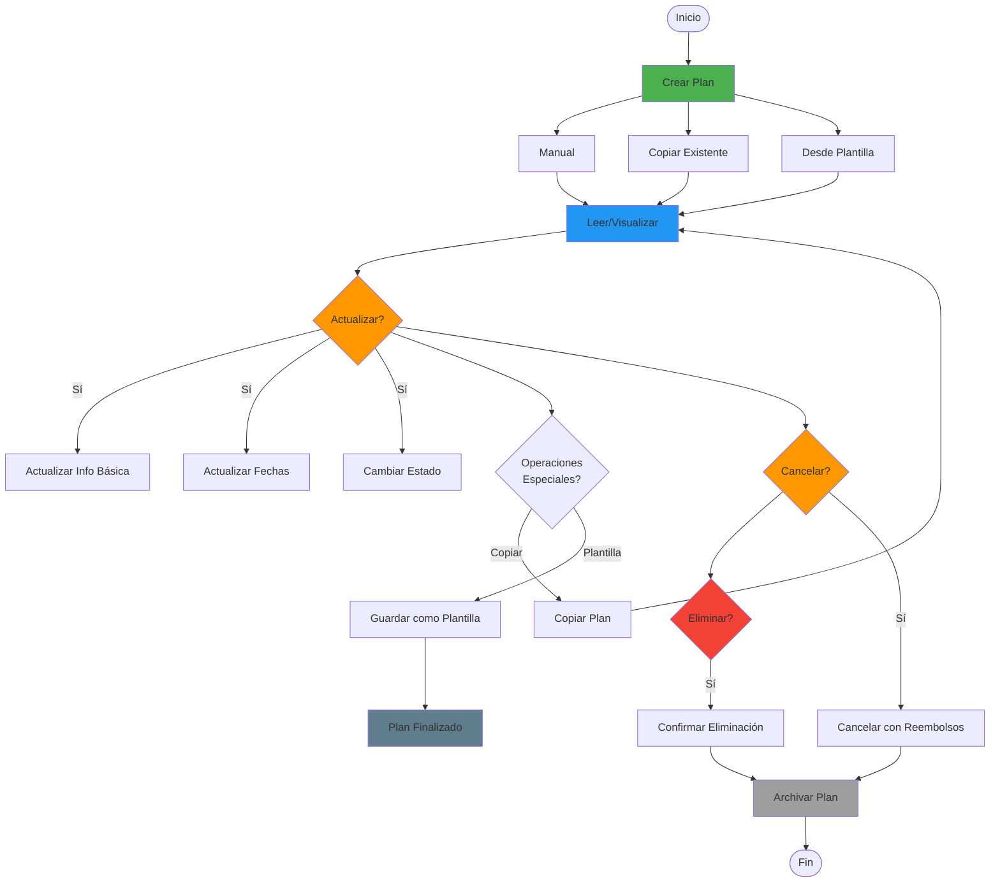

# 📋 Flujo de Vida Completa de Planes (CRUD)

> Define todo el ciclo de vida de un plan: crear, leer, actualizar y eliminar

**Relacionado con:** T109, T107, T118, T122  
**Versión:** 1.0  
**Fecha:** Enero 2025

---

## 🎯 Objetivo

Documentar todos los escenarios del ciclo de vida completo de un plan: desde su creación hasta su eliminación, incluyendo lectura, visualización, actualizaciones, copia, archivo y conversión a plantilla.

---

## 🔄 Diagrama del Ciclo de Vida de Planes



---

## 📊 ESTADOS DISPONIBLES

| Estado | Descripción | Editable | Eliminable | Visible Para |
|--------|-------------|----------|------------|--------------|
| **Borrador** | Plan en creación inicial | ✅ Todo | ✅ Sí | Solo creador |
| **Planificando** | Organizador añadiendo contenido | ✅ Casi todo | ✅ Sí | Solo participantes |
| **Confirmado** | Plan listo, esperando inicio | ⚠️ Ajustes menores | ⚠️ Con confirmación | Todos |
| **En Curso** | Plan activo, ejecutándose | ⚠️ Urgencias | ❌ No | Todos |
| **Finalizado** | Plan completado | ❌ No | ❌ No | Todos |
| **Cancelado** | Plan cancelado | ❌ No | ❌ No | Todos |

**Ver detalles de estados y transiciones en:** `FLUJO_ESTADOS_PLAN.md`

---

## 📋 CICLO DE VIDA DE PLANES

### 1. CREAR PLAN

#### 1.1 - Creación Manual (Desde Cero)

**Cuándo:** Usuario crea nuevo plan desde cero  
**Quién:** Usuario registrado

**Flujo completo:**
```
Usuario → Dashboard → "Crear plan"
  ↓
Formulario inicial:
- Nombre del plan (requerido, validar longitud)
- Fechas: inicio y fin (requerido, validar rango)
- Descripción (opcional, máximo 1000 caracteres)
- Imagen del plan (opcional, máx 5MB)
- Visibilidad: Público/Privado (default: Privado)
- Timezone: Auto-detectada del organizador (default)
  ↓
Guardar (primer guardado)
  ↓
Crear Plan en Firestore:
- id: Auto-generado
- name: Nombre del plan
- organizerId: userId del creador
- startDate, endDate: Fechas
- description: Descripción
- imageUrl: URL de imagen
- visibility: "private" o "public"
- timezone: Timezone del organizador
- state: "borrador"
- createdAt: Timestamp
- updatedAt: Timestamp
  ↓
Crear PlanParticipation para el organizador:
- planId: ID del plan
- userId: organizerId
- role: "organizer"
- joinedAt: Timestamp
- isActive: true
  ↓
Estado: "Borrador"
  ↓
Usuario completa configuración:
- Añadir participantes (T104)
- Añadir eventos y alojamientos
- Configurar presupuesto (T101)
- Configurar alarmas (T110)
  ↓
Guardar cambios
  ↓
Validaciones automáticas:
- ¿Tiene al menos 1 evento?
- ¿Tiene al menos 1 participante además del organizador?
- ¿Fechas son coherentes?
  ↓
Si cumple validaciones: Estado: "Planificando"
Si no cumple: Mantener "Borrador" con aviso
  ↓
Organizador marca como "listo" (opcional)
  ↓
Si marca "listo": Estado: "Confirmado"
```

#### 1.2 - Creación por Copia (T118)

**Cuándo:** Copiar plan existente como base  
**Quién:** Usuario con acceso al plan original

**Flujo:**
```
Usuario → Plan existente → "Copiar plan"
  ↓
Configuración de copia:
"¿Qué copiar?"

[ ] Estructura completa (eventos, participantes, presupuesto)
[ ] Solo eventos (sin participantes)
[ ] Solo evento [evento específico]
[ ] Copiar participantes del plan original

Fechas nuevas:
- Desde: [nueva fecha inicio]
- Hasta: [nueva fecha fin]
  ↓
Ajustar fechas automáticamente según nueva fecha inicio
  ↓
Generar nombre: "[Nombre Original] - Copia"
  ↓
Crear nuevo plan:
- Generar nuevo ID de plan
- Copiar campos base (nombre, descripción, etc.)
- Asignar nuevo organizerId (el usuario que copia)
- Ajustar fechas según nuevas fechas definidas
- Estado: "Planificando" (default, independiente del original)
  ↓
Copiar eventos si se seleccionó:
- Para cada evento: crear nuevo evento en nuevo plan
- Ajustar fechas relativas de eventos
- Copiar detalles, participantes, presupuesto
  ↓
Si se copió con participantes:
- Crear invitaciones pendientes para participantes originales
- No añadir directamente sin confirmación
  ↓
Notificar a participantes originales (opcional):
"El plan '[Nombre]' ha sido copiado por [Usuario].
Estás invitado a participar en el nuevo plan. ¿Te gustaría unirte?"
  ↓
Permisos requeridos:
- Copiar plan: Solo si tienes acceso al plan original
- Si el plan es privado: Solo participantes o el organizador pueden copiar
- Si el plan es público: Cualquiera puede copiar
```

#### 1.3 - Creación desde Plantilla (T122)

**Cuándo:** Usar plantilla guardada como base  
**Quién:** Usuario registrado

**Flujo:**
```
Usuario → Dashboard → "Crear desde plantilla"
  ↓
Buscar plantillas:
- Plantillas públicas
- Mis plantillas
- Plantillas guardadas
  ↓
Seleccionar plantilla
  ↓
Preview de la plantilla:
"Plantilla: Vacaciones Londres

Incluye:
- 15 eventos (vuelo, hotel, visitas)
- 4 alojamientos
- Estructura de presupuesto
- Listas sugeridas

Nombre del plan: [Vacaciones Londres 2025]
Fechas: [22/11/2025] - [28/11/2025]"
  ↓
Usuario completa:
- Nombre del plan
- Fechas nuevas
- Participantes iniciales
  ↓
Cargar plantilla
  ↓
Ajustar eventos a nuevas fechas automáticamente
  ↓
Estado: "Planificando"
```

---

### 2. LEER/VISUALIZAR PLAN

#### 2.1 - Vista General del Plan

**Flujo:**
```
Usuario hace click en plan
  ↓
Validar permisos:
- ¿Usuario tiene acceso al plan? (PlanParticipation.isActive == true)
- ¿Plan es público o el usuario es participante?
  ↓
Verificar estado del plan:
- Si plan está "Cancelado" o "Finalizado": mostrar vista de solo lectura
- Si plan está "Borrador" y usuario no es organizador: bloquear acceso
  ↓
Mostrar pantalla principal del plan:
┌────────────────────────────────────┐
│ 🏖️ Vacaciones Londres 2025         │
│ ━━━━━━━━━━━━━━━━━━━━━━━━━━━━━━━   │
│ 📅 15/11/2025 - 21/11/2025        │
│ 👥 6 participantes                 │
│ 📊 12 eventos, 2 alojamientos     │
│ 💰 Presupuesto: €3,500            │
│ 🔔 Estado: Confirmado             │
│                                    │
│ Vista:                            │
│ [Calendario] [Mapa] [Resumen]     │
│                                    │
│ [Participantes] [Eventos] [Config] │
└────────────────────────────────────┘
```

#### 2.2 - Acceso Según Rol

**Organizador:**
- Ver todo (eventos, participantes, presupuesto)
- Editar configuración del plan
- Gestionar participantes
- Ver estadísticas completas

**Participante:**
- Ver eventos a los que está asignado
- Ver su propio track
- Editar parte personal de eventos
- Ver presupuesto total

**Observador:**
- Ver estructura del plan
- Ver eventos (sin detalles personales)
- Solo lectura

---

### 3. ACTUALIZAR PLAN

#### 3.1 - Actualizar Información Básica

**Cuándo:** Cambiar nombre, descripción, imagen, visibilidad  
**Quién:** Solo organizador (y coorganizadores)

**Flujo:**
```
Organizador → Plan → "Editar información"
  ↓
Formulario editable:
- Nombre del plan
- Descripción
- Imagen
- Visibilidad (Público/Privado)
  ↓
Si cambió visibilidad (Privado → Público):
- Modal de confirmación crítica:
  "⚠️ HACER PLAN PÚBLICO
  Estás a punto de hacer este plan público.
  
  Esto significa:
  - El plan será visible para todos los usuarios
  - Cualquiera puede ver los eventos
  - La información será accesible públicamente
  
  ¿Continuar?"
  ↓
Validaciones:
- Nombre no vacío y longitud válida
- Descripción máxima 1000 caracteres
- Imagen máx 5MB
  ↓
Guardar cambios en Firestore
  ↓
Actualizar timestamp updatedAt
  ↓
Si cambió visibilidad: Notificar críticamente a todos los participantes (T105)
Si cambio significativo: Notificar a participantes (T105)
  ↓
Mostrar confirmación de cambios guardados
```

#### 3.2 - Actualizar Fechas del Plan (T107)

**Cuándo:** Expandir o reducir duración del plan  
**Quién:** Solo organizador

**Escenario: Añadir evento que sale fuera del rango**
```
Crear evento con fecha posterior a fin del plan
  ↓
Sistema detecta: "Este evento está fuera del rango del plan"
  ↓
Modal: "⚠️ EXPANDIR PLAN

El evento está programado para [fecha],
pero el plan termina el [fecha fin actual].

¿Expandir el plan hasta [fecha del evento]?"
  ↓
Si acepta:
- Actualizar fecha fin del plan
- Recalcular columnCount del calendario
- Notificar a todos los participantes
  ↓
Evento se crea correctamente
```

**Escenario: Reducir duración del plan**
```
Modificar fecha fin a fecha anterior
  ↓
Sistema detecta eventos posteriores a nueva fecha
  ↓
Modal: "⚠️ REDUCIR PLAN

Al reducir el plan a [nueva fecha], se afectarán:
- [N] eventos después del [nueva fecha]

¿Continuar?"
  ↓
Opciones:
- Eliminar eventos fuera del rango
- Cancelar y mantener fechas actuales
```

#### 3.3 - Cambiar Estado del Plan

**Ver detalles completos de transiciones en:** `FLUJO_ESTADOS_PLAN.md`

---

### 4. ELIMINAR/CANCELAR PLAN

#### 4.1 - Cancelar Plan (Durante Planificación/Confirmado)

**Cuándo:** Cancelar plan antes de que empiece  
**Quién:** Solo organizador

**Flujo:**
```
Organizador → Plan → "Cancelar plan"
  ↓
Modal de confirmación crítica:
"⚠️ CANCELAR PLAN

Estás a punto de cancelar el plan '[Nombre]'.

Esto:
- Cancelará todos los eventos futuros
- Notificará a todos los participantes
- Calculará reembolsos si hay pagos (T102)
- Marcará el plan como 'Cancelado'

Motivo (opcional): [input]

¿Estás seguro?"

[Cancelar] / [Sí, cancelar]
  ↓
Verificar pagos y presupuesto:
- ¿Hay pagos pendientes? (T102)
- ¿Hay presupuesto comprometido?
  ↓
Sistema:
- Cambiar estado a "Cancelado"
- Cancelar todos los eventos futuros
- Calcular reembolsos (T102):
  - Para cada evento pagado
  - Para cada participante que pagó
  - Generar lista de reembolsos pendientes
  - Enviar emails de reembolso automático
- Notificar críticamente a todos (T105):
  - Email urgente de cancelación
  - Informar sobre reembolsos
  - Razón de cancelación si se proporcionó
- Archivar plan
  ↓
Plan archivado, no se puede reactivar
```

**Impacto:**
- Eventos futuros cancelados
- Reembolsos calculados
- Notificación urgente a participantes
- Plan no se puede reactivar

#### 4.2 - Archivar Plan Finalizado

**Cuándo:** Plan completado y archivado  
**Quién:** Automático al finalizar

**Flujo:**
```
Plan llega a su fecha fin
  ↓
Sistema detecta: "Plan finalizado"
  ↓
Estado automático: "Finalizado"
  ↓
Mostrar opciones:
- "Archivar este plan"
- "Convertir en plantilla" (T122)
- "Ver estadísticas finales" (T113)
  ↓
Si archiva: Plan movido a "Planes archivados"
```

#### 4.3 - Eliminar Plan (Crítico)

**Cuándo:** Eliminar permanentemente un plan  
**Quién:** Solo organizador

**Flujo:**
```
Organizador → Plan → Configuración → "Eliminar plan"
  ↓
Modal de advertencia EXTREMA:
"🚨 ELIMINAR PLAN PERMANENTEMENTE

⚠️⚠️⚠️ ESTA ACCIÓN NO SE PUEDE DESHACER ⚠️⚠️⚠️

Plan: [Nombre]
Participantes: [N] personas
Eventos: [N] eventos
Planes en los que participo: [N]

Esto eliminará:
- Todo el contenido del plan
- Todos los eventos
- Todas las participaciones
- Todo el historial

Escribe '[NOMBRE DEL PLAN]' para confirmar:

[input]

¿Seguro que quieres eliminar?"

[Cancelar] / [Eliminar permanentemente]
  ↓
Sistema:
- Verificar permisos: ¿Usuario es el organizador original?
- Verificar estado: ¿Plan NO está "En Curso" ni "Finalizado" reciente?
  ↓
Calcular y enviar reembolsos finales (si hay pagos pendientes)
  ↓
Eliminar recursos asociados:
- Imagen del plan de Firebase Storage
- Fotos de eventos de Firebase Storage
- Documentos adjuntos de eventos
  ↓
Eliminar de Firestore:
- Plan document
- Todos los eventos relacionados (colección events)
- Todas las participaciones (colección plan_participations)
  ↓
Notificar críticamente a todos los participantes
- Email de eliminación
- Informar sobre reembolsos si aplica
  ↓
Plan eliminado permanentemente e irreversiblemente
```

**Requisitos:**
- Confirmación escrita del nombre del plan
- Plan NO puede estar "En Curso" o "Finalizado" reciente
- Solo organizador original
- Notificación EXTREMA a participantes

---

### 5. OPERACIONES ESPECIALES

#### 5.1 - Copiar Plan (T118)

**Flujo completo:**
```
Ver sección 1.2 (Creación por Copia)
```

#### 5.2 - Guardar como Plantilla (T122)

**Flujo:**
```
Organizador → Plan → "Guardar como plantilla"
  ↓
Formulario:
- Nombre de la plantilla
- Descripción
- Categoría (Vacaciones, Trabajo, Personal, etc.)
- Visibilidad: Pública/Privada
  ↓
Guardar
  ↓
Plantilla creada disponible para:
- Usuario que la creó
- Usuarios públicos (si es pública)
  ↓
Sistema: Copiar estructura del plan a template
- Eventos (sin participantes específicos)
- Estructura de presupuesto
- Listas sugeridas
- Tips y recomendaciones
```

---

## 📋 TAREAS RELACIONADAS

**Pendientes:**
- T118: Copiar planes completos
- T122: Guardar plan como plantilla
- T109: Sistema completo de estados del plan
- T107: Actualización dinámica de duración del plan
- T104: Invitaciones a participantes
- T101: Sistema de presupuesto
- T110: Sistema de alarmas
- Ver FLUJO_ESTADOS_PLAN.md para detalles de transiciones

**Completas ✅:**
- Crear planes básicos
- Configuración inicial de planes
- Sistema de participantes básico

---

## ✅ IMPLEMENTACIÓN ACTUAL

**Estado:** ⚠️ Básico implementado

**Lo que ya funciona:**
- ✅ Crear planes básicos
- ✅ Configurar nombre, fechas, participantes
- ✅ Añadir eventos y alojamientos
- ✅ Sistema de estados básico

**Lo que falta (CRÍTICO):**
- ❌ Sistema completo de estados (T109)
- ❌ Copiar planes (T118)
- ❌ Guardar como plantilla (T122)
- ❌ Actualización dinámica de duración (T107)
- ❌ Cancelación y eliminación con reembolsos (T102)
- ❌ Invitaciones a participantes (T104)
- ❌ Sistema de presupuesto integrado (T101)

---

*Documento de flujo CRUD completo de planes*  
*Última actualización: Enero 2025*

