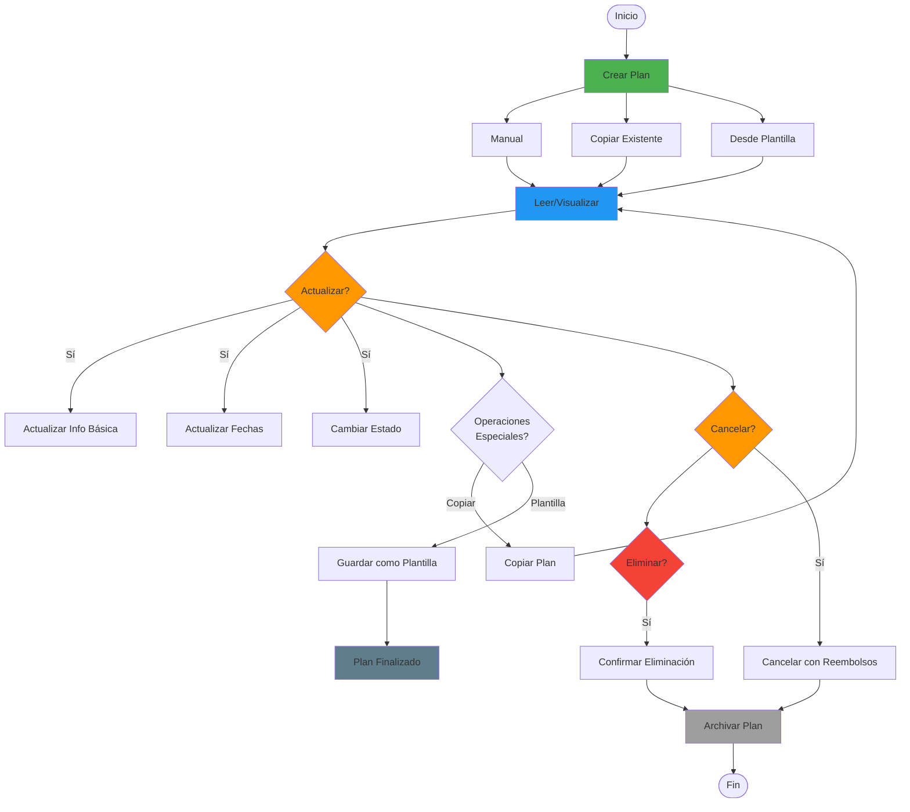

# 📋 Flujo de Vida Completa de Planes (CRUD)

> Define todo el ciclo de vida de un plan: crear, leer, actualizar y eliminar

**Relacionado con:** T109 ✅, T107 ✅, T118, T122, T131 - Calendarios externos, T133 - Exportación PDF, T144 - Gestión del ciclo de vida, T145 - Álbum digital, T147 - Valoraciones, T153 ✅, T101 ✅, T102 ✅  
**Versión:** 1.7  
**Fecha:** Marzo 2026 (info básica: nombre sobre foto; bloqueos T101/T102/T107/T153/T109)

---

## 🎯 Objetivo

Documentar todos los escenarios del ciclo de vida completo de un plan: desde su creación hasta su eliminación, incluyendo lectura, visualización, actualizaciones, copia, archivo y conversión a plantilla.

---

## 🔄 Diagrama del Ciclo de Vida de Planes


```mermaid
graph TB
    Start([Inicio]) --> CreatePlan[Crear Plan]
    
    CreatePlan --> Manual[Manual]
    CreatePlan --> Copy[Copiar Existente]
    CreatePlan --> Template[Desde Plantilla]
    
    Manual --> Read[Leer/Visualizar]
    Copy --> Read
    Template --> Read
    
    Read --> Update{Actualizar?}
    
    Update -->|Sí| UpdateInfo[Actualizar Info Básica]
    Update -->|Sí| UpdateDates[Actualizar Fechas]
    Update -->|Sí| ChangeState[Cambiar Estado]
    
    Update --> Special{Operaciones<br/>Especiales?}
    
    Special -->|Copiar| CopyPlan[Copiar Plan]
    Special -->|Plantilla| SaveTemplate[Guardar como Plantilla]
    
    Update --> Cancel{Cancelar?}
    Cancel --> Delete{Eliminar?}
    
    Cancel -->|Sí| CancelPlan[Cancelar con Reembolsos]
    Delete -->|Sí| DeleteConfirm[Confirmar Eliminación]
    DeleteConfirm --> Archive[Archivar Plan]
    
    CancelPlan --> Archive
    Archive --> End([Fin])
    
    CopyPlan --> Read
    SaveTemplate --> Complete[Plan Finalizado]
    
    style CreatePlan fill:#4CAF50
    style Read fill:#2196F3
    style Update fill:#FF9800
    style Cancel fill:#FF9800
    style Delete fill:#F44336
    style Archive fill:#9E9E9E
    style Complete fill:#607D8B
```

---

## 📊 ESTADOS DISPONIBLES

| Estado | Descripción | Editable | Eliminable | Visible Para |
|--------|-------------|----------|------------|--------------|
| **Planificando** | Estado inicial; organizador añadiendo contenido | ✅ Casi todo | ✅ Sí | Participantes (si invitados) |
| **Confirmado** | Plan listo, esperando inicio | ⚠️ Ajustes menores | ⚠️ Con confirmación | Todos |
| **En Curso** | Plan activo, ejecutándose | ⚠️ Urgencias | ❌ No | Todos |
| **Finalizado** | Plan completado | ❌ No | ❌ No | Todos |
| **Cancelado** | Plan cancelado | ❌ No | ❌ No | Todos |

**Ver detalles de estados y transiciones en:** `FLUJO_ESTADOS_PLAN.md`

---

## 📋 CICLO DE VIDA DE PLANES

### 1. CREAR PLAN

#### 1.1 - Creación manual (modal rápido)

**Cuándo:** Usuario crea nuevo plan desde cero  
**Quién:** Usuario registrado

**Flujo actualizado (2025):**
```
Usuario → Dashboard → botón "Crear plan"
  ↓
Modal rápido:
- Campo único: Nombre del plan (obligatorio)
- Se muestra “ID: …” con el UNP ID generado automáticamente
  ↓
Crear documento en Firestore:
- name: Nombre proporcionado
- organizerId: Usuario actual
- state: "planificando"
- visibility: "private"
- currency: valor por defecto (por ahora EUR)
- timezone: null (se establecerá más tarde) o `defaultTimezone` del organizador si existe
- createdAt / updatedAt
  ↓
Crear `plan_participation` para el organizador (role "organizer", isActive true)
  ↓
Cerrar modal → seleccionar plan en W28 → abrir `PlanDataScreen` en modo edición
  ↓
Desde `PlanDataScreen` el organizador completa:
- Fechas de inicio/fin (pickers con validación)
- Descripción, imagen, visibilidad
- Timezone del plan (dropdown de zonas comunes)
- Presupuesto estimado
- Gestión de estado (“Gestión de estado” card)
- Acceso a `ParticipantsScreen` para invitar y asignar roles
  ↓
Cada cambio relevante muestra banner de “Cambios sin guardar” (botones Guardar / Cancelar)
  ↓
Validaciones automáticas (PlanValidation / PlanStateService):
- Días vacíos, participantes sin eventos, etc.
  ↓
Al cumplir requisitos, el organizador marca como “Listo” → Estado “Confirmado”
```

#### 1.2 - Creación por Copia (T118)

**Cuándo:** Copiar plan existente como base  
**Quién:** Usuario con acceso al plan original

**Flujo:**
```
Usuario → Plan existente → "Copiar plan"
  ↓
Configuración de copia:
"¿Qué copiar?"

[ ] Estructura completa (eventos, participantes, presupuesto)
[ ] Solo eventos (sin participantes)
[ ] Solo evento [evento específico]
[ ] Copiar participantes del plan original

Fechas nuevas:
- Desde: [nueva fecha inicio]
- Hasta: [nueva fecha fin]
  ↓
Ajustar fechas automáticamente según nueva fecha inicio
  ↓
Generar nombre: "[Nombre Original] - Copia"
  ↓
Crear nuevo plan:
- Generar nuevo ID de plan
- Copiar campos base (nombre, descripción, etc.)
- Asignar nuevo organizerId (el usuario que copia)
- Ajustar fechas según nuevas fechas definidas
- Estado: "Planificando" (default, independiente del original)
  ↓
Copiar eventos si se seleccionó:
- Para cada evento: crear nuevo evento en nuevo plan
- Ajustar fechas relativas de eventos
- Copiar detalles, participantes, presupuesto
  ↓
Si se copió con participantes:
- Crear invitaciones pendientes para participantes originales
- No añadir directamente sin confirmación
  ↓
Notificar a participantes originales (opcional):
"El plan '[Nombre]' ha sido copiado por [Usuario].
Estás invitado a participar en el nuevo plan. ¿Te gustaría unirte?"
  ↓
Permisos requeridos:
- Copiar plan: Solo si tienes acceso al plan original
- Si el plan es privado: Solo participantes o el organizador pueden copiar
- Si el plan es público: Cualquiera puede copiar
```

#### 1.3 - Creación desde Plantilla (T122)

**Cuándo:** Usar plantilla guardada como base  
**Quién:** Usuario registrado

**Flujo:**
```
Usuario → Dashboard → "Crear desde plantilla"
  ↓
Buscar plantillas:
- Plantillas públicas
- Mis plantillas
- Plantillas guardadas
  ↓
Seleccionar plantilla
  ↓
Preview de la plantilla:
"Plantilla: Vacaciones Londres

Incluye:
- 15 eventos (vuelo, hotel, visitas)
- 4 alojamientos
- Estructura de presupuesto
- Listas sugeridas

Nombre del plan: [Vacaciones Londres 2025]
Fechas: [22/11/2025] - [28/11/2025]"
  ↓
Usuario completa:
- Nombre del plan
- Fechas nuevas
- Participantes iniciales
  ↓
Cargar plantilla
  ↓
Ajustar eventos a nuevas fechas automáticamente
  ↓
Estado: "Planificando"
```

---

### 2. LEER/VISUALIZAR PLAN

#### 2.1 - Vista General del Plan

**Flujo:**
```
Usuario hace click en plan (W28 o W6)
  ↓
Validar permisos de acceso:
- ¿Existe PlanParticipation activa o plan público?
- Si plan está en "Planificando" y usuario no es organizador/coorganizador → permisos según rol (solo lectura del contenido común si es participante)
  ↓
Abrir `PlanDataScreen` con layout modular:
- Cabecera: nombre, imagen, estado actual y enlace a `ParticipantsScreen`
- Cards principales:
  • Resumen + Gestión de estado
  • Información detallada (fechas, moneda, visibilidad, timezone, presupuesto)
  • Identificadores (UNP ID, ID interno, creación)
  • Participantes (enlace “Gestionar participantes”)
  • Anuncios activos
  • Zona de peligro (sólo visible para organizador)
- Banner “Cambios sin guardar” con botones Guardar / Cancelar si hay modificaciones locales
  ↓
Acciones disponibles dependen del rol (ver 2.2)
```

#### 2.2 - Acceso Según Rol

**Organizador:**
- Ver todo (eventos, participantes, presupuesto)
- Editar configuración del plan
- Gestionar participantes
- Ver estadísticas completas

**Participante:**
- Ver eventos a los que está asignado
- Ver su propio track
- Editar parte personal de eventos
- Ver presupuesto total

**Observador:**
- Ver estructura del plan
- Ver eventos (sin detalles personales)
- Solo lectura

#### 2.3 - Acceso desde Dashboard (W27/W28)

- `W28` muestra los planes relevantes:
  - Vista “Lista”: cards con nombre, rango de fechas, estado y número de participantes activos (datos en tiempo real).
  - Vista “Calendario” (toggle en `W27`):
    - Scroll vertical de 12 meses con el mes actual centrado al entrar.
    - Tooltip al pasar el ratón por un día con planes muestra los nombres.
    - Clic en un día con múltiples planes abre modal para elegir cuál abrir.
- Cambiar entre lista y calendario **no** pierde la selección del plan ni rompe la navegación hacia `PlanDataScreen` o `CalendarScreen`.
- Calendario móvil embebido y calendario web: al abrir el plan, la ventana de días visible se **ancla** a **hoy** si hoy está en el rango del plan; si el viaje es futuro, desde el **día 1**; si ya terminó, la **última** ventana que cabe (`Plan.initialVisiblePlanDayIndex`).

#### 2.4 - Pestaña "Mi resumen" / "Plan completo" (T252, Marzo 2026)

Vista dentro del detalle del plan para el participante:

- Conmutador de vista corto (**mío** / **todos** en ES; **mine** / **all** en EN) para la misma lista filtrada o completa.
- Fila de **acceso rápido** (iconos Importante, Participantes, **hoy**, **mañana**): al pulsar se abre un **modal inferior** con el mismo contenido que antes en secciones expandibles (ítem 75); **hoy**/**mañana** solo si el día actual está dentro del rango del plan.
- En el plan completo, hora de fin que pasa de medianoche se muestra como hora civil del día siguiente más sufijo **(+1)** (ítem 72).
- Secciones expandibles (**Desplazamientos**, alojamientos, plan completo, etc.): **cerradas por defecto** al abrir (ítem 70); la sección de desplazamientos incluye **toda** la familia Desplazamiento, no solo avión (ítem 84).
- En **Plan completo** los encabezados de día usan **locale del usuario**, **día de la semana completo** y **fecha con año** (`DateFormat.yMMMMEEEEd`).
- Eventos ordenados por **fecha y hora de inicio** (desempate por `createdAt` e `id`).
- Con plan en **en_curso**, los eventos **ya pasados** se muestran con tipografía más **atenuada** (ítem 69).
- En estado **planificando**, si hay eventos **borrador**, un icono de **filtro** en la barra permite ver **solo borradores** (ítem 81).
- **Lo más importante** resume: nombre, rango de fechas, **estado** del plan y **número de participantes** (ítem 74).
- En **Resumen todos**, si el evento o alojamiento es para **todos** los participantes, la etiqueta correspondiente se muestra en **naranja**.
- Fila de **alojamiento**: nombre del hotel en la primera línea; **fechas**, **noches** y participantes en la segunda (ítem 85).
- En la lista rápida de **alojamientos** no se muestra la **dirección** en el subtítulo; el acceso a Maps sigue por el icono de **marcador** (misma huella que enlace **web**: icono `public` en chip, tamaño alineado al marcador).

---

### 3. ACTUALIZAR PLAN

#### 3.1 - Actualizar Información Básica

**Cuándo:** Cambiar nombre, descripción, imagen, visibilidad  
**Quién:** Solo organizador (y coorganizadores)

**Flujo:**
```
Organizador → Plan → "Editar información"
  ↓
Formulario editable:
- Nombre del plan (en UI, el **nombre** aparece **encima** de la tarjeta de foto/estado del plan — paridad web/iOS)
- Descripción
- Imagen
- Visibilidad (Público/Privado)
  ↓
Si cambió visibilidad (Privado → Público):
- Modal de confirmación crítica:
  "⚠️ HACER PLAN PÚBLICO
  Estás a punto de hacer este plan público.
  
  Esto significa:
  - El plan será visible para todos los usuarios
  - Cualquiera puede ver los eventos
  - La información será accesible públicamente
  
  ¿Continuar?"
  ↓
Validaciones:
- Nombre no vacío y longitud válida
- Descripción máxima 1000 caracteres
- Imagen máx 5MB
  ↓
Guardar cambios en Firestore
  ↓
Actualizar timestamp updatedAt
  ↓
Si cambió visibilidad: Notificar críticamente a todos los participantes (T105)
Si cambio significativo: Notificar a participantes (T105)
  ↓
Mostrar confirmación de cambios guardados
```

#### 3.2 - Actualizar Fechas del Plan (T107)

**Cuándo:** Expandir o reducir duración del plan  
**Quién:** Solo organizador

**Escenario: Añadir evento que sale fuera del rango**
```
Crear evento con fecha posterior a fin del plan
  ↓
Sistema detecta: "Este evento está fuera del rango del plan"
  ↓
Modal: "⚠️ EXPANDIR PLAN

El evento está programado para [fecha],
pero el plan termina el [fecha fin actual].

¿Expandir el plan hasta [fecha del evento]?"
  ↓
Si acepta:
- Actualizar fecha fin del plan
- Recalcular columnCount del calendario
- Notificar a todos los participantes
  ↓
Evento se crea correctamente
```

**Escenario: Reducir duración del plan**
```
Modificar fecha fin a fecha anterior
  ↓
Sistema detecta eventos posteriores a nueva fecha
  ↓
Modal: "⚠️ REDUCIR PLAN

Al reducir el plan a [nueva fecha], se afectarán:
- [N] eventos después del [nueva fecha]

¿Continuar?"
  ↓
Opciones:
- Eliminar eventos fuera del rango
- Cancelar y mantener fechas actuales
```

#### 3.3 - Cambiar Estado del Plan

**Ver detalles completos de transiciones en:** `FLUJO_ESTADOS_PLAN.md`

---

### 4. ELIMINAR/CANCELAR PLAN

#### 4.1 - Cancelar Plan (Durante Planificación/Confirmado)

**Cuándo:** Cancelar plan antes de que empiece  
**Quién:** Solo organizador

**Flujo:**
```
Organizador → Plan → "Cancelar plan"
  ↓
Modal de confirmación crítica:
"⚠️ CANCELAR PLAN

Estás a punto de cancelar el plan '[Nombre]'.

Esto:
- Cancelará todos los eventos futuros
- Notificará a todos los participantes
- Calculará reembolsos si hay pagos (T102)
- Marcará el plan como 'Cancelado'

Motivo (opcional): [input]

¿Estás seguro?"

[Cancelar] / [Sí, cancelar]
  ↓
Verificar pagos y presupuesto:
- ¿Hay pagos pendientes? (T102)
- ¿Hay presupuesto comprometido?
  ↓
Sistema:
- Cambiar estado a "Cancelado"
- Cancelar todos los eventos futuros
- Calcular reembolsos (T102):
  - Para cada evento pagado
  - Para cada participante que pagó
  - Generar lista de reembolsos pendientes
  - Enviar emails de reembolso automático
- Notificar críticamente a todos (T105):
  - Email urgente de cancelación
  - Informar sobre reembolsos
  - Razón de cancelación si se proporcionó
- Archivar plan
  ↓
Plan archivado, no se puede reactivar
```

**Impacto:**
- Eventos futuros cancelados
- Reembolsos calculados
- Notificación urgente a participantes
- Plan no se puede reactivar

#### 4.2 - Gestión del Ciclo de Vida al Finalizar Plan (T144)

**Cuándo:** Plan completado y finalizado  
**Quién:** Automático al finalizar o manualmente por organizador

**Flujo:**
```
Plan llega a su fecha fin
  ↓
Sistema detecta: "Plan finalizado"
  ↓
Estado automático: "Finalizado"
  ↓
Mostrar diálogo con opciones (T144):
┌─────────────────────────────────────┐
│ ¿Qué hacer con este plan?          │
│                                     │
│ [📦 Archivar (Recomendado)]        │ ← Por defecto
│   Reduce costes, mantiene datos    │
│   localmente, metadata en servidor │
│                                     │
│ [💾 Exportar plan]                 │
│   PDF profesional (T133)           │
│   JSON/ZIP para respaldo           │
│                                     │
│ [💎 Mantener en servidor]          │
│   Opción A: Gratis (solo local)    │
│   Opción B: Premium (con cuota)    │
│                                     │
│ [🗑️ Eliminar permanentemente]      │
│   Advertencia: No se puede deshacer│
│                                     │
│ [❌ Cancelar - Decidir más tarde]   │
└─────────────────────────────────────┘
  ↓
Si selecciona "Archivar" (default):
  ↓
Proceso de archivado:
- Backup completo en local (SQLite/Hive)
- Reducir datos en Firestore:
  - Eliminar subcolecciones (eventos, alojamientos detallados)
  - Mantener solo: nombre, fechas, imagen, estadísticas básicas
  - Marcar como `archived: true` y `archivedAt: timestamp`
- Sincronización deshabilitada
- Plan visible en listado con badge "Archivado"
- Usuario puede desarchivar si lo desea
  ↓
Si selecciona "Exportar":
  ↓
Opciones de exportación:
- Exportar a PDF profesional (T133)
- Exportar a PDF álbum digital (T145)
- Exportar a calendario externo .ics (T131)
- Exportar a JSON/ZIP (respaldo técnico)
- Incluir: eventos, alojamientos, participantes, fotos, presupuesto
  ↓
Si selecciona "Mantener en servidor":
  ↓
Elegir opción:
- Opción A (Gratis): Mantener solo local (igual que archivar)
- Opción B (Premium): Mantener completo en servidor con cuota mensual/anual
  - Beneficios: acceso multi-dispositivo, compartición, respaldo en la nube
  ↓
Si selecciona "Eliminar":
  ↓
Confirmación crítica con advertencia extrema (ver sección 4.3)
  ↓
Después de cualquier acción:
  ↓
Opciones adicionales disponibles:
- "Convertir en plantilla" (T122)
- "Ver estadísticas finales" (T113)
- "Valorar este plan" (T147) - Sistema de valoraciones
- "Generar álbum digital" (T145) - Si no se exportó ya
  ↓
Si valoración disponible: Prompt para valorar el plan (T147)
```

**Nota:** Ver T144 para detalles completos de estrategias de archivado, reducción de costes, y monetización.

#### 4.3 - Eliminar Plan (Crítico)

**Cuándo:** Eliminar permanentemente un plan  
**Quién:** Solo organizador

**Flujo:**
```
Organizador → Plan → Configuración → "Eliminar plan"
  ↓
Modal de advertencia EXTREMA:
"🚨 ELIMINAR PLAN PERMANENTEMENTE

⚠️⚠️⚠️ ESTA ACCIÓN NO SE PUEDE DESHACER ⚠️⚠️⚠️

Plan: [Nombre]
Participantes: [N] personas
Eventos: [N] eventos
Planes en los que participo: [N]

Esto eliminará:
- Todo el contenido del plan
- Todos los eventos
- Todas las participaciones
- Todo el historial

Escribe '[NOMBRE DEL PLAN]' para confirmar:

[input]

¿Seguro que quieres eliminar?"

[Cancelar] / [Eliminar permanentemente]
  ↓
Sistema:
- Verificar permisos: ¿Usuario es el organizador original?
- Verificar estado: ¿Plan NO está "En Curso" ni "Finalizado" reciente?
  ↓
Calcular y enviar reembolsos finales (si hay pagos pendientes)
  ↓
Eliminar recursos asociados:
- Imagen del plan de Firebase Storage
- Fotos de eventos de Firebase Storage
- Documentos adjuntos de eventos
  ↓
Eliminar de Firestore:
- Plan document
- Todos los eventos relacionados (colección events)
- Todas las participaciones (colección plan_participations)
  ↓
Notificar críticamente a todos los participantes
- Email de eliminación
- Informar sobre reembolsos si aplica
  ↓
Plan eliminado permanentemente e irreversiblemente
```

**Requisitos:**
- Confirmación escrita del nombre del plan
- Plan NO puede estar "En Curso" o "Finalizado" reciente
- Solo organizador original
- Notificación EXTREMA a participantes

**⚠️ IMPORTANTE - Orden de eliminación en cascada:**

**Para planes (`PlanService.deletePlan()`):**
1. `event_participants` (participantes de eventos del plan) - eliminación física
2. `plan_invitations` (invitaciones del plan, cualquier estado) - eliminación física
3. `plan_permissions` (permisos del plan) - eliminación física
4. `plan_participations` (participaciones) - eliminación física
5. `plan` (el plan mismo) - eliminación física

**Para eventos (`EventService.deleteEvent()` y `deleteEventsByPlanId()`):**
1. `event_participants` (participantes registrados en el evento) - eliminación física
2. Copias del evento (si es un evento base con copias) - eliminación física
3. `event` (el evento mismo) - eliminación física

**📋 Recordatorio para nuevas estructuras de datos:**
- **Si se crea una nueva colección relacionada con un plan** (ej: `plan_comments`, `plan_attachments`, etc.), **DEBE** añadirse la lógica de eliminación en cascada en `PlanService.deletePlan()`.
- Incluir también la limpieza de cualquier colección de invitaciones relacionada (p. ej. `plan_invitations`) por `planId`.
- **Si se crea una nueva colección relacionada con un evento** (ej: `event_comments`, `event_attachments`, etc.), **DEBE** añadirse la lógica de eliminación en cascada en `EventService.deleteEvent()`.
- Verificar también que las reglas de Firestore permitan la eliminación cuando el plan/evento ya no existe.

---

### 5. OPERACIONES ESPECIALES

#### 5.1 - Copiar Plan (T118)

**Flujo completo:**
```
Ver sección 1.2 (Creación por Copia)
```

#### 5.2 - Guardar como Plantilla (T122)

**Flujo:**
```
Organizador → Plan → "Guardar como plantilla"
  ↓
Formulario:
- Nombre de la plantilla
- Descripción
- Categoría (Vacaciones, Trabajo, Personal, etc.)
- Visibilidad: Pública/Privada
  ↓
Guardar
  ↓
Plantilla creada disponible para:
- Usuario que la creó
- Usuarios públicos (si es pública)
  ↓
Sistema: Copiar estructura del plan a template
- Eventos (sin participantes específicos)
- Estructura de presupuesto
- Listas sugeridas
- Tips y recomendaciones
```

#### 5.3 - Exportar Plan a Calendario Externo (T131)

**Cuándo:** Exportar todos los eventos del plan a un calendario externo (Google Calendar, Outlook, iCloud, etc.)  
**Quién:** Cualquier participante del plan

**Flujo:**
```
Usuario → Plan → "Exportar calendario" (T131)
  ↓
Configuración de exportación:
┌─────────────────────────────────────┐
│ 📅 Exportar a calendario externo   │
│                                     │
│ Seleccionar eventos:                │
│ [ ] Todos los eventos               │
│ [ ] Solo mis eventos                │
│ [ ] Eventos del [X] al [Y]         │
│                                     │
│ Incluir:                            │
│ [✓] Descripciones                   │
│ [✓] Ubicaciones                     │
│ [✓] Participantes                   │
│ [ ] Información personal            │
│                                     │
│ Formato:                            │
│ ○ Archivo .ics (iCalendar)         │
│                                     │
│ [Exportar] [Cancelar]              │
└─────────────────────────────────────┘
  ↓
Generar archivo .ics:
- Crear archivo iCalendar (RFC 5545)
- Para cada evento seleccionado:
  - Título del evento
  - Fecha y hora (start/end)
  - Descripción (incluir detalles si se seleccionó)
  - Ubicación (si existe)
  - Participantes (si se seleccionó)
  - Timezone del evento
  - Información personal (solo si usuario es el creador y seleccionó)
  ↓
Archivo .ics generado
  ↓
Opciones:
- "Descargar archivo" → Descargar .ics localmente
- "Compartir" → Compartir archivo (email, apps, etc.)
- "Abrir con..." → Abrir directamente en app de calendario
  ↓
Usuario puede:
- Importar el archivo en Google Calendar, Outlook, Apple Calendar
- Compartir con otros participantes del plan
- Usar como respaldo del plan
```

**Información incluida en .ics:**
- Eventos seleccionados con fechas y horarios completos
- Descripciones (si se selecciona)
- Ubicaciones (origen/destino para desplazamientos)
- Timezone de cada evento
- Participantes (si se selecciona)
- Información personal (solo del usuario exportador)

**Notas:**
- Exportar solo eventos visibles para el usuario (según permisos)
- Filtrar eventos personales según configuración
- Formato estándar RFC 5545 (iCalendar) compatible con todos los calendarios
- Ver T131 para detalles técnicos completos

#### 5.4 - Importar Eventos desde Calendario Externo (T131)

**Cuándo:** Importar eventos desde un archivo .ics (exportado desde Google Calendar, Outlook, etc.)  
**Quién:** Organizador o participante con permisos

**Flujo:**
```
Usuario → Plan → "Importar desde calendario" (T131)
  ↓
Seleccionar archivo .ics:
- "Seleccionar archivo .ics" (file picker)
- O "Pegar contenido .ics" (texto)
  ↓
Sistema parsea archivo .ics:
- Validar formato iCalendar (RFC 5545)
- Extraer eventos del archivo
- Parsear información: título, fecha, hora, descripción, ubicación
  ↓
Mostrar preview de eventos a importar:
┌─────────────────────────────────────┐
│ 📅 Eventos a importar               │
│                                     │
│ Se encontraron [N] eventos:        │
│                                     │
│ 1. ✈️ Vuelo Madrid → Barcelona     │
│    📅 15/03/2025, 10:30h - 12:00h │
│                                     │
│ 2. 🍽️ Cena en restaurante          │
│    📅 15/03/2025, 20:00h           │
│                                     │
│ ...                                 │
│                                     │
│ [✓] Importar todos                 │
│ [ ] Seleccionar eventos            │
│                                     │
│ Mapeo automático:                   │
│ - Fechas fuera del plan → Omitir   │
│ - Eventos duplicados → Omitir      │
│                                     │
│ [Importar] [Cancelar]              │
└─────────────────────────────────────┘
  ↓
Usuario selecciona eventos a importar
  ↓
Validar cada evento:
- ¿Fecha está dentro del rango del plan?
- ¿Ya existe un evento similar? (duplicado)
- ¿Participantes existen en el plan?
  ↓
Mostrar advertencias si las hay:
"⚠️ Advertencias:
- [N] eventos fuera del rango del plan (se omitirán)
- [M] eventos potencialmente duplicados
- ¿Continuar?"
  ↓
Si confirma: Crear eventos en el plan
  ↓
Para cada evento importado:
- Crear Event document (como creación manual)
- Mapear campos:
  - Título → título del evento
  - Fecha/hora → fecha/hora del evento
  - Descripción → descripción (si existe)
  - Ubicación → ubicación (si existe)
  - Tipo/Subtipo: Intentar inferir del título/descripción o usar "Actividad" por defecto
- Asignar al usuario que importa (participantTrackIds)
- Estado: "Pendiente" (requiere revisión)
  ↓
Mostrar resumen:
"✅ Importados: [N] eventos
⚠️ Omitidos: [M] eventos (fuera de rango o duplicados)

Eventos creados:
- Vuelo Madrid → Barcelona
- Cena en restaurante
..."
  ↓
Eventos aparecen en el calendario del plan
```

**Validaciones:**
- Solo importar eventos dentro del rango de fechas del plan
- Detectar y omitir duplicados (misma fecha/hora y título similar)
- Inferir tipo/subtipo del evento cuando sea posible (keywords en título/descripción)
- Mapear timezone correctamente

**Notas:**
- Los eventos importados requieren revisión/edición para completar información
- Usuario puede editar eventos después de importar
- Ver T131 para detalles técnicos completos

---

## 📋 TAREAS RELACIONADAS

**Pendientes:**
- T118: Copiar planes completos
- T122: Guardar plan como plantilla
- T109: Sistema completo de estados del plan
- T107: Actualización dinámica de duración del plan
- T104: Invitaciones a participantes
- T101: Sistema de presupuesto
- T110: Sistema de alarmas
- Ver FLUJO_ESTADOS_PLAN.md para detalles de transiciones

**Completas ✅:**
- Crear planes básicos
- Configuración inicial de planes
- Sistema de participantes básico

---

## ✅ IMPLEMENTACIÓN ACTUAL

**Estado:** ✅ Base funcional implementada, mejoras y características avanzadas pendientes

**Lo que ya funciona:**
- ✅ Crear planes básicos con `state: 'planificando'` por defecto
- ✅ Configurar nombre, fechas, participantes, descripción, visibilidad
- ✅ Campos `state`, `visibility`, `timezone`, `description` añadidos al modelo Plan
- ✅ Valores por defecto: state='planificando', visibility='private', timezone=auto-detectada
- ✅ Sanitización de inputs (T127)
- ✅ Rate limiting de creación (T126)
- ✅ Validaciones de formulario (nombre 3-100 chars, descripción 0-1000 chars)
- ✅ Añadir eventos y alojamientos
- ✅ Firestore rules actualizadas para validar nuevos campos
- ✅ **Sistema completo de transiciones de estados (T109)**:
  - ✅ Servicio de gestión de estados con validaciones
  - ✅ Badges visuales en UI (dashboard, tarjetas, pantalla de datos)
  - ✅ Transiciones automáticas basadas en fechas (Confirmado → En Curso → Finalizado)
  - ✅ Transiciones manuales con diálogos de confirmación
  - ✅ Controles de cambio de estado (solo organizador)
  - ✅ Indicadores visuales de bloqueos según estado
  - ✅ Permisos de acciones según estado

**Lo que falta:**
- ❌ Copiar planes (T118)
- ❌ Guardar como plantilla (T122)
- ✅ Actualización dinámica de duración (T107) - **COMPLETADA**
- ✅ Cancelación y eliminación con reembolsos (T102) - **COMPLETADA (Base)**
- ❌ Invitaciones a participantes (T104)
- ✅ Sistema de presupuesto integrado (T101) - **COMPLETADA**
- ❌ Notificaciones automáticas de cambio de estado (T105) - Base completada, pendiente push
- ✅ Bloqueos funcionales en UI según estado (T109) - **COMPLETADA**

---

*Documento de flujo CRUD completo de planes*  
*Última actualización: Febrero 2026*

