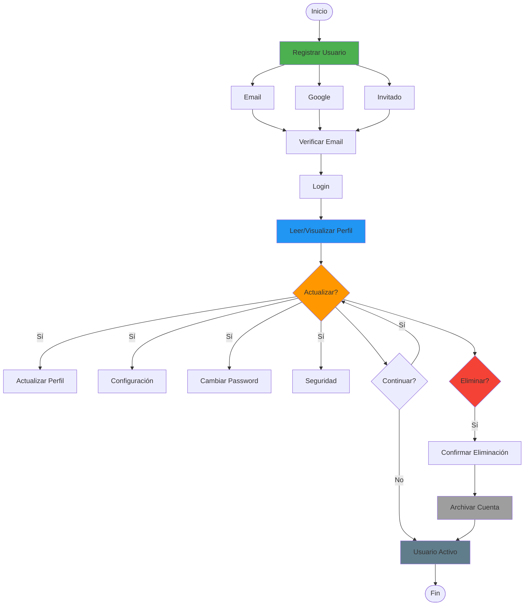
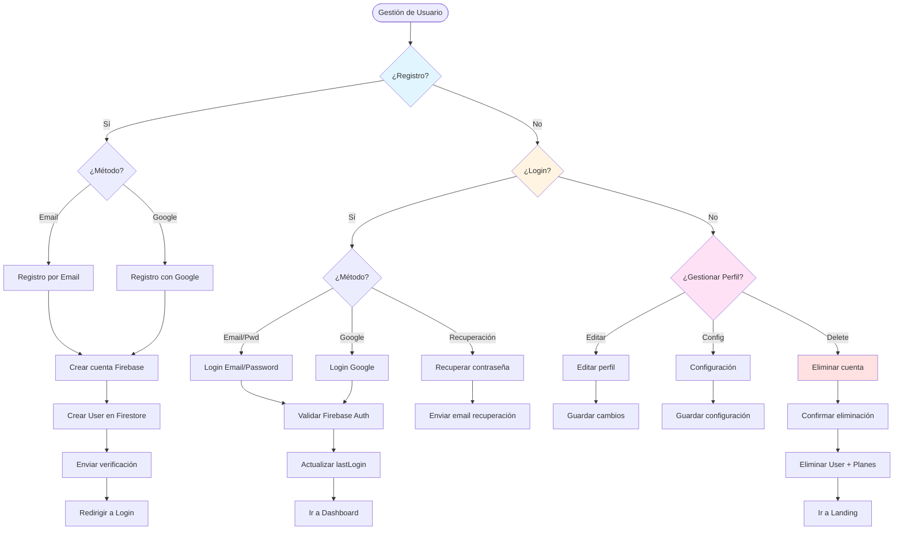

# 👤 Flujo de Vida Completa de Usuarios (CRUD)

> Define todo el ciclo de vida de un usuario: crear, leer, actualizar y eliminar

**Relacionado con:** T47, T49, T50, T124  
**Versión:** 1.0  
**Fecha:** Enero 2025

---

## 🎯 Objetivo

Documentar todos los escenarios del ciclo de vida completo de un usuario: desde su registro hasta su eliminación, incluyendo lectura, visualización, actualizaciones de perfil, configuración y permisos.

---

## 🔄 Diagrama del Ciclo de Vida de Usuarios



---

## 📊 TIPOS DE USUARIO

| Tipo | Descripción | Permisos Especiales | Visible Para |
|------|-------------|---------------------|--------------|
| **Usuario Estándar** | Usuario normal registrado | Crear planes, participar | Todos (si público) |
| **Administrador** | Usuario con permisos especiales | Todo (modificar planes de otros) | Solo admins |
| **Usuario Inactivo** | Cuenta sin actividad >6 meses | Ninguno | Solo admins |

---

## 📋 PROCESOS DE GESTIÓN

### 1. REGISTRO DE USUARIO

#### 1.1 - Registro por Email

**Flujo:**
```
Usuario → "Crear cuenta"
  ↓
Formulario de registro:
- Email (requerido, único)
- Password (requerido, mínimo 8 caracteres)
- Nombre completo (requerido)
- Username (opcional, único si se proporciona)
- Aceptar términos y condiciones [checkbox obligatorio]
- Verificar "No soy un robot" (CAPTCHA)
  ↓
Validaciones:
- Email no registrado previamente
- Password cumple requisitos
- Username disponible (si se proporciona)
- Términos aceptados
- CAPTCHA verificado
  ↓
Registrar aceptación de términos:
- Guardar timestamp de aceptación
- Guardar versión de términos aceptada
- Generar hash de identificación
  ↓
Crear cuenta en Firebase Auth
  ↓
Crear documento User en Firestore:
- userId: UID de Firebase Auth
- email: Email del usuario
- displayName: Nombre completo
- username: Username (si proporcionado)
- createdAt: Timestamp
- lastLogin: Timestamp
- isActive: true
- role: "user"
  ↓
Enviar email de verificación
  ↓
Redirigir a login
  ↓
Email enviado:
"Bienvenido a Planazoo

Haz clic aquí para verificar tu cuenta.
Link válido por 7 días."
```

**Campos del modelo User:**
```dart
class UserModel {
  final String userId;
  final String email;
  final String? displayName;
  final String? username;
  final String? photoURL;
  final String? bio; // Biografía de perfil
  final DateTime createdAt;
  final DateTime lastLogin;
  final DateTime? lastActiveAt;
  final bool isActive;
  final bool emailVerified; // Estado de verificación de email
  final String status; // "active", "suspended", "deleted", "inactive"
  final String role; // "user", "admin"
  final Map<String, dynamic>? preferences;
  final Map<String, dynamic>? termsAcceptance; // Aceptación de términos
}
```

**Modelo de Aceptación de Términos:**
```dart
class TermsAcceptance {
  final DateTime acceptedAt;
  final String version; // Versión de términos aceptada
  final String hash; // Hash para identificación
  final bool current; // Si es la versión actual
}
```

#### 1.2 - Registro con Google

**Flujo:**
```
Usuario → "Continuar con Google"
  ↓
Abrir Google Sign-In
  ↓
Usuario selecciona cuenta de Google
  ↓
Google devuelve auth token
  ↓
Crear cuenta en Firebase Auth (si no existe)
  ↓
Verificar si ya existe User en Firestore
  ↓
Si NO existe: Crear User con datos de Google
Si YA existe: Log in directo
  ↓
Añadir Google como proveedor de auth
  ↓
Crear User en Firestore:
- userId: UID de Firebase
- email: Email de Google
- displayName: Nombre de Google
- photoURL: Foto de perfil de Google
- createdAt: Timestamp
- lastLogin: Timestamp
- isActive: true
- role: "user"
```

#### 1.3 - Registro Invitado

**Flujo:**
```
Usuario recibe invitación a plan
  ↓
Hace clic en link de invitación
  ↓
Modal: "Registrarse en Planazoo"
  ↓
Formulario simplificado:
- Email (pre-rellenado de invitación)
- Password
- Nombre completo
- Username (opcional)
  ↓
Crear cuenta
  ↓
Aceptar invitación automáticamente
  ↓
Añadir a participantes del plan
```

---

### 2. LOGIN DE USUARIO

#### 2.1 - Login Normal (Email + Password)

**Flujo:**
```
Usuario → "Iniciar sesión"
  ↓
Formulario:
- Email
- Password
  ↓
Validaciones:
- Email existe en Firebase Auth
- Password correcto
- Cuenta activa (no suspendida)
  ↓
Login exitoso
  ↓
Actualizar lastLogin en Firestore
  ↓
Redirigir a Dashboard
  ↓
Mostrar últimos planes del usuario
```

#### 2.2 - Login con Google

**Flujo:**
```
Usuario → "Continuar con Google"
  ↓
Abrir Google Sign-In
  ↓
Usuario selecciona cuenta
  ↓
Verificar credenciales
  ↓
Crear sesión en Firebase
  ↓
Actualizar lastLogin
  ↓
Redirigir a Dashboard
```

#### 2.3 - Verificación de Email

**Flujo:**
```
Usuario se registra con email
  ↓
Email de verificación enviado
  ↓
¿Email verificado?
  ↓
NO verificó: Mostrar aviso en perfil
"Verifica tu email para acceder a todas las funcionalidades"
  ↓
Usuario solicita reenvío
  ↓
Enviar nuevo email de verificación
  ↓
Usuario hace clic en link
  ↓
Email verificado ✅
  ↓
Acceso completo a funcionalidades
```

**Consideraciones:**
- Cuentas sin verificar tienen limitaciones (no pueden invitar a otros, crear planes públicos, etc.)
- Enviar recordatorios automáticos si no verifica en 3 días
- Permitir reenvío de email de verificación

#### 2.4 - Recuperación de Contraseña

**Flujo:**
```
Usuario → "¿Olvidaste tu contraseña?"
  ↓
Formulario: Ingresar email
  ↓
Verificar email existe
  ↓
Enviar email de recuperación:
"Recuperar contraseña de Planazoo

Haz clic aquí para restablecer tu contraseña.
Link válido por 1 hora."
  ↓
Usuario hace clic en link
  ↓
Formulario: Nueva contraseña (confirmación)
  ↓
Actualizar contraseña
  ↓
Redirigir a login
```

#### 2.5 - Cerrar Sesión

**Flujo:**
```
Usuario → Perfil → "Cerrar sesión"
  ↓
¿Cerrar en todos los dispositivos? [Checkbox opcional]
  ↓
Confirmar cerrar sesión
  ↓
Sistema:
- Cerrar sesión en Firebase Auth
- Redirigir a login
- Limpiar datos locales (cache, preferencias temporales)
```

**Gestión de Sesiones Múltiples:**
```
Usuario → Configuración → "Sesiones activas"
  ↓
Listar dispositivos activos:
- Dispositivo actual: "Ahora"
- Móvil Android - Último acceso: hace 2 horas
- Chrome Desktop - Último acceso: hace 1 día
  ↓
Opciones por sesión:
- Ver detalles
- Cerrar sesión en este dispositivo
  ↓
Cerrar todas las demás sesiones
```

---

### 3. GESTIÓN DE PERFIL

#### 3.1 - Editar Perfil

**Flujo:**
```
Usuario → Perfil → "Editar"
  ↓
Formulario editable:
- Foto de perfil (subir/cambiar/eliminar)
- Nombre completo
- Username
- Email (no editable, solo visible)
- Biografía (máximo 500 caracteres)
  ↓
Guardar cambios
  ↓
Validaciones:
- Nombre no vacío
- Username único (si cambió)
- Foto dentro de límite de tamaño (máx 2MB)
- Biografía máximo 500 caracteres
  ↓
Actualizar en Firestore
  ↓
Actualizar en Firebase Auth (displayName, photoURL)
  ↓
Actualizar foto en Firebase Storage (si cambió foto)
  ↓
Mostrar confirmación
```

**Campos editables:**
- `displayName` - Nombre completo (requerido)
- `username` - Identificador único (requerido)
- `photoURL` - URL de foto de perfil (opcional, máx 2MB)
- `bio` - Biografía/descripción (opcional, máx 500 caracteres)
- `preferences` - Configuración personal

**Gestión de Foto de Perfil:**
```
Usuario → Perfil → Foto de perfil
  ↓
Opciones:
- "Subir foto" → Seleccionar desde galería o cámara
- "Editar foto" → Recortar/reemplazar
- "Eliminar foto" → Eliminar foto actual
- "Usar foto de Google" → Si tiene Google Sign-In
  ↓
Si sube nueva foto:
- Subir a Firebase Storage
- Generar thumbnail optimizado
- Actualizar photoURL en Firestore
- Limpiar foto antigua de storage
```

#### 3.2 - Cambiar Contraseña

**Flujo:**
```
Usuario → Perfil → "Cambiar contraseña"
  ↓
Formulario:
- Contraseña actual
- Nueva contraseña
- Confirmar nueva contraseña
  ↓
Validaciones:
- Contraseña actual correcta
- Nueva contraseña mínimo 8 caracteres
- Nuevas contraseñas coinciden
  ↓
Actualizar en Firebase Auth
  ↓
Cerrar sesión en todos los dispositivos (opcional)
  ↓
Confirmar cambio exitoso
```

#### 3.3 - Cambiar Email

**Flujo:**
```
Usuario → Perfil → "Cambiar email"
  ↓
Modal de advertencia:
"Cambiar email requiere verificación
de nuevo email.

¿Continuar?"
  ↓
Formulario:
- Email actual: [mostrar, no editable]
- Nuevo email
  ↓
Enviar email de verificación al nuevo email
  ↓
Email enviado:
"Verifica tu nuevo email en Planazoo

Haz clic aquí para verificar tu nuevo email."
  ↓
Usuario hace clic en link
  ↓
Actualizar email en Firebase Auth y Firestore
  ↓
Email anterior ya no válido para login
```

---

### 4. CONFIGURACIÓN Y PREFERENCIAS

#### 4.1 - Configuración de Notificaciones

**Flujo:**
```
Usuario → Configuración → "Notificaciones"
  ↓
Panel de preferencias:
- Notificaciones push: Activadas/Desactivadas
- Notificaciones email: Activadas/Desactivadas
- Horarios silencio: 22:00 - 08:00
- Notificaciones de planes: Sí/No
- Notificaciones de eventos: Sí/No
  ↓
Guardar preferencias
  ↓
Actualizar en Firestore:
preferences: {
  notifications: {
    push: true,
    email: true,
    quietHours: {...},
    plans: true,
    events: true
  }
}
```

#### 4.2 - Idioma y Zona Horaria

**Flujo:**
```
Usuario → Configuración → "Localización"
  ↓
Seleccionar idioma: Español / English
  ↓
Seleccionar zona horaria:
- Europe/Madrid (automático por ubicación)
- Otras opciones...
  ↓
Guardar
  ↓
Actualizar preferencias en Firestore
  ↓
App se actualiza inmediatamente con nuevo idioma
```

#### 4.3 - Configuración de Privacidad

**Flujo:**
```
Usuario → Configuración → "Privacidad"
  ↓
Opciones:
- ¿Tu perfil es público? (default: Sí)
- ¿Mostrar email en perfil? (default: No)
- ¿Mostrar planes en perfil? (default: No)
  ↓
Guardar
  ↓
Actualizar en Firestore
```

---

### 5. ELIMINACIÓN DE CUENTA

#### 5.1 - Eliminar Cuenta (Usuario)

**Flujo:**
```
Usuario → Configuración → "Eliminar cuenta"
  ↓
Modal de advertencia crítica:
"⚠️ ELIMINAR CUENTA

Estás a punto de eliminar permanentemente tu cuenta.

Esto eliminará:
- Todos tus planes (si eres organizador)
- Tu participación en todos los planes
- Todos tus datos personales
- Tu historial completo

Esta acción NO se puede deshacer.

Escribe tu contraseña para confirmar: [input]

[Motivo de eliminación] (opcional)

[Cancelar] [Eliminar cuenta]"
  ↓
Confirmar contraseña
  ↓
Sistema:
- Marcar planes como "Sin organizador" (o asignar a Coorganizador)
- Eliminar de participantes de planes
- Eliminar User de Firestore (o marcar como eliminado)
- Eliminar cuenta de Firebase Auth
  ↓
Notificar a otros participantes (opcional):
"[Usuario] ha eliminado su cuenta y ya no participa en [Plan]"
  ↓
Redirigir a landing page
```

**Consideraciones:**
- No eliminar realmente datos por posible recuperación (30 días)
- Marcar como "deleted" en lugar de eliminar
- Permitir recuperación dentro de 30 días

#### 5.2 - Suspender Cuenta (Admin)

**Flujo:**
```
Admin → Dashboard → Usuarios → Seleccionar usuario
  ↓
Ver perfil y estadísticas del usuario
  ↓
"Suspender usuario" / "Eliminar usuario"
  ↓
Modal de decisión:
"¿Qué acción quieres realizar?

[Suspender] - Usuario temporalmente desactivado
- No puede hacer login
- Sus planes se mantienen
- Puede reactivarse
- Razón obligatoria

[Eliminar] - Eliminación permanente
- No se puede deshacer
- Datos eliminados en 30 días
- Generar reporte
- Notificar al usuario"
  ↓
Suspender:
- Marcar como "suspended"
- Desactivar login
- Notificar usuario por email
- Permitir apelación

Eliminar:
- Marcar como "eliminado por admin"
- Desactivar cuenta
- Generar reporte de eliminación
- Notificar usuario por email
```

#### 5.3 - Auto-suspensión por Inactividad

**Flujo:**
```
Sistema detecta cuenta inactiva >6 meses
  ↓
Enviar email de recordatorio:
"Hace más de 6 meses que no has accedido a Planazoo.

Por seguridad, tu cuenta será desactivada en 30 días
si no inicias sesión.

[Acceder ahora] / [Activar auto-suspensión]"
  ↓
Si usuario accede: Mantener cuenta activa
  ↓
Si usuario NO accede en 30 días:
- Marcar cuenta como "inactiva"
- Ocultar planes del usuario
- Mantener datos por 1 año
- Permitir reactivación con verificación de email
```

#### 5.4 - Eliminar Usuario (Admin - version extendida)

**Flujo:**
```
Admin → Dashboard → Usuarios → Seleccionar usuario
  ↓
Ver perfil y estadísticas del usuario
  ↓
"Eliminar usuario"
  ↓
Modal de advertencia:
"⚠️ ELIMINAR USUARIO

Usuario: [Nombre]
Email: [Email]
Planes creados: [N]
Participaciones: [N]

¿Quieres eliminar este usuario?

Razón: [input obligatorio]"
  ↓
Confirmar
  ↓
Sistema:
- Marcar como "eliminado por admin"
- Desactivar cuenta
- Generar reporte de eliminación
  ↓
Notificar usuario por email
```

---

## 📊 DIAGRAMA DE FLUJO



---

## 📋 TAREAS RELACIONADAS

**Pendientes:**
- T47: Gestión de permisos por rol
- T49: Sistema de roles (admin, user)
- T50: Configuración de preferencias de usuario
- T124: Dashboard administrativo (eliminar usuarios)

**Completas ✅:**
- Registro básico por email
- Login básico por email
- Perfil básico

---

## ✅ IMPLEMENTACIÓN ACTUAL

**Estado:** ⚠️ Básico implementado

**Lo que ya funciona:**
- ✅ Registro por email (Firebase Auth)
- ✅ Login por email
- ✅ Perfil básico con displayName
- ✅ Username añadido recientemente (T123)

**Lo que falta (CRÍTICO):**
- ❌ Registro con Google
- ❌ Recuperación de contraseña
- ❌ Verificación de email y limitaciones sin verificar
- ❌ Cambio de contraseña en perfil
- ❌ Cambio de email
- ❌ Configuración de notificaciones
- ❌ Configuración de privacidad
- ❌ Cerrar sesión (logout)
- ❌ Gestión de sesiones múltiples
- ❌ Eliminación de cuenta
- ❌ Suspensión de cuenta (admin y auto)
- ❌ Gestión de roles (admin)
- ❌ Sistema de preferencias completo
- ❌ Foto de perfil (subir, editar, eliminar)
- ❌ Biografía de perfil
- ❌ Aceptación de términos y condiciones
- ❌ Reenvío de email de verificación

---

*Documento de flujo de gestión de usuarios*  
*Última actualización: Enero 2025*

