# 👤 Flujo de Vida Completa de Usuarios (CRUD)

> Define todo el ciclo de vida de un usuario: crear, leer, actualizar y eliminar

**Relacionado con:** T47, T49, T50, T124  
**Versión:** 1.0  
**Fecha:** Enero 2025

---

## 🎯 Objetivo

Documentar todos los escenarios del ciclo de vida completo de un usuario: desde su registro hasta su eliminación, incluyendo lectura, visualización, actualizaciones de perfil, configuración y permisos.

---

## 🔄 Diagrama del Ciclo de Vida de Usuarios


---

## 📊 TIPOS DE USUARIO

| Tipo | Descripción | Permisos Especiales | Visible Para |
|------|-------------|---------------------|--------------|
| **Usuario Estándar** | Usuario normal registrado | Crear planes, participar | Todos (si público) |
| **Administrador** | Usuario con permisos especiales | Todo (modificar planes de otros) | Solo admins |
| **Usuario Inactivo** | Cuenta sin actividad >6 meses | Ninguno | Solo admins |

---

## 📋 PROCESOS DE GESTIÓN

### 1. REGISTRO DE USUARIO

#### 1.1 - Registro por Email

**Flujo:**
```
Usuario → "Crear cuenta"
  ↓
Formulario de registro:
- Email (requerido, único)
- Password (requerido, mínimo 8 caracteres)
- Nombre completo (requerido)
- Username (opcional, único si se proporciona)
- Aceptar términos y condiciones [checkbox obligatorio]
- Verificar "No soy un robot" (CAPTCHA)
  ↓
Validaciones:
- Email no registrado previamente
- Password cumple requisitos
- Username disponible (si se proporciona)
- Términos aceptados
- CAPTCHA verificado
  ↓
Registrar aceptación de términos:
- Guardar timestamp de aceptación
- Guardar versión de términos aceptada
- Generar hash de identificación
  ↓
Crear cuenta en Firebase Auth
  ↓
Crear documento User en Firestore:
- userId: UID de Firebase Auth
- email: Email del usuario
- displayName: Nombre completo
- username: Username (si proporcionado)
- createdAt: Timestamp
- lastLogin: Timestamp
- isActive: true
- role: "user"
  ↓
Enviar email de verificación
  ↓
Redirigir a login
  ↓
Email enviado:
"Bienvenido a Planazoo

Haz clic aquí para verificar tu cuenta.
Link válido por 7 días."
```

**Campos del modelo User:**
```dart
class UserModel {
  final String userId;
  final String email;
  final String? displayName;
  final String? username;
  final String? photoURL;
  final String? bio; // Biografía de perfil
  final DateTime createdAt;
  final DateTime lastLogin;
  final DateTime? lastActiveAt;
  final bool isActive;
  final bool emailVerified; // Estado de verificación de email
  final String status; // "active", "suspended", "deleted", "inactive"
  final String role; // "user", "admin"
  final Map<String, dynamic>? preferences;
  final Map<String, dynamic>? termsAcceptance; // Aceptación de términos
}
```

**Modelo de Aceptación de Términos:**
```dart
class TermsAcceptance {
  final DateTime acceptedAt;
  final String version; // Versión de términos aceptada
  final String hash; // Hash para identificación
  final bool current; // Si es la versión actual
}
```

#### 1.2 - Registro con Google

**Flujo:**
```
Usuario → "Continuar con Google"
  ↓
Abrir Google Sign-In
  ↓
Usuario selecciona cuenta de Google
  ↓
Google devuelve auth token
  ↓
Crear cuenta en Firebase Auth (si no existe)
  ↓
Verificar si ya existe User en Firestore
  ↓
Si NO existe: Crear User con datos de Google
Si YA existe: Log in directo
  ↓
Añadir Google como proveedor de auth
  ↓
Crear User en Firestore:
- userId: UID de Firebase
- email: Email de Google
- displayName: Nombre de Google
- photoURL: Foto de perfil de Google
- createdAt: Timestamp
- lastLogin: Timestamp
- isActive: true
- role: "user"
```

#### 1.3 - Registro mediante Invitación (mismo registro estándar)

> La invitación no crea un tipo de usuario distinto. Solo prellena datos y vincula al plan tras el registro estándar.

**Flujo (unificado con registro por email):**
```
Usuario recibe invitación a plan (token firmado con caducidad)
  ↓
Hace clic en link de invitación
  ↓
Pantalla de registro estándar
  ↓
Formulario (igual que email):
- Email (pre-rellenado y bloqueado si viene en la invitación)
- Password
- Nombre completo
- Username (opcional)
- Aceptar términos y condiciones (obligatorio)
  ↓
Validaciones estándar (incluye rate limiting si hay fallos sucesivos)
  ↓
Crear cuenta en Firebase Auth + User en Firestore
  ↓
Enviar email de verificación
  ↓
Tras verificar email: aceptar invitación y añadir a `PlanParticipation`
  ↓
Redirigir al plan invitado
```

**Casos límite:**
```
Token expirado/ya usado → Mostrar aviso y opción "Solicitar nueva invitación"
Email distinto al de la invitación → Bloquear o requerir aprobación del organizador
Usuario ya logueado y con cuenta existente → Aceptar invitación directamente y vincular
CAPTCHA → Solo aplica al registro por email, no a Google
Multi-idioma → Textos de emails/notificaciones vienen de .arb
```

---

### 2. LOGIN DE USUARIO

#### 2.1 - Login Normal (Email + Password)

**Flujo:**
```
Usuario → "Iniciar sesión"
  ↓
Formulario:
- Email
- Password
  ↓
Validaciones:
- Email existe en Firebase Auth
- Password correcto
- Cuenta activa (no suspendida)
  ↓
Intentos fallidos (seguridad):
- Después de 3 fallos: Mostrar CAPTCHA
- Después de 5 fallos: Bloquear cuenta temporalmente (15 minutos)
- Después de 5 fallos: Enviar email de alerta al usuario
  ↓
Login exitoso
  ↓
Detectar dispositivo:
- ¿Es dispositivo conocido?
  ↓
Si es dispositivo NUEVO:
- Enviar email de notificación:
  "Inicio de sesión desde nuevo dispositivo [ip, browser, fecha]"
- Mostrar advertencia en UI (opcional)
  ↓
Actualizar lastLogin en Firestore
  ↓
Redirigir a Dashboard
  ↓
Mostrar últimos planes del usuario
```

**Manejo de errores:**
- Mensaje genérico: "Email o contraseña incorrectos" (no detallar cuál)
- No exponer si el email existe o no por razones de seguridad
- Logging sin datos sensibles (userId hasheado, timestamp, IP máscara parcial)

#### 2.2 - Login con Google

**Flujo:**
```
Usuario → "Continuar con Google"
  ↓
Abrir Google Sign-In
  ↓
Usuario selecciona cuenta
  ↓
Verificar credenciales
  ↓
Crear sesión en Firebase
  ↓
Actualizar lastLogin
  ↓
Redirigir a Dashboard
```

#### 2.3 - Verificación de Email

**Flujo:**
```
Usuario se registra con email
  ↓
Email de verificación enviado
  ↓
¿Email verificado?
  ↓
NO verificó: Mostrar aviso en perfil
"Verifica tu email para acceder a todas las funcionalidades"
  ↓
Usuario solicita reenvío
  ↓
Enviar nuevo email de verificación
  ↓
Usuario hace clic en link
  ↓
Email verificado ✅
  ↓
Acceso completo a funcionalidades
```

**Consideraciones:**
- Link de verificación válido por **7 días** (con token firmado)
- Cuentas sin verificar tienen limitaciones (no pueden invitar a otros, crear planes públicos, etc.)
- Enviar recordatorios automáticos si no verifica en 3 días
- Permitir reenvío de email de verificación
- Invalidar todos los tokens de verificación previos al generar uno nuevo

#### 2.4 - Recuperación de Contraseña

**Flujo:**
```
Usuario → "¿Olvidaste tu contraseña?"
  ↓
Formulario: Ingresar email
  ↓
Verificar email existe
  ↓
Rate limiting:
- Máximo 3 emails de recuperación por hora
- Si se excede: bloquear por 1 hora
- Notificar al usuario de intentos excesivos
  ↓
Enviar email de recuperación:
"Recuperar contraseña de Planazoo

Haz clic aquí para restablecer tu contraseña.
Link válido por 1 hora.

⚠️ Si no solicitaste esto, ignora este email."
  ↓
Invalidar todos los tokens de recuperación previos
  ↓
Usuario hace clic en link
  ↓
Validar token no expirado (1 hora)
  ↓
Si expirado: Mensaje "Link expirado. Solicita uno nuevo."
  ↓
Formulario: Nueva contraseña (confirmación)
  ↓
Validaciones:
- Mínimo 8 caracteres
- Requisitos de seguridad
  ↓
Actualizar contraseña
  ↓
Invalidar el token usado (no reutilizable)
  ↓
Enviar email de confirmación de cambio
  ↓
Redirigir a login
```

#### 2.5 - Cerrar Sesión

**Flujo:**
```
Usuario → Perfil → "Cerrar sesión"
  ↓
¿Cerrar en todos los dispositivos? [Checkbox opcional]
  ↓
Confirmar cerrar sesión
  ↓
Sistema:
- Cerrar sesión en Firebase Auth
- Redirigir a login
- Limpiar datos locales (cache, preferencias temporales)
```

**Gestión de Sesiones Múltiples:**
```
Usuario → Configuración → "Sesiones activas"
  ↓
Listar dispositivos activos:
- Dispositivo actual: "Ahora"
- Móvil Android - Último acceso: hace 2 horas
- Chrome Desktop - Último acceso: hace 1 día
  ↓
Opciones por sesión:
- Ver detalles
- Cerrar sesión en este dispositivo
  ↓
Cerrar todas las demás sesiones
```

---

### 3. GESTIÓN DE PERFIL

#### 3.1 - Editar Perfil

**Flujo:**
```
Usuario → Perfil → "Editar"
  ↓
Formulario editable:
- Foto de perfil (subir/cambiar/eliminar)
- Nombre completo
- Username
- Email (editable, requiere verificación de nuevo email)
- Biografía (máximo 500 caracteres)
  ↓
Guardar cambios
  ↓
Validaciones:
- Nombre no vacío
- Username único (si cambió)
- Email válido y único (si cambió)
- Foto dentro de límite de tamaño (máx 2MB)
- Biografía máximo 500 caracteres
  ↓
Si cambió email:
- Enviar email de verificación al nuevo email
- Bloquear edición hasta verificación
- Mostrar "Esperando verificación de nuevo email"
  ↓
Actualizar en Firestore
  ↓
Actualizar en Firebase Auth (displayName, photoURL, email si cambió)
  ↓
Actualizar foto en Firebase Storage (si cambió foto)
  ↓
Mostrar confirmación
```

**Campos editables:**
- `displayName` - Nombre completo (requerido)
- `username` - Identificador único (requerido)
- `photoURL` - URL de foto de perfil (opcional, máx 2MB)
- `bio` - Biografía/descripción (opcional, máx 500 caracteres)
- `preferences` - Configuración personal

**Gestión de Foto de Perfil:**
```
Usuario → Perfil → Foto de perfil
  ↓
Opciones:
- "Subir foto" → Seleccionar desde galería o cámara
- "Editar foto" → Recortar/reemplazar
- "Eliminar foto" → Eliminar foto actual
- "Usar foto de Google" → Si tiene Google Sign-In
  ↓
Si sube nueva foto:
- Subir a Firebase Storage
- Generar thumbnail optimizado
- Actualizar photoURL en Firestore
- Limpiar foto antigua de storage
```

#### 3.2 - Cambiar Contraseña

**Flujo:**
```
Usuario → Perfil → "Cambiar contraseña"
  ↓
Reautenticación (opcional si requisitos de seguridad):
- Solicitar contraseña actual O verificación por email
  ↓
Formulario:
- Contraseña actual (si no se reautenticó)
- Nueva contraseña
- Confirmar nueva contraseña
  ↓
Validaciones:
- Contraseña actual correcta (si no se reautenticó)
- Nueva contraseña mínimo 8 caracteres
- Nueva contraseña diferente a la actual
- Nuevas contraseñas coinciden
  ↓
Actualizar en Firebase Auth
  ↓
Invalidar todos los tokens de sesión excepto el actual
  ↓
Mostrar opción: "Cerrar sesión en todos los dispositivos" [Checkbox]
  ↓
Confirmar cambio exitoso
  ↓
Enviar email de confirmación de cambio de contraseña
```

#### 3.3 - Cambiar Email

**Flujo:**
```
Usuario → Perfil → "Cambiar email"
  ↓
Modal de advertencia:
"Cambiar email requiere verificación
de nuevo email.

¿Continuar?"
  ↓
Reautenticación obligatoria:
- Solicitar contraseña actual O verificación por email al email actual
  ↓
Formulario:
- Email actual: [mostrar, no editable]
- Nuevo email
  ↓
Validaciones:
- Nuevo email válido y único
- Nuevo email diferente al actual
  ↓
Enviar email de verificación al nuevo email
  ↓
Invalidar todos los tokens de cambio de email previos
  ↓
Email enviado:
"Verifica tu nuevo email en Planazoo

Haz clic aquí para verificar tu nuevo email.
Link válido por 1 hora."
  ↓
Usuario hace clic en link
  ↓
Validar token no expirado (1 hora)
  ↓
Si expirado: Mensaje "Link expirado. Solicita uno nuevo."
  ↓
Actualizar email en Firebase Auth y Firestore
  ↓
Invalidar el token usado (no reutilizable)
  ↓
Invalidar todos los tokens de sesión del email anterior
  ↓
Email anterior ya no válido para login
  ↓
Enviar email de confirmación al nuevo email:
"Tu email ha sido cambiado exitosamente.
Email anterior ya no válido para login."
```

---

### 4. CONFIGURACIÓN Y PREFERENCIAS

#### 4.1 - Configuración de Notificaciones

**Flujo:**
```
Usuario → Configuración → "Notificaciones"
  ↓
Panel de preferencias globales:
- Notificaciones push: Activadas/Desactivadas
- Notificaciones email: Activadas/Desactivadas
- Horarios silencio: 22:00 - 08:00
  ↓
Configuración por tipo (opcional):
- Notificaciones de planes: Sí/No (default: Sí)
- Notificaciones de eventos: Sí/No (default: Sí)
- Cambios importantes: Sí/No (default: Sí)
- Recordatorios: Sí/No (default: Sí)
- Comentarios/avisos: Sí/No (default: Sí)
  ↓
Configuración por plan (gestionar por separado):
- Mostrar planes activos
- Activar/desactivar notificaciones por plan individual
  ↓
Guardar preferencias
  ↓
Actualizar en Firestore:
preferences: {
  notifications: {
    push: true,
    email: true,
    quietHours: { start: "22:00", end: "08:00" },
    types: {
      plans: true,
      events: true,
      important: true,
      reminders: true,
      comments: true
    }
  }
}
  ↓
Persistencia adicional en localStorage para configuración inmediata
```

#### 4.2 - Idioma y Zona Horaria

**Flujo:**
```
Usuario → Configuración → "Localización"
  ↓
Seleccionar idioma: Español / English
  ↓
Formato de fecha (derivado de idioma):
- dd/mm/yyyy (Español)
- mm/dd/yyyy (English)
- yyyy-mm-dd (ISO)
  ↓
Formato de hora:
- 12h (AM/PM)
- 24h (default)
  ↓
Seleccionar zona horaria:
- Auto-detectada por ubicación (default)
- Europe/Madrid (automático por ubicación)
- Otras opciones... (selector manual)
  ↓
Guardar
  ↓
Actualizar preferencias en Firestore
  ↓
App se actualiza inmediatamente sin reinicio
  ↓
Persistencia en localStorage para cambio inmediato de idioma
```

#### 4.3 - Configuración de Privacidad

**Flujo:**
```
Usuario → Configuración → "Privacidad"
  ↓
Opciones:
- ¿Tu perfil es público? (default: Sí)
- ¿Mostrar email en perfil? (default: No)
- ¿Mostrar planes en perfil? (default: No)
  ↓
Guardar
  ↓
Actualizar en Firestore
```

---

### 5. ELIMINACIÓN DE CUENTA

#### 5.1 - Eliminar Cuenta (Usuario)

**Flujo:**
```
Usuario → Configuración → "Eliminar cuenta"
  ↓
Modal de advertencia crítica:
"⚠️ ELIMINAR CUENTA

Estás a punto de eliminar permanentemente tu cuenta.

Esto eliminará:
- Todos tus planes (si eres organizador)
- Tu participación en todos los planes
- Todos tus datos personales
- Tu historial completo

Esta acción NO se puede deshacer.

Escribe tu contraseña para confirmar: [input]

[Motivo de eliminación] (opcional)

[Cancelar] [Eliminar cuenta]"
  ↓
Confirmar contraseña
  ↓
Sistema:
- Estado inicial: "deleted" con timestamp deletedAt
- Período de gracia: 30 días antes de eliminación permanente
- Proceso de despedida:
  a) Si tiene planes como organizador:
     - Buscar Coorganizador para asignar
     - Si no hay: marcar planes como "Sin organizador"
     - Notificar a participantes: "El organizador [Usuario] ha eliminado su cuenta"
  b) Eliminar de PlanParticipation en todos los planes
  c) Mantener datos personales (User en Firestore) marcados como "deleted"
  d) Cerrar sesión en todos los dispositivos
  e) Bloquear acceso a Firebase Auth (mantener cuenta por 30 días)
  ↓
Enviar email de despedida:
"Hemos recibido tu solicitud de eliminación de cuenta.
Tus datos se eliminarán permanentemente en 30 días.
Si cambias de opinión, recupera tu cuenta antes del [fecha]."
  ↓
Notificar a otros participantes:
"[Usuario] ha eliminado su cuenta y ya no participa en [Plan]"
  ↓
Redirigir a landing page con mensaje de despedida
  ↓
Después de 30 días (proceso automático):
- Eliminar User de Firestore permanentemente
- Eliminar cuenta de Firebase Auth
- Limpiar datos de planes (si no hay coorganizador)
```

**Consideraciones:**
- No eliminar datos durante el período de gracia (30 días)
- Marcar como `status: "deleted"` en lugar de eliminar inmediatamente
- Permitir recuperación dentro de 30 días
- Proceso de recuperación: re-login y confirmar que quiere restaurar cuenta
- Si pasa los 30 días: eliminación automática e irreversible

#### 5.2 - Suspender Cuenta (Admin)

**Flujo:**
```
Admin → Dashboard → Usuarios → Seleccionar usuario
  ↓
Ver perfil y estadísticas del usuario
  ↓
"Suspender usuario" / "Eliminar usuario"
  ↓
Modal de decisión:
"¿Qué acción quieres realizar?

[Suspender] - Usuario temporalmente desactivado
- No puede hacer login
- Sus planes se mantienen
- Puede reactivarse
- Razón obligatoria

[Eliminar] - Eliminación permanente
- No se puede deshacer
- Datos eliminados en 30 días
- Generar reporte
- Notificar al usuario"
  ↓
Suspender:
- Marcar como `status: "suspended"`
- Desactivar login
- Definir tiempo de suspensión (30/60/90 días)
- Notificar usuario por email con:
  - Razón de suspensión
  - Duración
  - Proceso de apelación
- Permitir apelación con panel de revisión

Eliminar:
- Marcar como `status: "eliminado por admin"`
- Proceso de despedida (igual que usuario auto-eliminado):
  - Buscar Coorganizadores para sus planes
  - Eliminar de participaciones
  - Mantener datos 30 días antes de eliminación permanente
- Generar reporte de eliminación con:
  - Razón de eliminación
  - Timestamp
  - Datos eliminados
- Notificar usuario por email con plazo de 30 días antes de eliminación permanente
```

#### 5.3 - Auto-suspensión por Inactividad

**Flujo:**
```
Sistema detecta cuenta inactiva >6 meses
  ↓
Enviar email de recordatorio:
"Hace más de 6 meses que no has accedido a Planazoo.

Por seguridad, tu cuenta será desactivada en 30 días
si no inicias sesión.

[Acceder ahora] / [Activar auto-suspensión]"
  ↓
Si usuario accede: Mantener cuenta activa
  ↓
Si usuario NO accede en 30 días:
- Marcar cuenta como "inactiva"
- Ocultar planes del usuario
- Mantener datos por 1 año
- Permitir reactivación con verificación de email
```

#### 5.4 - Eliminar Usuario (Admin - version extendida)

**Flujo:**
```
Admin → Dashboard → Usuarios → Seleccionar usuario
  ↓
Ver perfil y estadísticas del usuario
  ↓
"Eliminar usuario"
  ↓
Modal de advertencia:
"⚠️ ELIMINAR USUARIO

Usuario: [Nombre]
Email: [Email]
Planes creados: [N]
Participaciones: [N]

¿Quieres eliminar este usuario?

Razón: [input obligatorio]"
  ↓
Confirmar
  ↓
Sistema:
- Marcar como "eliminado por admin"
- Desactivar cuenta
- Generar reporte de eliminación
  ↓
Notificar usuario por email
```

---

## 📊 DIAGRAMA DE FLUJO

```mermaid
graph TD
    Start([Gestión de Usuario]) --> Reg{¿Registro?}
    
    Reg -->|Sí| RegMethod{¿Método?}
    RegMethod -->|Email| RegEmail[Registro por Email]
    RegMethod -->|Google| RegGoogle[Registro con Google]
    
    RegEmail --> CreateAccount[Crear cuenta Firebase]
    RegGoogle --> CreateAccount
    
    CreateAccount --> CreateUser[Crear User en Firestore]
    CreateUser --> VerifyEmail[Enviar verificación]
    VerifyEmail --> RedirectLogin[Redirigir a Login]
    
    Reg -->|No| Login{¿Login?}
    
    Login -->|Sí| LoginMethod{¿Método?}
    LoginMethod -->|Email/Pwd| LoginNormal[Login Email/Password]
    LoginMethod -->|Google| LoginGoogle[Login Google]
    LoginMethod -->|Recuperación| ForgotPwd[Recuperar contraseña]
    
    LoginNormal --> AuthFirebase[Validar Firebase Auth]
    LoginGoogle --> AuthFirebase
    ForgotPwd --> SendRecovery[Enviar email recuperación]
    
    AuthFirebase --> UpdateLogin[Actualizar lastLogin]
    UpdateLogin --> Dashboard[Ir a Dashboard]
    
    Login -->|No| Profile{¿Gestionar Perfil?}
    
    Profile -->|Editar| EditProfile[Editar perfil]
    Profile -->|Config| Config[Configuración]
    Profile -->|Delete| DeleteAcc[Eliminar cuenta]
    
    EditProfile --> SaveProfile[Guardar cambios]
    Config --> SaveConfig[Guardar configuración]
    DeleteAcc --> ConfirmDel[Confirmar eliminación]
    
    ConfirmDel --> DelUser[Eliminar User + Planes]
    DelUser --> Landing[Ir a Landing]
    
    style Reg fill:#e1f5ff
    style Login fill:#fff4e1
    style Profile fill:#ffe1f5
    style DeleteAcc fill:#ffe1e1
```



---

## 📋 TAREAS RELACIONADAS

**Pendientes:**
- T47: Gestión de permisos por rol
- T49: Sistema de roles (admin, user)
- T50: Configuración de preferencias de usuario
- T124: Dashboard administrativo (eliminar usuarios)

**Completas ✅:**
- Registro básico por email
- Login básico por email
- Perfil básico

---

## ✅ IMPLEMENTACIÓN ACTUAL

**Estado:** ⚠️ Básico implementado

**Lo que ya funciona:**
- ✅ Registro por email (Firebase Auth)
- ✅ Login por email
- ✅ Perfil básico con displayName
- ✅ Username añadido recientemente (T123)

**Lo que falta (CRÍTICO):**
- ❌ Registro con Google
- ❌ Recuperación de contraseña
- ❌ Verificación de email y limitaciones sin verificar
- ❌ Cambio de contraseña en perfil
- ❌ Cambio de email
- ❌ Configuración de notificaciones
- ❌ Configuración de privacidad
- ❌ Cerrar sesión (logout)
- ❌ Gestión de sesiones múltiples
- ❌ Eliminación de cuenta
- ❌ Suspensión de cuenta (admin y auto)
- ❌ Gestión de roles (admin)
- ❌ Sistema de preferencias completo
- ❌ Foto de perfil (subir, editar, eliminar)
- ❌ Biografía de perfil
- ❌ Aceptación de términos y condiciones
- ❌ Reenvío de email de verificación

---

*Documento de flujo de gestión de usuarios*  
*Última actualización: Enero 2025*

