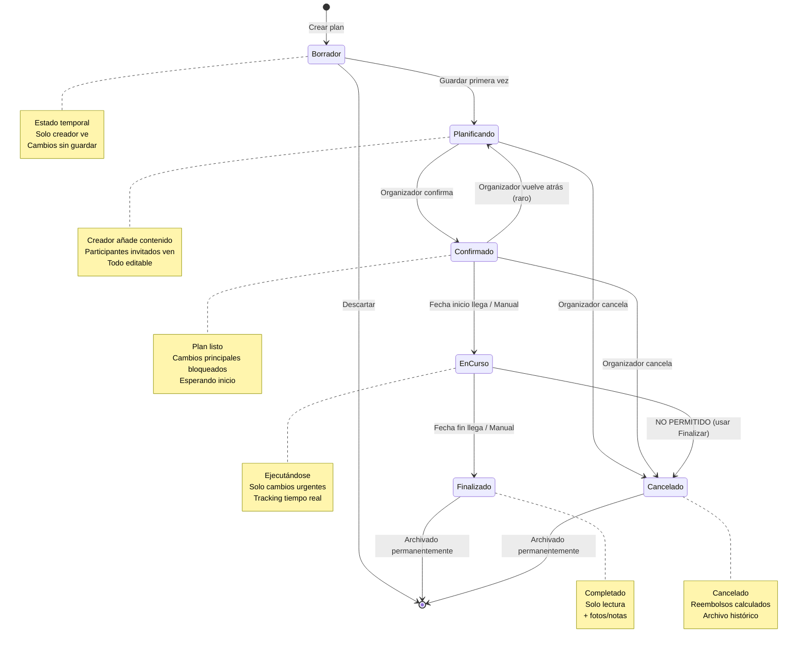

# 🔄 Flujo de Transiciones de Estado del Plan

> Define cómo un plan transiciona entre estados y qué implica cada cambio de estado

**Relacionado con:** T109 - Estados del Plan, T144 - Gestión del ciclo de vida al finalizar plan, T133 - Exportación PDF, T145 - Álbum digital, T147 - Valoraciones  
**Completa CRUD de planes:** `FLUJO_CRUD_PLANES.md`  
**Versión:** 1.1  
**Fecha:** Enero 2025 (Actualizado)

---

## 🎯 Objetivo

Documentar **solo las transiciones entre estados** de un plan, qué permisos/bloqueos conlleva cada cambio de estado, y qué validaciones son necesarias para cada transición.

**Para el ciclo completo CRUD (crear, leer, actualizar, eliminar):** Ver `FLUJO_CRUD_PLANES.md`

---

## 📊 ESTADOS DISPONIBLES

| Estado | Descripción | Permite Cambios | Permite Cancelar | Visible para | Nota |
|--------|-------------|-----------------|------------------|--------------|------|
| **Borrador** | Plan en creación inicial | ✅ Todo | ✅ Sí | Solo creador | Estado temporal |
| **Planificando** | Organizador añadiendo contenido | ✅ Casi todo | ✅ Sí | Solo participantes | Estado principal de creación |
| **Confirmado** | Plan listo, esperando inicio | ⚠️ Ajustes menores | ⚠️ Con confirmación | Todos los participantes | Bloqueos parciales |
| **En Curso** | Plan activo, ejecutándose | ⚠️ Urgencias | ❌ No | Todos los participantes | Solo cambios críticos |
| **Finalizado** | Plan completado | ❌ No | ❌ No | Todos los participantes | Solo lectura |
| **Cancelado** | Plan cancelado | ❌ No | ❌ No | Todos los participantes | Archivar, reembolsos |

---

## 🔄 TRANSICIONES DE ESTADO

### 1. NUEVO PLAN → BORRADOR

**Cuándo:** Al crear un plan por primera vez  
**Quién:** Automático por el sistema  
**Duración:** Hasta que el usuario guarda o cierra el modal

**Permisos:**
- ✅ Creador puede modificar todo
- ✅ Creador puede añadir eventos, alojamientos, participantes
- ✅ Creador puede eliminar todo
- ✅ Creador puede guardar o descartar cambios

**Bloqueos:** Ninguno

**UI:**
- Badge "BORRADOR" en el plan
- Aviso "Guardando en borrador..."

---

### 2. BORRADOR → PLANIFICANDO

**Cuándo:** Al guardar el plan por primera vez  
**Quién:** Automático después de primer guardado  
**Duración:** Hasta que el organizador considera que el plan está "listo"

**Permisos:**
- ✅ Organizador puede modificar todo
- ✅ Organizador puede añadir/eliminar eventos y participantes
- ✅ Participantes pueden ver el plan (si están invitados)
- ⚠️ Participantes NO pueden editar contenido común
- ✅ Participantes pueden editar su parte personal

**Bloqueos:** Ninguno funcional, solo de permisos

**UI:**
- Badge "PLANIFICANDO" en el plan
- Contador de eventos/participantes
- Barra de progreso (opcional)

**Acciones disponibles:**
- Añadir eventos, alojamientos
- Añadir/eliminar participantes (T104)
- Modificar fechas inicio/fin
- Configurar presupuesto (T101)
- Añadir listas (T111)

---

### 3. PLANIFICANDO → CONFIRMADO

**Cuándo:** Organizador marca plan como "listo"  
**Quién:** Solo organizador (confirmación requerida)  
**Duración:** Hasta inicio del plan o cambio manual a "En curso"

**Permisos:**
- 🔒 Fechas inicio/fin: BLOQUEADAS
- 🔒 Número participantes principal: BLOQUEADO
- ⚠️ Añadir/eliminar participantes: Permitido con confirmación
- ⚠️ Cambios de hora evento: Permitido (<4h de diferencia)
- ⚠️ Cambios de ubicación: Permitido (mismo día)
- ✅ Cambiar hora evento: Permitido
- ✅ Añadir eventos nuevos: Permitido
- ✅ Eliminar eventos futuros: Permitido (con confirmación)
- ✅ Participantes pueden editar parte personal
- ✅ Participantes pueden ver todo

**Bloqueos:**
- ❌ Cambiar fechas inicio/fin del plan
- ❌ Aumentar presupuesto >50% sin confirmación
- ❌ Eliminar plan completo sin confirmación
- ❌ Cambiar estado a "Planificando" (solo avanzar o cancelar)

**UI:**
- Badge "CONFIRMADO" en el plan
- Banner "Plan confirmado - Inicia el [fecha]"
- Contador "Días restantes" (T112)
- Opción "Marcar como 'En curso'" aparece automáticamente cuando llega fecha inicio

**Acciones especiales:**
- Notificar a todos los participantes del cambio de estado (T105)
- Validar que no hay eventos sin participantes asignados (T109)
- Validar que no hay días completamente vacíos (opcional)
- Mostrar resumen de "qué falta" si aplica

**Confirmación al cambiar estado:**
```
Modal: "¿Confirmar plan?"
- "Este plan quedará como confirmado. Los cambios importantes estarán bloqueados."
- Opción: "Seguir en planificación" / "Confirmar"
```

---

### 4. CONFIRMADO → EN CURSO

**Cuándo:** 
1. Automático: Cuando llega la fecha de inicio del plan
2. Manual: Organizador marca "En curso"

**Quién:** Automático o solo organizador  
**Duración:** Hasta finalización del plan o cambio manual a "Finalizado"

**Permisos:**
- 🔒 Fechas inicio/fin: BLOQUEADAS
- 🔒 Añadir/eliminar participantes: BLOQUEADO (solo urgente con confirmación organizador)
- ⚠️ Crear evento: Solo organizador
- ⚠️ Modificar evento: Solo organizador, solo cambios urgentes (<24h)
- ⚠️ Eliminar evento: Solo organizador, solo eventos futuros (<7 días)
- ✅ Participantes pueden marcar "asistí" en eventos (T120)
- ✅ Participantes pueden añadir fotos
- ✅ Participantes pueden añadir notas post-evento
- ✅ Participantes pueden ver seguimiento tiempo real

**Bloqueos:**
- ❌ Cambiar fechas inicio/fin del plan
- ❌ Añadir participantes normalmente (solo casos excepcionales)
- ❌ Eliminar participantes (solo casos excepcionales con confirmación crítica)
- ❌ Modificar evento pasado (solo añadir notas)
- ❌ Eliminar evento pasado (solo marcar como "no realizado")
- ❌ Eliminar plan completo (solo cancelar plan)
- ❌ Cambiar presupuesto del plan

**UI:**
- Badge "EN CURSO" en el plan
- Marcador "Día actual" en el calendario
- Contador "Próximos eventos hoy" (T116)
- Vista de "Eventos de hoy" destacada
- Eventos pasados con estilo diferente
- Eventos próximos resaltados

**Funcionalidades especiales:**
- Tracking en tiempo real de "quién está dónde"
- Notificaciones push de próximos eventos (T110)
- Alertas si evento empieza en <2h
- Alerta si participante no ha confirmado asistencia (T120)

**Acciones críticas disponibles:**
- ✅ Cambiar hora evento urgente (<24h antes) → Notificar urgente (T105)
- ✅ Cancelar evento fututo → Calcular reembolsos (T102)
- ✅ Añadir participante urgente (casos excepcionales)
- ✅ Marcar "llegamos tarde" en evento en curso
- ✅ Añadir nota post-evento

---

### 5. EN CURSO → FINALIZADO

**Cuándo:** 
1. Automático: Cuando llega la fecha de fin del plan
2. Manual: Organizador marca "Finalizado"

**Quién:** Automático o solo organizador  
**Duración:** Permanente (no se puede cambiar de vuelta)

**Permisos:**
- ❌ BLOQUEAR TODOS LOS CAMBIOS
- ❌ No editar eventos
- ❌ No añadir eventos
- ❌ No eliminar eventos
- ❌ No modificar participantes
- ❌ No cambiar presupuesto
- ✅ Añadir fotos al plan
- ✅ Añadir fotos a eventos específicos
- ✅ Añadir comentarios/notas finales
- ✅ Ver plan completo (solo lectura)
- ✅ Exportar plan como PDF (T133)

**Bloqueos:**
- ❌ TODO está bloqueado excepto añadir fotos/comentarios
- ❌ No se puede cambiar de vuelta a otro estado
- ❌ No se puede eliminar el plan

**UI:**
- Badge "FINALIZADO" en el plan
- Banner "Plan completado"
- Icono "Exportar PDF" visible
- Sección "Galería de fotos" destacada
- Estadísticas finales visibles (T113)

**Acciones automáticas al finalizar:**
1. Calcular pagos finales (T102)
   - Quién debe pagar/cobrar
   - Generar resumen de pagos
   - Notificar pagos pendientes
2. Generar resumen final (T113)
   - Estadísticas del plan
   - Eventos más valorados
   - Participantes más activos
   - Comparar presupuesto real vs estimado (T101)
3. Archivar plan
   - Mover a colección "Planes finalizados"
   - Mantener acceso para ver histórico
4. Notificar a participantes
   - "Tu plan [nombre] ha finalizado"
   - Link para ver resumen
   - Opción para ver galería de fotos

**Opciones post-ejecución:**
- ✅ **Gestión del ciclo de vida (T144):**
  - Archivar plan (reducción de costes, backup local)
  - Exportar plan (PDF profesional T133, PDF álbum T145, JSON/ZIP)
  - Mantener en servidor (gratis local o premium con cuota)
  - Eliminar permanentemente
- ✅ Convertir plan finalizado en plantilla (T122)
- ✅ Descargar todas las fotos
- ✅ Exportar estadísticas (T113)
- ✅ Ver mapa completo del recorrido (T114)
- ✅ Generar álbum digital (T145)
- ✅ Valorar el plan (T147) - Sistema de valoraciones
- ✅ Evaluación del plan (opcional)

**Ver detalles completos en:** FLUJO_CRUD_PLANES.md sección 4.2

---

### 6. CUALQUIER ESTADO → CANCELADO

**Cuándo:** Organizador cancela el plan  
**Quién:** Solo organizador (confirmación crítica requerida)  
**Desde qué estados:** Puede cancelar desde "Planificando", "Confirmado", pero NO desde "En Curso" (ver abajo)

**Permisos:**
- ❌ TODO bloqueado (igual que Finalizado)
- ✅ Ver histórico del plan
- ✅ Calcular reembolsos (T102)
- ✅ Notificar a participantes

**Bloqueos:** TODO

**UI:**
- Badge "CANCELADO" en el plan
- Banner rojo "Este plan ha sido cancelado"
- Razón de cancelación visible (opcional)
- Botón "Ver reembolsos" visible

**Confirmación al cancelar:**
```
Modal: "¿Cancelar plan [nombre]?"
⚠️ ADVERTENCIA:
- Todos los participantes serán notificados
- Se calcularán reembolsos para eventos pagados (T102)
- Se cancelarán todos los eventos futuros
- El plan no se podrá reactivar

"¿Motivo de cancelación?" (texto opcional)
[Cancelar] / [Cancelar Plan]
```

**Acciones automáticas al cancelar:**
1. Calcular reembolsos completos (T102)
   - Para todos los eventos pagados
   - Por todos los participantes
   - Generar lista de reembolsos pendientes
2. Cancelar todos los eventos futuros
   - Marcar como "no realizados"
   - Actualizar calendario
3. Notificar a todos los participantes (T105)
   - Email urgente de cancelación
   - Informar sobre reembolsos
   - Razón de cancelación si se proporcionó
4. Archivar plan
   - Mover a colección "Planes cancelados"
   - Mantener histórico
   - No permitir reactivación

**Restricciones:**
- ❌ NO se puede cancelar un plan "En Curso"
- ⚠️ Para cancelar plan en ejecución: Usar "Finalizar anticipadamente" o esperar
- ❌ NO se puede reactivar un plan cancelado
- ❌ NO se puede eliminar permanentemente un plan cancelado (solo archivar)

---

## 🔐 MATRIZ DE PERMISOS POR ESTADO

| Acción | Borrador | Planificando | Confirmado | En Curso | Finalizado | Cancelado |
|--------|----------|--------------|------------|----------|------------|-----------|
| **Modificar fecha inicio/fin** | ✅ | ✅ | ❌ | ❌ | ❌ | ❌ |
| **Añadir evento** | ✅ | ✅ | ⚠️ Con limitaciones | ⚠️ Solo urgente | ❌ | ❌ |
| **Eliminar evento** | ✅ | ✅ | ⚠️ Con confirmación | ⚠️ Solo futuros | ❌ | ❌ |
| **Modificar evento** | ✅ | ✅ | ⚠️ Ajustes menores | ⚠️ Solo urgente | ❌ | ❌ |
| **Añadir participante** | ✅ | ✅ | ⚠️ Con confirmación | ❌ (solo excepcional) | ❌ | ❌ |
| **Eliminar participante** | ✅ | ✅ | ⚠️ Con confirmación | ❌ (solo excepcional) | ❌ | ❌ |
| **Modificar presupuesto** | ✅ | ✅ | ⚠️ <50% | ❌ | ❌ | ❌ |
| **Añadir foto** | ✅ | ✅ | ✅ | ✅ | ✅ | ✅ |
| **Añadir nota post-evento** | ❌ | ❌ | ❌ | ✅ | ✅ | ❌ |
| **Exportar PDF** | ✅ | ✅ | ✅ | ✅ | ✅ | ✅ |
| **Cancelar plan** | ✅ | ✅ | ⚠️ Sí, con confirmación | ❌ | ❌ | ✅ (ya está) |

---

## 📊 DIAGRAMA DE TRANSICIONES



---

## 🚨 CASOS ESPECIALES

### Cambiar de "Confirmado" a "Planificando"
**Cuándo:** Organizador quiere hacer cambios importantes bloqueados  
**Cómo:** Opción explícita "Volver a planificación" con confirmación  
**Impacto:** 
- Desbloquear todas las restricciones
- Notificar a participantes "se está reorganizando el plan"
- Permitir cambios de fechas, participantes, etc.

### Finalizar anticipadamente
**Cuándo:** Plan "En Curso" pero quieres cerrarlo antes de la fecha fin  
**Cómo:** Opción "Finalizar plan ahora"  
**Impacto:**
- Cambiar estado a "Finalizado"
- Marcar eventos futuros como "no realizados"
- Generar resumen parcial
- Notificar participantes

### Reactivar plan Cancelado
**Permiso:** NO PERMITIDO  
**Alternativa:** 
- Copiar plan cancelado (T118)
- Crear nuevo plan basado en cancelado
- No reactivar el original

---

## 📋 TAREAS RELACIONADAS

- **T109**: Sistema completo de estados
- **T105**: Notificaciones de cambio de estado
- **T102**: Reembolsos al cancelar
- **T113**: Resumen final al finalizar
- **T112**: Contador de días restantes (mientras "Confirmado")
- **T116**: Seguimiento tiempo real (durante "En Curso")
- **T120**: Confirmación de asistencia (durante "En Curso")

---

## ✅ IMPLEMENTACIÓN

**Estado actual:** ❌ No implementado (T109 pendiente)

**Archivos a crear/modificar:**
- `lib/features/plan/domain/models/plan_state.dart` - Enum de estados
- `lib/features/plan/domain/services/plan_state_service.dart` - Lógica de transiciones
- `lib/features/plan/presentation/widgets/plan_state_badge.dart` - Badge visual
- `lib/features/plan/presentation/widgets/state_transition_dialog.dart` - Diálogos de confirmación
- Modificar `lib/features/calendar/domain/models/plan.dart` - Añadir campo `state`
- Modificar `wd_calendar_screen.dart` - Mostrar estado y bloquear acciones según estado

---

*Documento de flujo de estados del plan*  
*Última actualización: Enero 2025*

