# 👥 Flujo de Gestión de Participantes

> Define cómo añadir, eliminar y gestionar participantes en un plan

**Relacionado con:** T51 - Validación de formularios (✅), T104, T117, T120, T123, T126 - Rate limiting (✅)  
**Ver CRUD completo:** `FLUJO_CRUD_PLANES.md`  
**Versión:** 1.1  
**Fecha:** Enero 2025 (Actualizado)

---

## 🎯 Objetivo

Documentar todos los escenarios de gestión de participantes: añadir, eliminar, cambiar roles, invitaciones, confirmaciones, y cómo cada acción afecta al plan.

---

## 📊 TIPOS DE PARTICIPANTES

| Rol | Descripción | Permisos | Puede Editar | Puede Ver |
|-----|-------------|----------|--------------|-----------|
| **Anfitrión** | Creador del plan | ✅ Total | Todo el plan | Todo |
| **Coorganizador** | Segundo al mando | ✅ Casi total | Casi todo excepto eliminar plan | Todo |
| **Participante** | Miembro activo | ✅ Activo | Solo su parte personal | Todo |
| **Invitado** | Pendiente de confirmar | ⚠️ Limitado | Nada | Solo estructura básica |
| **Observador** | Solo lectura | ❌ Ninguno | Nada | Plan completo |

---

## 📋 PROCESOS DE GESTIÓN

### 1. AÑADIR PARTICIPANTES

#### 1.1 - Invitar por Email (no tiene app)

**Flujo:**
```
Organizador → "Invitar por email"
  ↓
Sistema envía email con link único
  ↓
Link expira en 7 días
  ↓
Usuario hace clic en link
  ↓
Si tiene cuenta: Se añade automáticamente
Si NO tiene cuenta: Crea cuenta automática
  ↓
Participación creada con estado "Invitado"
  ↓
Participante confirma asistencia (T120)
  ↓
Estado cambia a "Participante"
```

**Campos necesarios:**
- Email del invitado
- Rol asignado (Participante, Observador)
- Timezone inicial
- Mensaje personalizado (opcional)

**Implementación (T104):**
- Generar link único con token
- Email HTML con botones "Aceptar" / "Rechazar"
- Redirección a app después de aceptar
- Expiración de link

#### 1.2 - Invitar por Username/Nickname

**Flujo:**
```
Organizador → "Invitar por @username"
  ↓
Búsqueda de usuarios por username/email/nombre
  ↓
Seleccionar usuario
  ↓
Sistema envía notificación push (T105)
  ↓
Participante ve notificación en app
  ↓
Participante acepta/rechaza invitación
  ↓
Estado: "Pendiente", "Aceptada", "Rechazada"
  ↓
Si acepta: Se añade como participante
```

**Campos necesarios:**
- Username, email o nombre
- Rol asignado
- Timezone inicial
- Mensaje personalizado (opcional)

#### 1.3 - Invitar Grupo Completo (T123)

**Flujo:**
```
Organizador → "Invitar grupo: Familia Ramos"
  ↓
Sistema muestra lista de miembros del grupo
  ↓
Organizador selecciona subconjunto (o todos)
  ↓
Sistema envía invitaciones a todos
  ↓
Cada miembro gestiona su invitación individualmente
  ↓
Estado por participante independiente
```

**Beneficios:**
- Invitar múltiples personas de una vez
- Reutilizar grupos entre planes
- Gestión centralizada de contactos frecuentes

---

### 2. CONFIRMAR ASISTENCIA

**Estados de invitación:**
- **Pendiente:** Invitación enviada, esperando respuesta
- **Aceptada:** Participante confirma que asistirá
- **Rechazada:** Participante rechaza invitación
- **Expirada:** Invitación sin respuesta >7 días

**Flujo (T120):**
```
Participante recibe notificación
  ↓
Abre plan
  ↓
Ve modal "¿Asistes al plan [nombre]?"
  ↓
Opción 1: "Sí, asistiré"
  ↓
Crear track del participante
Asignar a eventos futuros (opcional)
Actualizar contador participantes
  ↓
Opción 2: "No puedo asistir"
  ↓
Mantener en plan como "Rechazado"
NO crear track
NO asignar a eventos
  ↓
Opción 3: Cerrar sin responder
  ↓
Recordatorio automático en 2 días
```

**Acciones disponibles según estado:**
- **Pendiente:** Botón "Aceptar" / "Rechazar", Recordatorio automático
- **Aceptada:** Editar parte personal, ver plan completo, participar
- **Rechazada:** Ver plan básico, re-aceptar invitación, dejar comentario
- **Expirada:** Re-enviar invitación, Eliminar de plan

---

### 3. ELIMINAR PARTICIPANTES

#### 3.1 - Eliminar durante Planificación

**Flujo:**
```
Organizador → "Eliminar participante"
  ↓
Confirmación: "¿Eliminar [nombre] del plan?"
  ↓
Sistema:
- Eliminar de lista de participantes
- Eliminar tracks del participante
- Eliminar de eventos futuros solo suyos
- Mantener eventos con otros participantes
- Recalcular presupuesto (T101)
  ↓
Notificar al participante eliminado (T105)
Notificar a otros participantes
  ↓
Si eventos pagados: Calcular reembolsos (T102)
```

**Impacto:**
- Track del participante: Eliminado
- Eventos futuros solo suyos: Eliminados
- Eventos con otros participantes: Mantenidos, sin su participación
- Presupuesto: Recalculado por persona
- Permisos: Perdidos inmediatamente

#### 3.2 - Eliminar durante Ejecución (Urgente)

**Flujo:**
```
Organizador → "Eliminar participante" (con confirmación crítica)
  ↓
Modal de advertencia:
"⚠️ ELIMINAR PARTICIPANTE DURANTE PLAN EN CURSO

Se eliminará:
- Eventos futuros solo de [nombre]
- Track del participante
- Asignaciones a eventos

Se mantendrá:
- Eventos ya ejecutados
- Histórico de participación

¿Estás seguro?"

[Sí, eliminar] / [Cancelar]
  ↓
Sistema:
- Eliminar solo eventos futuros
- Mantener eventos pasados/histórico
- Recalcular presupuesto (T101)
- Calcular reembolsos completos (T102)
  ↓
Notificar urgente al participante (T105)
Notificar a otros participantes
  ↓
Actualizar calendario en tiempo real
```

**Restricciones:**
- Solo permitido para organizador/coorganizador
- Requiere confirmación crítica
- No reversible (participante eliminado)
- Reembolsos calculados automáticamente

---

### 4. CAMBIAR ROL DE PARTICIPANTE

#### 4.1 - De Participante a Observador

**Flujo:**
```
Organizador → "Cambiar rol: Participante → Observador"
  ↓
Confirmación:
"¿Cambiar [nombre] a Observador?

Cambios:
- Perderá acceso a eventos futuros
- Ya no podrá editar su parte personal
- Solo lectura del plan

¿Continuar?"
  ↓
Sistema:
- Cambiar rol en participación
- Actualizar permisos
- Eliminar de eventos futuros
- Mantener histórico
  ↓
Notificar al participante (T105)
```

**Impacto:**
- Acceso a eventos futuros: PERDIDO
- Edición de parte personal: BLOQUEADA
- Histórico de eventos pasados: MANTENIDO
- Track: Si tenía, se mantiene (solo lectura)

#### 4.2 - De Observador a Participante

**Flujo:**
```
Organizador → "Cambiar rol: Observador → Participante"
  ↓
Confirmación:
"¿Cambiar [nombre] a Participante?

Cambios:
- Obtendrá acceso a eventos futuros
- Podrá editar su parte personal
- Se asignará a eventos futuros disponibles

¿Continuar?"
  ↓
Sistema:
- Cambiar rol en participación
- Actualizar permisos
- Crear/activar track del participante
- Asignar a eventos futuros (opcional)
  ↓
Notificar al participante (T105)
```

**Impacto:**
- Acceso a eventos futuros: OBTENIDO
- Edición de parte personal: PERMITIDA
- Track: Creado/activado
- Asignación a eventos: Opcional (preguntar o no)

#### 4.3 - A Coorganizador

**Flujo:**
```
Organizador → "Añadir como Coorganizador"
  ↓
Confirmación:
"¿Añadir [nombre] como Coorganizador?

Nuevos permisos:
- Podrá modificar casi todo el plan
- Podrá añadir/eliminar eventos
- Podrá invitar participantes
- NO podrá eliminar el plan
- NO podrá eliminar al organizador original

¿Continuar?"
  ↓
Sistema:
- Cambiar rol a "Coorganizador"
- Actualizar permisos
- Notificar al participante
```

**Impacto:**
- Permisos ampliados significativamente
- Puede gestionar plan casi como organizador
- Excepciones: Eliminar plan, eliminar organizador original

---

### 5. GESTIÓN DE TIMEZONES

#### 5.1 - Configuración Inicial de Timezone

**Cuándo:** Al añadir participante  
**Valor por defecto:** Timezone del plan o timezone del usuario

**Flujo:**
```
Añadir participante
  ↓
Seleccionar timezone inicial
  ↓
Ejemplo:
- Participante: Madrid (Europe/Madrid)
- Plan: Londres (Europe/London)
- Usar timezone inicial del participante
  ↓
Guardar timezone en PlanParticipation
```

**Campos en PlanParticipation:**
- `personalTimezone`: Timezone actual del participante
- `initialTimezone`: Timezone desde donde empezó el plan

#### 5.2 - Actualizar Timezone durante Ejecución

**Escenario:** Participante viaja y cambia de timezone

**Flujo:**
```
Participante llega a Sydney (antes estaba en Madrid)
  ↓
Sistema detecta cambio de timezone
(Opcional: Participante actualiza manualmente)
  ↓
Actualizar `personalTimezone` del participante
  ↓
Recalcular eventos del participante
  ↓
Actualizar visualización en calendario
  ↓
Notificar a otros participantes (opcional)
```

**Implementación actual:** ✅ Ya implementado

**Casos de uso:**
- Vuelos internacionales
- Cambios de hora por DST (horario verano)
- Participantes en diferentes ubicaciones

---

### 6. GRUPOS DE PARTICIPANTES (T123)

#### 6.1 - Crear Grupo

**Flujo:**
```
Usuario → "Mis Grupos" → "Crear grupo"
  ↓
Campos del grupo:
- Nombre: "Familia Ramos"
- Descripción: "Familia directa"
- Icono: 👨‍👩‍👧‍👦
- Color: Azul
  ↓
Añadir miembros:
- Seleccionar de contactos
- Buscar por username
- Invitar por email
- Importar desde plan anterior
  ↓
Guardar grupo
```

**Almacenamiento:**
- Base de datos: `contact_groups`
- Vinculado al usuario propietario
- Lista de `memberUserIds` y `memberEmails`

#### 6.2 - Invitar Grupo Completo

**Flujo:**
```
Crear plan → Añadir participantes → "Invitar grupo"
  ↓
Seleccionar grupo: "Familia Ramos"
  ↓
Mostrar lista de miembros:
- Juan Ramos (aceptará)
- María Ramos (pendiente)
- Pedro Ramos (rechazará)
  ↓
Sistema envía invitaciones a todos
  ↓
Cada miembro gestiona individualmente
```

**Ventajas:**
- Invitar múltiples personas de una vez
- Reutilizar grupos entre planes
- Ahorro de tiempo para el organizador

---

## 🔔 NOTIFICACIONES PARA PARTICIPANTES

**Situaciones que requieren notificación (T105):**

1. ✅ Invitación recibida
2. ✅ Invitación aceptada por otro participante
3. ✅ Participante eliminado del plan
4. ✅ Rol de participante cambiado
5. ✅ Recordatorio de invitación pendiente (>3 días)
6. ✅ Cambio de timezone detectado (opcional)
7. ✅ Plan cambió de estado (Confirmado, En Curso, Finalizado)

**Timing de notificaciones:**
- Inmediato: Invitaciones, eliminar participante, cambio de rol
- Diario: Recordatorios de invitaciones pendientes
- Según cambio de estado: Cambio de estado del plan

---

## 📊 DIAGRAMA DE FLUJO PRINCIPAL

```mermaid
graph TD
    Start([Gestionar Participantes]) --> Add{¿Añadir Participante?}
    
    Add -->|Sí| InvMethod{¿Cómo invitar?}
    InvMethod -->|Email| Email[Añadir email]
    InvMethod -->|Username| Username[Buscar usuario]
    InvMethod -->|Grupo| Group[Seleccionar grupo T123]
    
    Email --> Invite[Enviar invitación T104]
    Username --> Push[Enviar notif push T105]
    Group --> MultiInvite[Enviar múltiples invitaciones]
    
    Invite --> Wait[Esperar confirmación]
    Push --> Wait
    MultiInvite --> Wait
    
    Wait --> Conf{¿Confirmado?}
    Conf -->|Sí| Accepted[Crear track + Asignar eventos]
    Conf -->|No| Rejected[Estado: Rechazado]
    Conf -->|Esperando| Reminder[Recordatorio en 2 días]
    Reminder --> Wait
    
    Accepted --> Continue[Seguir con plan]
    Rejected --> Archive[Archivar o re-enviar]
    
    Add -->|No| Manage{¿Gestionar Existente?}
    
    Manage -->|Cambiar rol| ChangeRole[Seleccionar nuevo rol]
    ChangeRole --> UpdatePerms[Actualizar permisos]
    UpdatePerms --> Notify[Notificar participante T105]
    
    Manage -->|Eliminar| Confirm{¿Confirmación?}
    Confirm -->|Sí| Delete[Eliminar de plan]
    Confirm -->|No| Cancel[Cancelar]
    
    Delete --> Recalc[Recalcular presupuesto T101]
    Recalc --> Reimburse[Calcular reembolsos T102]
    Reimburse --> NotifyOthers[Notificar a otros T105]
    
    Manage -->|Cambiar timezone| UpdateTZ[Actualizar timezone]
    UpdateTZ --> RecalcEvents[Recalcular eventos]
    
    Continue --> End([Finalizar])
    Notify --> End
    NotifyOthers --> End
    Archive --> End
    RecalcEvents --> End
    
    style Email fill:#e1f5ff
    style Username fill:#fff4e1
    style Group fill:#ffe1f5
    style Accepted fill:#e1ffe1
    style Delete fill:#ffe1e1
    style Reimburse fill:#ffeb3b
```



---

## 🎯 MATRIZ DE ACCIONES POR ROL

| Acción | Organizador | Coorganizador | Participante | Observador |
|--------|-------------|---------------|--------------|------------|
| **Invitar participantes** | ✅ Sí | ✅ Sí | ❌ No | ❌ No |
| **Eliminar participantes** | ✅ Sí | ⚠️ Solo no-organizadores | ❌ No | ❌ No |
| **Cambiar rol de participante** | ✅ Sí | ⚠️ Solo a Participante/Observador | ❌ No | ❌ No |
| **Editar parte personal** | ✅ Sí | ✅ Sí | ✅ Sí | ❌ No |
| **Ver plan completo** | ✅ Sí | ✅ Sí | ✅ Sí | ✅ Sí |
| **Aceptar invitación** | N/A | ✅ Sí | ✅ Sí | ✅ Sí |
| **Rechazar invitación** | N/A | ✅ Sí | ✅ Sí | ✅ Sí |
| **Actualizar timezone** | ✅ Sí | ✅ Sí | ✅ Sí | ❌ No |

---

## 🚨 CASOS ESPECIALES

### Máximo de Participantes por Plan

**Límite por defecto:** 50 participantes  
**Configuración:** Organizador puede aumentar hasta 200

**Motivos de límite:**
- Rendimiento de UI (calendario con >50 tracks es caótico)
- Rendimiento de Firestore
- UX: Difícil gestionar >50 personas visualmente

**Si se alcanza el límite:**
- Deshabilitar "Añadir participante"
- Mostrar mensaje: "Límite de participantes alcanzado"
- Opción: "Contactar soporte para aumentar límite"

### Desincronización de Timezones

**Problema:** Participante cambió de timezone pero eventos no se actualizan correctamente

**Solución:**
1. Detectar cambio de timezone
2. Forzar recálculo de TODOS los eventos del participante
3. Actualizar visualización en calendario
4. Notificar al participante "Hemos actualizado tus eventos según tu nueva timezone"

---

## 📋 TAREAS RELACIONADAS

### Pendientes (T104, T117, T120, T123):
- T104: Sistema completo de invitaciones por email/usuario
- T117: Sistema de registro de participación por evento
- T120: Sistema de confirmación de asistencia a eventos
- T123: Sistema de grupos de participantes reutilizables

### Completo ✅:
- Timezone dinámica de participantes
- Tracks de participantes
- Estados de participación básicos

---

## ✅ IMPLEMENTACIÓN ACTUAL

**Estado:** ✅ Core implementado, mejoras pendientes

**Lo que ya funciona:**
- ✅ Añadir participantes en creación de plan
- ✅ Invitación por email con validación (email regex)
- ✅ Rate limiting de invitaciones (T126): 50 invitaciones/día/usuario
- ✅ Remover participantes de un plan
- ✅ Roles básicos (organizador, participante, observador)
- ✅ Timezone inicial y actualización dinámica
- ✅ Tracks de participantes
- ✅ Sistema de participación (PlanParticipation) con Firestore
- ✅ Validación de email antes de invitar
- ✅ Manejo de errores y límites de rate limiting

**Lo que falta (PENDIENTE):**
- ⚠️ Invitaciones por email completas (T104):
  - ✅ Validación de email y rate limiting implementados
  - ❌ Búsqueda de usuario por email para obtener ID real
  - ❌ Generación de link único con token
  - ❌ Email HTML con botones "Aceptar" / "Rechazar"
  - ❌ Expiración de link (7 días)
- ❌ Invitaciones por username/nickname (T104)
- ❌ Grupos de participantes (T123)
- ❌ Sistema de confirmación de asistencia (T120)
- ❌ Historial de cambios de participantes
- ❌ Notificaciones automáticas de invitaciones (T105)

---

*Documento de flujo de gestión de participantes*  
*Última actualización: Enero 2025*

