# 👤 Flujo de Gestión de Usuarios

> Define cómo crear, modificar y gestionar usuarios en la plataforma

**Relacionado con:** T47, T49, T50, T124  
**Versión:** 1.0  
**Fecha:** Enero 2025

---

## 🎯 Objetivo

Documentar todos los escenarios de gestión de usuarios: registro, login, perfil, configuración, permisos y eliminación de cuenta.

---

## 📊 TIPOS DE USUARIO

| Tipo | Descripción | Permisos Especiales | Visible Para |
|------|-------------|---------------------|--------------|
| **Usuario Estándar** | Usuario normal registrado | Crear planes, participar | Todos (si público) |
| **Administrador** | Usuario con permisos especiales | Todo (modificar planes de otros) | Solo admins |
| **Usuario Inactivo** | Cuenta sin actividad >6 meses | Ninguno | Solo admins |

---

## 📋 PROCESOS DE GESTIÓN

### 1. REGISTRO DE USUARIO

#### 1.1 - Registro por Email

**Flujo:**
```
Usuario → "Crear cuenta"
  ↓
Formulario de registro:
- Email (requerido, único)
- Password (requerido, mínimo 8 caracteres)
- Nombre completo (requerido)
- Username (opcional, único si se proporciona)
- Aceptar términos y condiciones
- Verificar "No soy un robot" (CAPTCHA)
  ↓
Validaciones:
- Email no registrado previamente
- Password cumple requisitos
- Username disponible (si se proporciona)
  ↓
Crear cuenta en Firebase Auth
  ↓
Crear documento User en Firestore:
- userId: UID de Firebase Auth
- email: Email del usuario
- displayName: Nombre completo
- username: Username (si proporcionado)
- createdAt: Timestamp
- lastLogin: Timestamp
- isActive: true
- role: "user"
  ↓
Enviar email de verificación
  ↓
Redirigir a login
  ↓
Email enviado:
"Bienvenido a Planazoo

Haz clic aquí para verificar tu cuenta.
Link válido por 7 días."
```

**Campos del modelo User:**
```dart
class UserModel {
  final String userId;
  final String email;
  final String? displayName;
  final String? username;
  final String? photoURL;
  final DateTime createdAt;
  final DateTime lastLogin;
  final DateTime? lastActiveAt;
  final bool isActive;
  final String role; // "user", "admin"
  final Map<String, dynamic>? preferences;
}
```

#### 1.2 - Registro con Google

**Flujo:**
```
Usuario → "Continuar con Google"
  ↓
Abrir Google Sign-In
  ↓
Usuario selecciona cuenta de Google
  ↓
Google devuelve auth token
  ↓
Crear cuenta en Firebase Auth (si no existe)
  ↓
Verificar si ya existe User en Firestore
  ↓
Si NO existe: Crear User con datos de Google
Si YA existe: Log in directo
  ↓
Añadir Google como proveedor de auth
  ↓
Crear User en Firestore:
- userId: UID de Firebase
- email: Email de Google
- displayName: Nombre de Google
- photoURL: Foto de perfil de Google
- createdAt: Timestamp
- lastLogin: Timestamp
- isActive: true
- role: "user"
```

#### 1.3 - Registro Invitado

**Flujo:**
```
Usuario recibe invitación a plan
  ↓
Hace clic en link de invitación
  ↓
Modal: "Registrarse en Planazoo"
  ↓
Formulario simplificado:
- Email (pre-rellenado de invitación)
- Password
- Nombre completo
- Username (opcional)
  ↓
Crear cuenta
  ↓
Aceptar invitación automáticamente
  ↓
Añadir a participantes del plan
```

---

### 2. LOGIN DE USUARIO

#### 2.1 - Login Normal (Email + Password)

**Flujo:**
```
Usuario → "Iniciar sesión"
  ↓
Formulario:
- Email
- Password
  ↓
Validaciones:
- Email existe en Firebase Auth
- Password correcto
- Cuenta activa (no suspendida)
  ↓
Login exitoso
  ↓
Actualizar lastLogin en Firestore
  ↓
Redirigir a Dashboard
  ↓
Mostrar últimos planes del usuario
```

#### 2.2 - Login con Google

**Flujo:**
```
Usuario → "Continuar con Google"
  ↓
Abrir Google Sign-In
  ↓
Usuario selecciona cuenta
  ↓
Verificar credenciales
  ↓
Crear sesión en Firebase
  ↓
Actualizar lastLogin
  ↓
Redirigir a Dashboard
```

#### 2.3 - Recuperación de Contraseña

**Flujo:**
```
Usuario → "¿Olvidaste tu contraseña?"
  ↓
Formulario: Ingresar email
  ↓
Verificar email existe
  ↓
Enviar email de recuperación:
"Recuperar contraseña de Planazoo

Haz clic aquí para restablecer tu contraseña.
Link válido por 1 hora."
  ↓
Usuario hace clic en link
  ↓
Formulario: Nueva contraseña (confirmación)
  ↓
Actualizar contraseña
  ↓
Redirigir a login
```

---

### 3. GESTIÓN DE PERFIL

#### 3.1 - Editar Perfil

**Flujo:**
```
Usuario → Perfil → "Editar"
  ↓
Formulario editable:
- Foto de perfil
- Nombre completo
- Username
- Email (no editable, solo visible)
- Biografía (opcional)
  ↓
Guardar cambios
  ↓
Validaciones:
- Nombre no vacío
- Username único (si cambió)
- Foto dentro de límite de tamaño
  ↓
Actualizar en Firestore
  ↓
Actualizar en Firebase Auth (displayName, photoURL)
  ↓
Mostrar confirmación
```

**Campos editables:**
- `displayName` - Nombre completo
- `username` - Identificador único
- `photoURL` - URL de foto de perfil
- `bio` - Biografía/descripción
- `preferences` - Configuración personal

#### 3.2 - Cambiar Contraseña

**Flujo:**
```
Usuario → Perfil → "Cambiar contraseña"
  ↓
Formulario:
- Contraseña actual
- Nueva contraseña
- Confirmar nueva contraseña
  ↓
Validaciones:
- Contraseña actual correcta
- Nueva contraseña mínimo 8 caracteres
- Nuevas contraseñas coinciden
  ↓
Actualizar en Firebase Auth
  ↓
Cerrar sesión en todos los dispositivos (opcional)
  ↓
Confirmar cambio exitoso
```

#### 3.3 - Cambiar Email

**Flujo:**
```
Usuario → Perfil → "Cambiar email"
  ↓
Modal de advertencia:
"Cambiar email requiere verificación
de nuevo email.

¿Continuar?"
  ↓
Formulario:
- Email actual: [mostrar, no editable]
- Nuevo email
  ↓
Enviar email de verificación al nuevo email
  ↓
Email enviado:
"Verifica tu nuevo email en Planazoo

Haz clic aquí para verificar tu nuevo email."
  ↓
Usuario hace clic en link
  ↓
Actualizar email en Firebase Auth y Firestore
  ↓
Email anterior ya no válido para login
```

---

### 4. CONFIGURACIÓN Y PREFERENCIAS

#### 4.1 - Configuración de Notificaciones

**Flujo:**
```
Usuario → Configuración → "Notificaciones"
  ↓
Panel de preferencias:
- Notificaciones push: Activadas/Desactivadas
- Notificaciones email: Activadas/Desactivadas
- Horarios silencio: 22:00 - 08:00
- Notificaciones de planes: Sí/No
- Notificaciones de eventos: Sí/No
  ↓
Guardar preferencias
  ↓
Actualizar en Firestore:
preferences: {
  notifications: {
    push: true,
    email: true,
    quietHours: {...},
    plans: true,
    events: true
  }
}
```

#### 4.2 - Idioma y Zona Horaria

**Flujo:**
```
Usuario → Configuración → "Localización"
  ↓
Seleccionar idioma: Español / English
  ↓
Seleccionar zona horaria:
- Europe/Madrid (automático por ubicación)
- Otras opciones...
  ↓
Guardar
  ↓
Actualizar preferencias en Firestore
  ↓
App se actualiza inmediatamente con nuevo idioma
```

#### 4.3 - Configuración de Privacidad

**Flujo:**
```
Usuario → Configuración → "Privacidad"
  ↓
Opciones:
- ¿Tu perfil es público? (default: Sí)
- ¿Mostrar email en perfil? (default: No)
- ¿Mostrar planes en perfil? (default: No)
  ↓
Guardar
  ↓
Actualizar en Firestore
```

---

### 5. ELIMINACIÓN DE CUENTA

#### 5.1 - Eliminar Cuenta (Usuario)

**Flujo:**
```
Usuario → Configuración → "Eliminar cuenta"
  ↓
Modal de advertencia crítica:
"⚠️ ELIMINAR CUENTA

Estás a punto de eliminar permanentemente tu cuenta.

Esto eliminará:
- Todos tus planes (si eres organizador)
- Tu participación en todos los planes
- Todos tus datos personales
- Tu historial completo

Esta acción NO se puede deshacer.

Escribe tu contraseña para confirmar: [input]

[Motivo de eliminación] (opcional)

[Cancelar] [Eliminar cuenta]"
  ↓
Confirmar contraseña
  ↓
Sistema:
- Marcar planes como "Sin organizador" (o asignar a Coorganizador)
- Eliminar de participantes de planes
- Eliminar User de Firestore (o marcar como eliminado)
- Eliminar cuenta de Firebase Auth
  ↓
Notificar a otros participantes (opcional):
"[Usuario] ha eliminado su cuenta y ya no participa en [Plan]"
  ↓
Redirigir a landing page
```

**Consideraciones:**
- No eliminar realmente datos por posible recuperación (30 días)
- Marcar como "deleted" en lugar de eliminar
- Permitir recuperación dentro de 30 días

#### 5.2 - Eliminar Usuario (Admin)

**Flujo:**
```
Admin → Dashboard → Usuarios → Seleccionar usuario
  ↓
Ver perfil y estadísticas del usuario
  ↓
"Eliminar usuario"
  ↓
Modal de advertencia:
"⚠️ ELIMINAR USUARIO

Usuario: [Nombre]
Email: [Email]
Planes creados: [N]
Participaciones: [N]

¿Quieres eliminar este usuario?

Razón: [input obligatorio]"
  ↓
Confirmar
  ↓
Sistema:
- Marcar como "eliminado por admin"
- Desactivar cuenta
- Generar reporte de eliminación
  ↓
Notificar usuario por email
```

---

## 📊 DIAGRAMA DE FLUJO

```mermaid
graph TD
    Start([Gestión de Usuario]) --> Reg{¿Registro?}
    
    Reg -->|Sí| RegMethod{¿Método?}
    RegMethod -->|Email| RegEmail[Registro por Email]
    RegMethod -->|Google| RegGoogle[Registro con Google]
    
    RegEmail --> CreateAccount[Crear cuenta Firebase]
    RegGoogle --> CreateAccount
    
    CreateAccount --> CreateUser[Crear User en Firestore]
    CreateUser --> VerifyEmail[Enviar verificación]
    VerifyEmail --> RedirectLogin[Redirigir a Login]
    
    Reg -->|No| Login{¿Login?}
    
    Login -->|Sí| LoginMethod{¿Método?}
    LoginMethod -->|Email/Pwd| LoginNormal[Login Email/Password]
    LoginMethod -->|Google| LoginGoogle[Login Google]
    LoginMethod -->|Recuperación| ForgotPwd[Recuperar contraseña]
    
    LoginNormal --> AuthFirebase[Validar Firebase Auth]
    LoginGoogle --> AuthFirebase
    ForgotPwd --> SendRecovery[Enviar email recuperación]
    
    AuthFirebase --> UpdateLogin[Actualizar lastLogin]
    UpdateLogin --> Dashboard[Ir a Dashboard]
    
    Login -->|No| Profile{¿Gestionar Perfil?}
    
    Profile -->|Editar| EditProfile[Editar perfil]
    Profile -->|Config| Config[Configuración]
    Profile -->|Delete| DeleteAcc[Eliminar cuenta]
    
    EditProfile --> SaveProfile[Guardar cambios]
    Config --> SaveConfig[Guardar configuración]
    DeleteAcc --> ConfirmDel[Confirmar eliminación]
    
    ConfirmDel --> DelUser[Eliminar User + Planes]
    DelUser --> Landing[Ir a Landing]
    
    style Reg fill:#e1f5ff
    style Login fill:#fff4e1
    style Profile fill:#ffe1f5
    style DeleteAcc fill:#ffe1e1
```



---

## 📋 TAREAS RELACIONADAS

**Pendientes:**
- T47: Gestión de permisos por rol
- T49: Sistema de roles (admin, user)
- T50: Configuración de preferencias de usuario
- T124: Dashboard administrativo (eliminar usuarios)

**Completas ✅:**
- Registro básico por email
- Login básico por email
- Perfil básico

---

## ✅ IMPLEMENTACIÓN ACTUAL

**Estado:** ⚠️ Básico implementado

**Lo que ya funciona:**
- ✅ Registro por email (Firebase Auth)
- ✅ Login por email
- ✅ Perfil básico con displayName
- ✅ Username añadido recientemente (T123)

**Lo que falta (CRÍTICO):**
- ❌ Registro con Google
- ❌ Recuperación de contraseña
- ❌ Cambio de contraseña en perfil
- ❌ Cambio de email
- ❌ Configuración de notificaciones
- ❌ Configuración de privacidad
- ❌ Eliminación de cuenta
- ❌ Gestión de roles (admin)
- ❌ Sistema de preferencias completo
- ❌ Foto de perfil

---

*Documento de flujo de gestión de usuarios*  
*Última actualización: Enero 2025*

