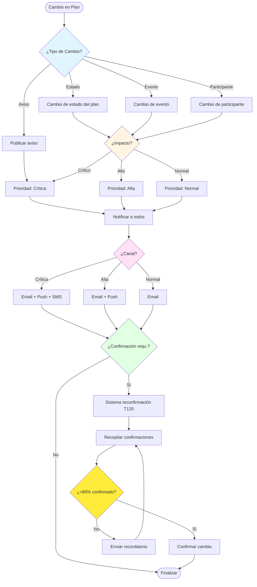

# 🔔 Flujo de Invitaciones y Notificaciones

> Define el sistema de invitaciones a planes y notificaciones de cambios

**Relacionado con:** T104, T105, T110  
**Versión:** 1.1  
**Fecha:** Enero 2025 (Actualizado: Noviembre 2025)

---

## 🎯 Objetivo

Documentar el sistema completo de invitaciones a participantes y notificaciones de cambios en el plan, eventos y colaboración.

---

## 📊 TIPOS DE NOTIFICACIONES

| Tipo | Descripción | Prioridad | Canal | Cuándo |
|------|-------------|-----------|-------|--------|
| **Invitación** | Invitación a un plan nuevo | Alta | Email + Push | Al invitar |
| **Invitación cancelada** | El organizador cancela una invitación pendiente | Alta | Email + Push | Al cancelar |
| **Confirmación** | Participante acepta/rechaza | Normal | Push | Al responder |
| **Cambio evento** | Modificación de evento | Variable | Variable | Al cambiar |
| **Cambio participante** | Añadir/eliminar participante | Alta | Email + Push | Al cambiar |
| **Estado plan** | Plan cambia de estado | Alta | Email + Push | Al cambiar |
| **Alarma** | Recordatorio de evento | Crítica | Push + SMS | Antes del evento |
| **Aviso** | Mensaje del organizador | Normal | Push | Al publicar |

---

## 📋 PROCESOS

### 1. INVITACIONES (T104)

#### 1.1 - Invitar por Email

**Flujo completo:**
```
Organizador → "Invitar por email"
  ↓
Formulario:
- Email: usuario@example.com
- Rol: Participante / Observador
- Mensaje personalizado: (opcional)
  ↓
Sistema genera link único con token
  ↓
Email enviado:
┌──────────────────────────────┐
│ Hola!                        │
│                              │
│ Juan Ramos te ha invitado al │
│ plan "Vacaciones Londres"    │
│                              │
│ [Ver Plan] [Aceptar] [Rechazar]
│                              │
│ Mensaje: "¡Espero verte!"    │
│                              │
│ Link válido hasta: 7 días    │
└──────────────────────────────┘
  ↓
Participante hace clic en link
  ↓
Si tiene app instalada:
- Abrir app
- Ir a pantalla de invitación
- Ver detalles del plan
- Botones: [Aceptar] / [Rechazar]

Si NO tiene app:
- Mostrar web con detalles plan
- Botones: [Descargar app] / [Aceptar sin app]
  ↓
Participante acepta
  ↓
Sistema:
- Crear cuenta automática (si no tiene)
- Crear participación con estado "Aceptada"
- Crear track del participante
- Asignar a eventos futuros (opcional)
  ↓
Notificar a organizador
Email: "[Nombre] ha aceptado tu invitación"
  ↓
Actualizar contador de participantes
```

#### 1.2 - Invitar por Username

**Flujo:**
```
Organizador → "Invitar por username"
  ↓
Búsqueda:
- Campo de búsqueda
- Autocompletar por @username, email, nombre
  ↓
Seleccionar usuario
  ↓
Enviar invitación
  ↓
Usuario recibe notificación push (T105)
  ↓
Usuario abre notificación
  ↓
Ver detalles del plan en app
  ↓
Botones: [Aceptar] / [Rechazar]
  ↓
Mismo flujo que email después
```

#### 1.3 - Invitar Grupo (T123)

**Flujo:**
```
Organizador → "Invitar grupo"
  ↓
Seleccionar grupo: "Familia Ramos"
  ↓
Mostrar miembros:
- Juan Ramos ✅ (activo)
- María Ramos ✅ (activa)
- Pedro Ramos ❓ (inactivo)
- Ana Ramos ❓ (no tiene app)
  ↓
Organizador selecciona a quién invitar
  ↓
Enviar invitaciones:
- A usuarios activos: Push
- A usuarios inactivos: Email
  ↓
Cada miembro gestiona individualmente
  ↓
Estados independientes por miembro
```

#### 1.4 - Recordatorios de Invitaciones Pendientes

**Sistema automático:**
```
Invitación enviada
  ↓
Esperar 2 días sin respuesta
  ↓
Enviar recordatorio 1 (suave):
"Te enviamos una invitación hace 2 días.
¿Puedes responder?"
  ↓
Esperar 3 días más sin respuesta
  ↓
Enviar recordatorio 2 (más insistente):
"[Nombre], te invitamos hace 5 días.
Por favor, confirma tu asistencia para poder organizar el plan."
  ↓
Esperar 2 días más sin respuesta
  ↓
Marcar como "Expirada"
  ↓
Notificar a organizador:
"[Nombre] no ha respondido a tu invitación.
Puedes re-enviar la invitación o eliminarla."
```

#### 1.5 - Cancelación de Invitación (Owner/Admin)

**Flujo completo:**
```
Organizador → Participantes → Invitaciones pendientes → "Cancelar"
  ↓
Confirmación:
"¿Seguro que deseas cancelar esta invitación para [email]?"
  ↓
Sistema:
- Cambia `status` → "cancelled"
- Estampa `respondedAt`
  ↓
Notificaciones:
- Email al invitado:
  Asunto: "Se ha cancelado tu invitación al plan [Nombre]"
  Contenido: "El organizador ha cancelado la invitación. No necesitas realizar ninguna acción."
- Push (si el invitado tiene cuenta/app): "Tu invitación a [Nombre] ha sido cancelada"
- Email al organizador (opcional) o snackbar de confirmación en la app
  ↓
UI:
- La invitación desaparece de la lista de pendientes
- El contador de invitaciones pendientes se actualiza
```

**Reglas y seguridad:**
- Solo el owner del plan o un admin pueden cancelar invitaciones (ver `firestore.rules` `plan_invitations.update` con `status: 'cancelled'`).
- No se permiten cambios de otros campos al cancelar (solo `status` y `respondedAt`).

#### 1.6 - Aceptar/Rechazar Invitación (Usuario Invitado)

**Flujo completo:**
```
Usuario invitado recibe invitación (email o en app)
  ↓
Usuario hace clic en link o abre invitación en app
  ↓
Sistema verifica:
- Token válido (si es link)
- Invitación no expirada (7 días)
- Estado de invitación es "pending"
  ↓
Usuario acepta o rechaza
  ↓
Si ACEPTA:
- Sistema crea `PlanParticipation` con estado "accepted"
- Sistema actualiza `plan_invitations.status` → "accepted"
- Sistema estampa `plan_invitations.respondedAt`
- Usuario es añadido al plan
- Notificar al organizador
  ↓
Si RECHAZA:
- Sistema actualiza `plan_invitations.status` → "rejected"
- Sistema estampa `plan_invitations.respondedAt`
- Usuario NO es añadido al plan
- Notificar al organizador
```

**Reglas y seguridad:**
- **Solo el usuario invitado puede aceptar/rechazar su propia invitación** (ver `firestore.rules` `plan_invitations.update`).
- La verificación del email se hace de dos formas:
  1. Primero verifica el email del token de Firebase Auth (`request.auth.token.email`)
  2. Si no coincide, verifica el email del documento de usuario en Firestore (`users/{userId}.email`)
- Esta doble verificación asegura que funcione incluso si el email del token no coincide exactamente con el email de la invitación.
- Solo se pueden actualizar los campos `status` y `respondedAt` (no se pueden modificar `planId`, `email`, `token`, `createdAt`, `expiresAt`, `role`).
- Solo se puede cambiar el estado de "pending" a "accepted" o "rejected".
- **Solo el organizador del plan puede eliminar invitaciones** (ver `firestore.rules` `plan_invitations.delete`).

**Notas importantes:**
- Si la actualización del estado de la invitación falla por permisos, pero la participación se crea correctamente, el sistema continúa funcionando (la participación es lo más importante).
- El estado de la invitación puede actualizarse manualmente por el organizador o mediante una Cloud Function si es necesario.

---

### 2. NOTIFICACIONES DE CAMBIOS (T105)

#### 2.1 - Sistema de Avisos Unidireccionales

**Concepto:** Sistema de mensajes del organizador a participantes (NO es chat)

**Flujo:**
```
Organizador → "Publicar aviso"
  ↓
Modal de publicación:
"Escribe tu aviso para [nombre del plan]:"

[Aviso:                              ]
[                                     ]
[                                     ]

[Añadir foto] [Añadir ubicación] [Publicar]

  ↓
Publicar aviso
  ↓
Sistema:
- Guardar aviso en plan
- Notificar a todos los participantes (T105)
- Mostrar timestamp y autor
  ↓
Participantes reciben notificación push
  ↓
Abrir notificación
  ↓
Ver aviso en timeline del plan
  ↓
Listo (no se puede responder)
```

**Campos del aviso:**
- Autor (usuario que publica)
- Mensaje (texto)
- Foto adjunta (opcional)
- Ubicación (opcional)
- Timestamp
- Tipo: "Información" / "Urgente" / "Importante"

**Historial de avisos:**
```
Timeline del plan:
───────────────────────────
Hace 2 horas
Aviso de Juan Ramos:
"Recordatorio: El vuelo sale mañana
 a las 08:00h. Llegar al aeropuerto a las 6:00h."
───────────────────────────
Hace 1 día
Aviso de Juan Ramos:
"Actualización: El restaurante ha cambiado
 a uno más cercano al hotel."
───────────────────────────
Hace 3 días
Aviso de Juan Ramos:
"Bienvenidos al plan Londres 2025! 🎉"
───────────────────────────
```

#### 2.2 - Notificaciones Automáticas de Cambios

**Tipos de cambios que generan notificación:**

**Cambio de Estado del Plan:**
```
Plan cambia de "Planificando" → "Confirmado"
  ↓
Notificar a todos los participantes
  ↓
Email + Push:
"El plan 'Vacaciones Londres' ha sido confirmado.

Está listo para ejecutarse el 15/11/2025."
```

**Cambio de Evento (por magnitud):**
```
Cambiar hora de evento <1h:
- Notificar con prioridad baja

Cambiar hora de evento 1-4h:
- Notificar con prioridad alta

Cambiar hora de evento >4h:
- Notificar con prioridad crítica
- Requiere reconfirmación (T120)
```

**Cambio de Participantes:**
```
Añadir participante:
"María García se ha unido al plan 'Vacaciones Londres'"

Eliminar participante:
"Pedro Martínez ha sido eliminado del plan.
Si tenías eventos asignados con Pedro, serán actualizados."
```

#### 2.3 - Notificaciones de Alarmas (T110)

**Concepto:** Recordatorios automáticos antes de eventos

**Configuración de alarma:**
```
Crear/editar evento
  ↓
"Recordatorios"
  ↓
Configurar:
- Recordatorio 1: 24h antes
- Recordatorio 2: 2h antes
- Recordatorio 3: 30min antes
  ↓
Guardar
```

**Flujo de alarma:**
```
Hora del evento: 15/11/2025 a las 10:00h
  ↓
[24h antes] 14/11/2025 a las 10:00h
Enviar notificación: "Mañana tienes [Evento] a las 10:00h"
  ↓
[2h antes] 15/11/2025 a las 08:00h
Enviar notificación: "En 2h: [Evento]"
  ↓
[30min antes] 15/11/2025 a las 09:30h
Enviar notificación PUSH urgente + SMS:
"⚠️ En 30 minutos: [Evento]
Ubicación: [Dirección]"
```

**Configuración por usuario:**
```
Ajustes personales → Notificaciones
  ↓
Configurar:
- Alarmas: Activadas
- Horarios silencio: 22:00h - 08:00h
- Snooze: 5 minutos / 30 minutos / 1 hora
  ↓
Guardar
```

---

### 3. SISTEMA DE CONFIRMACIÓN DE EVENTOS (T120)

#### 3.1 - Eventos que Requieren Confirmación

**Configuración:**
```
Crear evento
  ↓
Configuración avanzada
  ↓
Checkbox: "Requiere confirmación de asistencia"
- Activar
  ↓
Configurar límite opcional:
- "Máximo 10 personas" (opcional)
  ↓
Guardar
```

**Flujo de confirmación:**
```
Evento creado con "requiere confirmación"
  ↓
Participantes asignados reciben notificación:
"Invitación a evento: [Nombre evento]
Fecha: [Fecha]
Ubicación: [Ubicación]
Límite: 10 personas (7 confirmadas)"

[Confirmar asistencia] [No puedo asistir]
  ↓
Participante confirma
  ↓
Sistema:
- Actualizar contador confirmaciones
- Mostrar "quién confirmó" en UI
- Notificar a otros si hay lista de espera
  ↓
Si se alcanza límite:
- Cerrar confirmaciones
- Crear lista de espera
```

**UI del evento:**
```
┌──────────────────────────────┐
│ Cena Grupal                   │
│ 📍 Restaurant X              │
│ 📅 15/11/2025 - 20:00h      │
│ 👥 8 de 10 personas          │
│                              │
│ Confirmados (8):             │
│ ✅ Juan                      │
│ ✅ María                     │
│ ✅ Pedro                     │
│ ✅ Ana                       │
│ ✅ Luis                      │
│ ✅ Laura                     │
│ ✅ Miguel                    │
│ ✅ Carmen                    │
│                              │
│ Lista de espera (2):        │
│ ⏳ Rosa                      │
│ ⏳ Carlos                    │
└──────────────────────────────┘
```

---

## 📊 DIAGRAMA DE FLUJO DE NOTIFICACIONES



---

## 📋 TAREAS RELACIONADAS

**Pendientes:**
- T104: Sistema completo de invitaciones (email, username, grupos)
- T105: Sistema completo de notificaciones (push, email, avisos)
- T110: Sistema de alarmas y recordatorios
- T120: Sistema de confirmación de eventos
- Integración con Firebase Cloud Messaging (FCM)
- Configuración de preferencias de notificación por usuario

**Completas ✅:**
- Ninguna (todo pendiente)

---

## ✅ IMPLEMENTACIÓN ACTUAL

**Estado:** ⚠️ Parcialmente implementado (Base de avisos y confirmación de invitaciones completada, notificaciones push pendientes)

**Lo que está implementado:**
- ✅ Sistema de avisos unidireccionales - Base (T105)
  - ✅ Modelo `PlanAnnouncement` con tipos (info, urgent, important)
  - ✅ Publicación de avisos con validación y sanitización
  - ✅ Timeline cronológica de avisos
  - ✅ Eliminación de avisos (autor u organizador)
  - ✅ Integración en pantalla de datos del plan
  - ✅ Firestore rules y providers Riverpod

**Lo que falta:**
- ✅ Sistema de invitaciones por email/usuario - COMPLETADO (T104):
  - ✅ Modelo PlanInvitation con token único y expiración (7 días)
  - ✅ InvitationService para gestionar invitaciones
  - ✅ Búsqueda de usuario por email (si existe, requiere aceptación explícita)
  - ✅ Generación de links únicos con token
  - ✅ Página InvitationPage para procesar links (/invitation/{token})
  - ✅ Email HTML con botones "Aceptar" / "Rechazar" (Firebase Functions + SendGrid)
  - ✅ Template HTML responsive con información del plan
  - ✅ Firestore rules para plan_invitations con verificación de email mejorada (token + fallback a documento usuario)
  - ✅ Campo status en PlanParticipation (pending, accepted, rejected, expired)
  - ✅ Métodos acceptInvitationByToken y rejectInvitationByToken en servicio
  - ✅ UI diálogo para aceptar/rechazar invitaciones por token en app
  - ✅ Integración en ParticipantsScreen y DashboardPage para mostrar invitaciones pendientes
  - ✅ Validación de email antes de crear invitación
  - ✅ Prevención de invitaciones duplicadas (detecta invitaciones pendientes existentes)
  - ✅ Prevención de invitar usuarios que ya son participantes
  - ✅ Gestión de invitaciones canceladas por organizador
  - ✅ Verificación de permisos: solo el usuario invitado puede aceptar/rechazar su propia invitación
  - ✅ Verificación de permisos: solo el organizador puede eliminar invitaciones
  - ✅ Manejo de errores cuando la actualización del estado falla pero la participación se crea correctamente
  - ⚠️ Pendiente: Invitaciones por username/nickname (T104 - parte opcional)
  - ⚠️ Pendiente: Cloud Function para actualizar automáticamente el estado de la invitación cuando se crea una participación
- ❌ Notificaciones push (Firebase Cloud Messaging) - Pendiente FCM
- ❌ Historial de notificaciones
- ✅ Sistema de confirmación de asistencia a eventos - Base (T120 Fase 2):
  - ✅ Campo requiresConfirmation en Event
  - ✅ Campo confirmationStatus en EventParticipant
  - ✅ Checkbox en EventDialog para organizador
  - ✅ Creación automática de confirmaciones pendientes
  - ✅ Botones confirmar/no asistir para participantes
  - ✅ Indicadores visuales de estado (confirmado, pendiente, declinado)
  - ✅ Estadísticas y listas por estado
  - ✅ Integración con límites de participantes
  - ⚠️ Notificaciones push (pendiente FCM)
- ❌ Sistema de alarmas antes de eventos
- ❌ Configuración de preferencias de notificación
- ❌ Recordatorios automáticos

---

*Documento de flujo de invitaciones y notificaciones*  
*Última actualización: Noviembre 2025*

**Cambios recientes (v1.1):**
- ✅ Aclarado que solo el usuario invitado puede aceptar/rechazar su propia invitación
- ✅ Aclarado que solo el organizador puede eliminar invitaciones
- ✅ Documentada la verificación de email mejorada (token + fallback a documento usuario)
- ✅ Documentado el manejo de errores cuando la actualización del estado falla pero la participación se crea correctamente
- ✅ Actualizada la sección de implementación con todos los detalles completados

