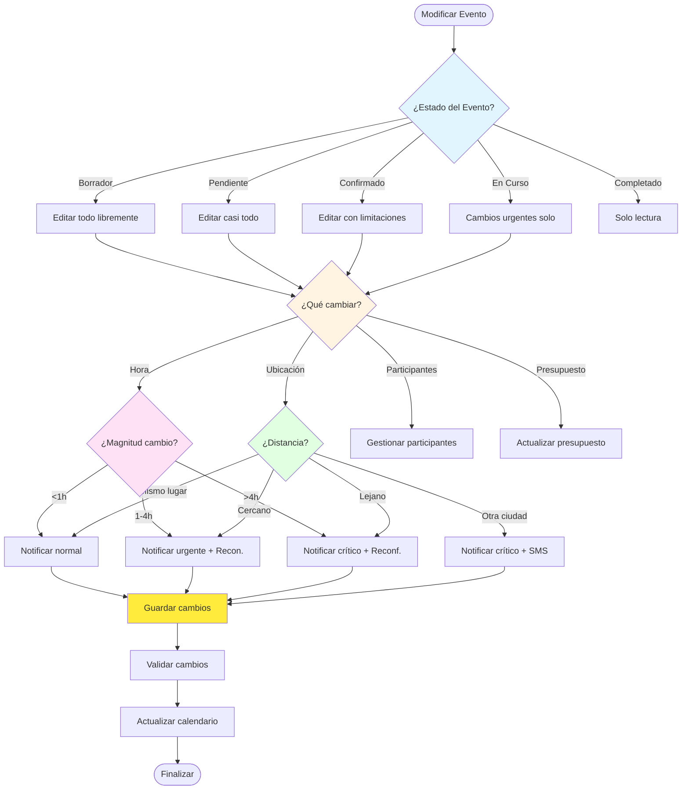

# 📅 Flujo de Modificación de Eventos

> Define qué pasa cuando se crean, modifican o eliminan eventos durante la vida del plan

**Relacionado con:** T121, T105, T110, T101, T102, T120  
**Versión:** 1.0  
**Fecha:** Enero 2025

---

## 🎯 Objetivo

Documentar todos los escenarios de modificación de eventos: crear, editar hora/ubicación/participantes, eliminar, y cómo cada cambio afecta a participantes, presupuesto, y validaciones.

---

## 📊 ESTADOS DE EVENTOS

| Estado | Descripción | Editable | Eliminable | Visible Para |
|--------|-------------|----------|------------|--------------|
| **Borrador** | Evento en creación | ✅ Todo | ✅ Sí | Solo creador |
| **Pendiente** | Evento creado, no confirmado | ✅ Casi todo | ✅ Sí | Asignados + organizador |
| **Confirmado** | Evento confirmado | ⚠️ Limitado | ⚠️ Con confirmación | Todos |
| **En Curso** | Evento ejecutándose | ⚠️ Solo urgente | ❌ No | Todos |
| **Completado** | Evento terminado | ❌ No | ❌ No | Todos |
| **Cancelado** | Evento cancelado | ❌ No | ❌ No | Todos |

---

## 📋 PROCESOS DE MODIFICACIÓN

### 1. CREAR EVENTO

#### 1.1 - Durante Planificación

**Flujo:**
```
Organizador/Participante → "Añadir evento"
  ↓
Abrir formulario (T121)
  ↓
Completar campos:
- Título, fecha, hora, duración
- Tipo (Desplazamiento/Restauración/Actividad)
- Subtipo (Avión/Tren/Hotel/etc.)
- Participantes asignados
- Ubicación (opcional)
- Presupuesto si aplica (T101)
  ↓
Guardar evento
  ↓
Estado: "Pendiente" o "Confirmado"
```

**Validaciones (T51):**
- Título no vacío
- Fecha dentro del rango del plan
- Participantes asignados
- No solapamientos (si no es borrador)
- Timezone válido

**Acciones post-creación:**
1. Crear evento en calendario
2. Asignar a tracks de participantes
3. Detectar solapamientos
4. Notificar a participantes asignados (T105)
5. Actualizar presupuesto (T101)

#### 1.2 - Durante Ejecución

**Flujo:**
```
Organizador → "Añadir evento" (urgente)
  ↓
Modal: "¿Crear evento urgente?"
  ↓
Completar formulario
  ↓
Configurar alarma si <2 horas (T110)
  ↓
Guardar con estado "Confirmado"
  ↓
Notificar urgentemente (T105)
```

**Consideraciones especiales:**
- Solo organizador puede crear eventos en ejecución
- Configurar alarma inmediatamente si evento <2h
- Notificar PUSH urgente a participantes
- Auto-asignar a todos los participantes (opcional)

#### 1.3 - Evento Espontáneo

**Escenario:** Decisión de último momento durante el plan

**Ejemplo:** "Quedemos para cenar en 2 horas"

**Flujo:**
```
Participante o Organizador → "Evento espontáneo"
  ↓
Formulario simplificado:
- Solo: Título, hora (próximas 6h), ubicación, participantes
  ↓
Guardar con alarma inmediata
  ↓
Notificar urgente
  ↓
Aparece en calendario en tiempo real
```

---

### 2. MODIFICAR EVENTO

#### 2.1 - Cambiar Hora del Evento

**Escenarios según magnitud del cambio:**

##### Cambio Leve (<1h)
```
Ejemplo: 20:00 → 20:30

Flujo:
- Editar hora en formulario
- Guardar
- Notificar a participantes (prioridad baja)
- Actualizar alarmas (T110)
- Recalcular solapamientos
```

**Impacto:** Menor  
**Urgencia:** Normal  
**Notificación:** Email estándar (T105)

##### Cambio Significativo (1-4h)
```
Ejemplo: 20:00 → 22:00

Flujo:
- Editar hora en formulario
- Guardar
- Notificar urgente a participantes
- Solicitar reconfirmación (T120)
- Actualizar alarmas (T110)
- Recalcular solapamientos con más detalle
```

**Impacto:** Medio  
**Urgencia:** Alta  
**Notificación:** Email urgente + Push (T105)  
**Reconfirmación:** Opcional

##### Cambio Drástico (>4h o cambio de día)
```
Ejemplo: Lunes 20:00 → Martes 08:00

Flujo:
- Editar hora/fecha en formulario
- Sistema detecta cambio drástico
- Modal: "⚠️ CAMBIO DRASTICO DE FECHA/HORA

Antes: Lunes 20/10 a las 20:00h
Ahora: Martes 21/10 a las 08:00h

¿Estás seguro? Requerirá reconfirmación de participantes."

[Cancelar] / [Sí, cambiar]
  ↓
Guardar
  ↓
Estado evento: "Pendiente de reconfirmación"
  ↓
Notificar crítico a participantes (T105)
  ↓
Bloquear evento hasta reconfirmación
  ↓
Sistema (T120):
- Enviar notificación a todos
- Esperar >80% confirmaciones
- Desbloquear evento automáticamente
```

**Impacto:** Alto  
**Urgencia:** Crítica  
**Notificación:** Email + Push críticos (T105)  
**Reconfirmación:** ✅ OBLIGATORIA

**Cambio a Día Pasado:**
```
Sistema detecta fecha anterior a "hoy"
  ↓
Modal: "❌ ERROR

No se puede cambiar a una fecha pasada.

¿Quieres marcar este evento como 'no realizado'?"
  ↓
Si acepta: Marcar evento como "Cancelado"
Actualizar presupuesto (T101)
Recalcular reembolsos si aplica (T102)
```

#### 2.2 - Cambiar Ubicación del Evento

**Escenarios según distancia:**

##### Misma Ubicación (cambio de sala)
```
Ejemplo: Hotel X, Sala A → Hotel X, Sala B

Flujo:
- Editar ubicación
- Notificar participantes (prioridad baja)
- Actualizar mapa (T114)
```

##### Ubicación Cercana (mismo barrio)
```
Ejemplo: Calle A, 123 → Calle A, 456 (200m)

Flujo:
- Editar ubicación
- Notificar participantes
- Actualizar mapa (T114)
- Calcular tiempo de traslado ajustado
```

##### Ubicación Lejana (nuevo barrio)
```
Ejemplo: Centro → Periferia (5km)

Flujo:
- Editar ubicación
- Sistema detecta cambio >2km
- Notificar urgente a participantes
- Actualizar mapa (T114)
- Calcular nuevo tiempo de traslado
- Alertar si hay tiempo insuficiente entre eventos
```

##### Ubicación en Otra Ciudad/País
```
Ejemplo: Madrid → Barcelona

Flujo:
- Editar ubicación
- Sistema detecta cambio a otra ciudad
- Modal: "⚠️ CAMBIO DE CIUDAD

Ubicación cambió de Madrid a Barcelona.
Este cambio requiere reconfirmación de participantes.

¿Continuar?"

[Sí] / [Cancelar]
  ↓
Reconfirmación obligatoria (T120)
  ↓
Si confirma: Actualizar ubicación
Recalcular presupuesto (T101) - viaje adicional
Actualizar mapa completo (T114)
```

#### 2.3 - Cambiar Participantes del Evento

##### Añadir Participante a Evento Existente

**Flujo:**
```
Abrir evento
  ↓
"Participantes" → "Añadir participante"
  ↓
Seleccionar de lista
  ↓
Actualizar track del participante añadido
  ↓
Notificar al participante añadido
Notificar a otros participantes (si es evento privado/capacidad limitada)
  ↓
Recalcular presupuesto si hay coste por persona (T101)
Actualizar capacidad si aplica
```

**Impacto:**
- Nueva persona puede asistir
- Si hay límite de plazas: se consume 1 plaza
- Presupuesto aumenta proporcionalmente

##### Eliminar Participante de Evento Existente

**Flujo:**
```
Abrir evento
  ↓
"Participantes" → "Eliminar [nombre]"
  ↓
Confirmación: "¿Eliminar a [nombre] de este evento?"
  ↓
Actualizar track del participante
Eliminar de asignación del evento
  ↓
Notificar al participante eliminado
Notificar a otros (si había límite de plazas)
  ↓
Recalcular presupuesto si había coste (T101)
Calcular reembolso si ya pagó (T102)
Liberar plaza si había límite
```

**Impacto:**
- Participante ya no puede asistir
- Reembolso si pagado
- Plaza disponible para otros

#### 2.4 - Cambiar Presupuesto del Evento

**Flujo:**
```
Abrir evento
  ↓
"Presupuesto" → Editar coste
  ↓
Actualizar coste estimado/real
  ↓
Recalcular presupuesto total del plan (T101)
  ↓
Recalcular distribución de costes (T102)
  ↓
Notificar si cambio significativo (>20% del coste del evento)
```

**Acciones automáticas:**
1. Actualizar presupuesto total (T101)
2. Recalcular "quién debe pagar" (T102)
3. Actualizar gráfico de distribución (T101)
4. Notificar si cambio >€50 o >20% del evento

---

### 3. ELIMINAR/CANCELAR EVENTO

#### 3.1 - Eliminar durante Planificación (>7 días)

**Flujo:**
```
Seleccionar evento
  ↓
"Eliminar evento"
  ↓
Confirmación: "¿Eliminar este evento?

- [Título del evento]
- Fecha: [Fecha]
- Participantes: [Lista]

Esta acción no se puede deshacer."

[Cancelar] / [Eliminar]
  ↓
Sistema:
- Eliminar de calendario
- Eliminar de tracks de participantes
- Recalcular presupuesto (T101)
- Cancelar alarmas si existían (T110)
  ↓
Notificar a participantes
  ↓
Si hay coste pagado: Calcular reembolsos (T102)
```

**Impacto:**
- Evento desaparece del calendario
- Presupuesto disminuye
- Si pagado: reembolso calculado

#### 3.2 - Eliminar durante Planificación (1-7 días)

**Flujo:**
```
Seleccionar evento
  ↓
"Eliminar evento"
  ↓
Modal de advertencia: "⚠️ ELIMINAR EVENTO CERCANO

Este evento está programado para [fecha] (en [X] días).

¿Estás seguro de eliminarlo?

Cambios:
- El evento desaparecerá del calendario
- Los participantes serán notificados urgentemente
- Se calcularán reembolsos si pagado

[Razón de cancelación] (opcional)

[Cancelar] / [Sí, eliminar"
  ↓
Sistema:
- Eliminar de calendario
- Recalcular presupuesto (T101)
- Calcular reembolsos completos (T102)
- Notificar urgente (T105)
  ↓
Email urgente a todos los participantes
```

**Impacto:**
- Evento eliminado
- Notificación urgente
- Reembolsos calculados
- Posible descontento de participantes

#### 3.3 - Eliminar evento muy cercano (<24h)

**Flujo:**
```
Seleccionar evento <24h
  ↓
"Eliminar evento" → BLOQUEADO
  ↓
Mostrar opción alternativa: "Cancelar evento"
  ↓
Modal crítico: "🚨 CANCELAR EVENTO INMINENTE

Este evento empieza en [X] horas.

Solo puedes CANCELARLO, no eliminarlo.

Esta acción:
- Notificará críticamente a todos los participantes
- Calculará reembolsos inmediatos
- Marcará el evento como 'cancelado'
- Mantendrá el evento en histórico

[Motivo de cancelación] (obligatorio)

[Cancelar] / [Cancelar evento"
  ↓
Sistema:
- Marcar como "Cancelado" (no eliminar)
- Notificar crítico (T105)
- Calcular reembolsos inmediatos (T102)
- Actualizar calendario
  ↓
Email + SMS (si posible) urgente
```

**Restricción:**
- NO se puede eliminar eventos <24h
- Solo cancelar
- Requiere motivo obligatorio

#### 3.4 - Evento en Curso o Pasado

**Flujo:**
```
Intento eliminar evento pasado
  ↓
Sistema: "❌ NO PERMITIDO

Este evento ya ha ocurrido (o está en curso).
No se puede eliminar.

¿Qué quieres hacer?"

[Marcar como 'no realizado']
[Añadir nota]
[Añadir foto]
[Cancelar]
```

**Acciones permitidas:**
- ✅ Marcar como "no realizado" (solo para eventos muy recientes)
- ✅ Añadir nota post-evento
- ✅ Añadir foto del evento
- ❌ Eliminar o modificar

---

### 4. IMPORTACIÓN Y CONEXIÓN CON PROVEEDORES

#### 4.1 - Importar desde JSON Propietario

**Formato JSON de importación:**
```json
{
  "formatVersion": "1.0",
  "planId": "optional_if_linking_to_existing",
  "events": [
    {
      "title": "Vuelo Madrid → Sydney",
      "type": "Desplazamiento",
      "subtype": "Avión",
      "date": "2025-10-22",
      "startTime": "20:00",
      "duration": 840,
      "timezone": "Europe/Madrid",
      "arrivalTimezone": "Australia/Sydney",
      "location": {
        "name": "Aeropuerto Adolfo Suárez Madrid-Barajas",
        "address": "28042 Madrid, Spain",
        "coordinates": { "lat": 40.4839, "lng": -3.5679 }
      },
      "arrivalLocation": {
        "name": "Aeropuerto Sydney",
        "address": "Sydney NSW 2020, Australia",
        "coordinates": { "lat": -33.9399, "lng": 151.1753 }
      },
      "participants": ["user1", "user2"],
      "cost": 300.00,
      "costPerPerson": true
    }
  ]
}
```

**Flujo de importación:**
```
Usuario → Plan → "Importar eventos"
  ↓
Seleccionar archivo JSON
  ↓
Validar formato y versión
  ↓
Preview: "Se importarán [N] eventos"
  ↓
Validar cada evento:
- Fecha en rango del plan
- Participantes existen
- Sin solapamientos
  ↓
Mostrar errores: "⚠️ [M] eventos con errores"
  ↓
Importar eventos válidos
  ↓
Mostrar resumen: "✅ [N] importados"
```

#### 4.2 - Conectar con Proveedor vía API

**Concepto:** Proveedores externos (aerolíneas, hoteles, restaurantes) actualizan eventos automáticamente.

**Flujo de conexión:**
```
Usuario → Evento → "Conectar con proveedor"
  ↓
Buscar proveedor: "Iberia", "Hilton", etc.
  ↓
Autorizar conexión
  ↓
Guardar API configuration
  ↓
Evento actualizado automáticamente
  ↓
Badge: "Actualizado por Iberia"
```

**API del proveedor:**
```dart
// GET /api/v1/event-updates/{eventId}
{
  "eventId": "abc123",
  "updatedAt": "2025-01-15T10:30:00Z",
  "changes": {
    "departureTime": "20:30",
    "gate": "A5"
  },
  "metadata": {
    "provider": "Iberia",
    "reservationNumber": "IBE123"
  }
}
```

**Consideraciones de seguridad:**
- API Key segura por proveedor
- Rate limiting
- Validar origen de actualizaciones
- Logging de actualizaciones automáticas

#### 4.3 - Export de Eventos (para generar JSONs)

```
Usuario → "Exportar eventos"
  ↓
Seleccionar eventos
  ↓
Generar JSON
  ↓
Descargar o compartir
```

---

### 5. HISTORIAL DE CAMBIOS

**Sistema de auditoría (futuro):**

Para cada cambio en un evento, registrar:
- **Quién:** Usuario que hizo el cambio
- **Cuándo:** Timestamp del cambio
- **Qué cambió:** Campo afectado (hora, ubicación, participantes, etc.)
- **De:** Valor anterior
- **A:** Valor nuevo
- **Motivo:** Razón del cambio (opcional)

**UI para ver historial:**
```
Abrir evento
  ↓
"Ver historial de cambios"
  ↓
Mostrar timeline:
- [Hace 2 días] Juan cambió la hora de 20:00 a 22:00
- [Hace 1 semana] María añadió el participante Pedro
- [Hace 2 semanas] Juan creó el evento
```

---

## 🔔 NOTIFICACIONES PARA CAMBIOS DE EVENTOS

> Nota: Esta sección se mantiene como parte del flujo principal de modificaciones.

### Matriz de Notificaciones

| Tipo de Cambio | Prioridad | Notificación | Canal |
|----------------|-----------|--------------|-------|
| **Crear evento durante ejecución** | Normal | ✅ Email | Email estándar |
| **Cambio hora <1h** | Baja | ⚠️ Opcional | Email + Push opcional |
| **Cambio hora 1-4h** | Alta | ✅ Sí | Email + Push |
| **Cambio hora >4h** | Crítica | ✅ Sí (urgente) | Email + Push urgente |
| **Cambio día** | Crítica | ✅ Sí (urgente) | Email + Push urgente |
| **Cambio ubicación misma ciudad** | Normal | ✅ Email | Email estándar |
| **Cambio ubicación lejana** | Alta | ✅ Urgente | Email + Push |
| **Cambio ciudad/país** | Crítica | ✅ Crítico | Email + Push + SMS |
| **Añadir participante** | Normal | ✅ Sí | Email + Push |
| **Eliminar participante** | Alta | ✅ Sí (urgente) | Email + Push |
| **Eliminar evento >7 días** | Normal | ✅ Email | Email estándar |
| **Eliminar evento 1-7 días** | Crítica | ✅ Urgente | Email + Push urgente |
| **Eliminar evento <24h** | Crítico | ✅ Crítico | Email + Push + SMS |

---

## 📊 DIAGRAMAS DE FLUJO

### Flujo de Modificación de Evento



---

## 📋 TAREAS RELACIONADAS

**Pendientes:**
- T121: Formularios enriquecidos para eventos
- T105: Sistema de notificaciones robusto
- T110: Sistema de alarmas
- T120: Sistema de reconfirmación
- T51: Validación de formularios completa
- Historial de cambios/auditoría

**Completas ✅:**
- Crear eventos básicos
- Modificar eventos básicos
- Sistema de tracks
- Timezone-aware

---

## ✅ IMPLEMENTACIÓN ACTUAL

**Estado:** ⚠️ Básico implementado

**Lo que ya funciona:**
- ✅ Crear eventos básicos
- ✅ Editar título, fecha, hora, duración
- ✅ Asignar participantes
- ✅ Gestionar timezones
- ✅ Sistema de tracks

**Lo que falta (CRÍTICO):**
- ❌ Formularios específicos por tipo (T121)
- ❌ Sistema de estados de evento (Pendiente, Confirmado, etc.)
- ❌ Reconocimiento obligatorio para cambios drásticos (T120)
- ❌ Notificaciones automáticas (T105)
- ❌ Sistema de alarmas (T110)
- ❌ Historial de cambios
- ❌ Integración con presupuesto (T101)
- ❌ Integración con pagos (T102)

---

*Documento de flujo de modificación de eventos*  
*Última actualización: Enero 2025*

