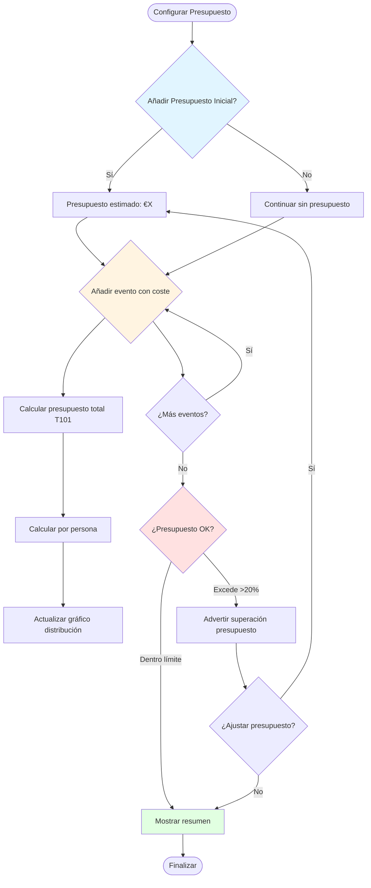

# 💰 Flujo de Presupuesto y Pagos

> Define cómo gestionar presupuestos, costes, pagos y bote común en un plan

**Relacionado con:** T101 ✅, T102 ✅, T153 ✅  
**Versión:** 1.1  
**Fecha:** Enero 2025 (Actualizado - T102 y T153 completados)

---

## 🎯 Objetivo

Documentar el sistema completo de gestión financiera del plan: presupuestos, costes por evento, pagos individuales, bote común, y cálculo de deudas/reembolsos.

---

## 📊 CONCEPTOS CLAVE

| Concepto | Descripción | Ejemplo |
|----------|-------------|---------|
| **Presupuesto total** | Suma de todos los costes del plan | €2,500 |
| **Coste por evento** | Coste individual de un evento | Vuelo: €300 |
| **Coste estimado** | Coste previsto antes del evento | "En torno a €50" |
| **Coste real** | Coste final después del evento | "Fueron €47.50" |
| **Pago individual** | Lo que pagó un participante específico | Juan pagó €120 |
| **Bote común** | Fondo compartido del grupo | "Bote: €500" |
| **Distribución equitativa** | Coste dividido entre participantes | €300 ÷ 4 = €75 c/u |
| **Deuda** | Lo que debe pagar un participante | Juan debe €25 |
| **Crédito** | Lo que se debe a un participante | María debe cobrar €15 |

---

## 📋 PROCESOS DE GESTIÓN

### 1. CONFIGURAR PRESUPUESTO DEL PLAN

#### 1.1 - Presupuesto Estimado Inicial

**Cuándo:** Durante planificación (ETAPA 1 o ETAPA 3)  
**Quién:** Organizador

**Flujo:**
```
Organizador → "Configurar presupuesto"
  ↓
Campos:
- Presupuesto estimado total: €2,500
- Moneda: EUR
- Por participante estimado: €625 (4 personas)
  ↓
Guardar
```

**Funcionalidad (T101):**
- Campo `cost` en Event y Accommodation (T101)
- Cálculo automático de presupuesto total (T101)
- Servicio `BudgetService` para cálculos
- Visualización en estadísticas del plan (T101)

**Funcionalidad (T153):**
- Selector de moneda al crear plan (EUR, USD, GBP, JPY)
- Campo `currency` en Plan (default: EUR)
- Formateo automático según moneda del plan

#### 1.2 - Actualizar Presupuesto Dinámicamente

**Flujo automático:**
```
Cada vez que se añade evento con coste:
  ↓
Sistema:
1. Sumar coste del evento al presupuesto total
2. Recalcular coste por participante
3. Actualizar gráfico de distribución
  ↓
UI actualiza:
- Presupuesto total: €2,800 (+€300)
- Por participante: €700 (+€75)
```

**Validaciones:**
- Presupuesto total no puede ser negativo
- Avisar si se supera presupuesto inicial >20%
- Sugerir ajustar presupuesto inicial si hay mucha diferencia

---

### 2. AÑADIR COSTES A EVENTOS

#### 2.1 - Coste Estimado al Crear Evento

**Flujo:**
```
Crear evento
  ↓
Completar campos básicos
  ↓
Añadir coste (T101/T153):
- Selector de moneda local (ej: USD)
- Coste: 300
  ↓
Si moneda local ≠ moneda del plan:
  - Sistema calcula conversión automáticamente
  - Muestra: "Convertido a EUR: €277.78"
  - Disclaimer: "Tipos de cambio orientativos..."
  ↓
Guardar evento
  - Coste se guarda en moneda del plan (convertido)
  ↓
Actualizar presupuesto del plan (T101)
```

**Tipos de coste:**
- **Por persona:** €50 x 4 personas = €200 total
- **Total del evento:** €200 total (sin importar personas)

#### 2.2 - Actualizar Coste Real después del Evento

**Flujo (durante post-ejecución):**
```
Evento completado
  ↓
Ab lightr evento
  ↓
"Actualizar coste real"
  ↓
Campos:
- Coste real: €287.50
- Desglose (opcional):
  - Vuelo base: €250
  - Equipaje extra: €25
  - Seguro: €12.50
  ↓
Guardar
  ↓
Recalcular presupuesto del plan
Actualizar comparación estimado vs real (T101)
```

**Funcionalidad (T101):**
- Tracking de "coste estimado" vs "coste real"
- Gráfico de diferencia
- Actualización automática de presupuesto total

#### 2.3 - Desglose de Costes por Evento

**Campos detallados (T121):**
```
Evento: Vuelo Madrid → Sydney

Costes:
- Billetes base: €1,200 (4 personas x €300)
- Equipaje extra: €80 (2 personas x €40)
- Selección de asientos: €60 (€15 x 4)
- Seguro de viaje: €50
Total: €1,390

Distribución:
- Por persona: €347.50
- Por servicios extras: Variable
```

---

### 3. SISTEMA DE PAGOS (T102)

#### 3.1 - Registro de Pagos Individuales

**Flujo:**
```
Participante paga algo
  ↓
Organizador → "Registrar pago" (T102)
  ↓
Formulario:
- Participante: [Seleccionar]
- Moneda del pago: [EUR/USD/GBP/JPY] (T153, default: moneda del plan)
- Monto: 120
  ↓
Si moneda del pago ≠ moneda del plan:
  - Sistema calcula conversión automáticamente
  - Muestra: "Convertido a EUR: €111.11"
  - Disclaimer: "Tipos de cambio orientativos..."
  ↓
- Fecha: [Fecha de pago]
- Método: Efectivo / Transferencia / Tarjeta
- Concepto: Billetes de vuelo
- Descripción: "4 billetes Madrid-Sydney"
  ↓
Guardar pago
  - Monto se guarda en moneda del plan (convertido) (T153)
  ↓
Actualizar:
- Registro de pagos del participante
- Balance de pagos (T102)
- Cálculo de "Quién debe pagar/cobrar" (T102)
```

**Estados de pago:**
- **Pendiente:** Pago programado pero no realizado
- **Pagado:** Pago confirmado
- **Reembolsado:** Pago devuelto

#### 3.2 - Sistema de Bote Común

**Concepto:** Fondo compartido del grupo para gastos colectivos

**Flujo:**
```
Organizador → "Gestionar bote común"
  ↓
Ver estado actual:
- Total en bote: €500
- Aportaciones:
  - Juan: €200
  - María: €150
  - Pedro: €150
- Gastos del bote:
  - Comida grupo: -€180
  - Taxi compartido: -€50
- Saldo actual: €270
  ↓
Opciones:
- Añadir aportación
- Registrar gasto del bote
- Ver historial
```

**Funcionalidad:**
- Tracking de aportaciones por persona
- Tracking de gastos del bote
- Cálculo de saldo
- Historial completo

#### 3.3 - Cálculo de "Quién Debe Pagar / Cobrar"

**Algoritmo (T102):**

**Paso 1: Calcular coste total por persona**
```
Para cada participante:
  costeParticipante = suma(costes de eventos asignados)
  
Ejemplo Juan:
- Vuelo: €300
- Hotel 3 noches: €150
- Total: €450
```

**Paso 2: Calcular pagos por persona**
```
Para cada participante:
  pagosParticipante = suma(pagos individuales registrados)
  
Ejemplo Juan:
- Pagó billetes vuelo: €1,200
- Pagó hotel: €400
- Total pagado: €1,600
```

**Paso 3: Calcular balance**
```
Para cada participante:
  balance = pagosParticipante - costeParticipante
  
Ejemplo Juan:
Balance = €1,600 - €450 = €1,150
```

**Paso 4: Equilibrar**

```
1. Sumar todos los balances positivos → Total a cobrar
2. Sumar todos los balances negativos → Total a pagar
3. Deben ser iguales (validar)

4. Calcular distribuciones:
   - Deudores → Pagar a acreedores
   - Acreedores → Recibir de deudores

5. Sugerir transferencias mínimas
```

**Ejemplo:**
```
4 personas en plan
Coste total: €2,000
Por persona equitativo: €500

Pagaron:
- Juan: €1,500
- María: €300
- Pedro: €200
- Ana: €0

Balance:
- Juan: €1,500 - €500 = €1,000 (debe cobrar)
- María: €300 - €500 = -€200 (debe pagar)
- Pedro: €200 - €500 = -€300 (debe pagar)
- Ana: €0 - €500 = -€500 (debe pagar)

Equilibrios:
- María → Juan: €200
- Pedro → Juan: €300
- Ana → Juan: €500

Resultado:
Juan debe recibir €1,000
María debe pagar €200
Pedro debe pagar €300
Ana debe pagar €500
```

**UI del cálculo:**
```
Mostrar tarjetas por participante:

┌──────────────────────────────┐
│ Juan                         │
│ ✅ Debe cobrar: €1,000      │
│                              │
│ Debe recibir de:             │
│ • María: €200               │
│ • Pedro: €300               │
│ • Ana: €500                 │
└──────────────────────────────┘
```

---

### 4. REEMBOLSOS

#### 4.1 - Reembolso por Eliminación de Evento Pagado

**Flujo:**
```
Eliminar evento con coste pagado
  ↓
Sistema detecta: "Evento tiene coste de €300 y está pagado"
  ↓
Cálculo de reembolsos:
- Coste total del evento: €300
- Participantes asignados: 4
- Coste por persona: €75
  ↓
Calcular reembolsos:
- Juan (pagó €300): Reembolsar €225
- María, Pedro, Ana (no pagaron): No reembolso
  ↓
Notificar:
"Evento eliminado. Se han calculado reembolsos:
- Juan: -€225 (será reembolsado)
- María, Pedro, Ana: Ya lo pagaron"
```

#### 4.2 - Reembolso por Eliminación de Participante

**Flujo:**
```
Eliminar participante del plan
  ↓
Sistema analiza:
- Participante tiene 5 eventos con coste pagado
- Total pagado por participante: €450
  ↓
Calcular reembolsos:
- Por cada evento pagado:
  reembolso = coste del evento ÷ participantes
  ↓
Ejemplo:
- Vuelo (€300, 4 personas): €300÷4 = €75 reembolsar
- Hotel (€200, 2 personas): €200÷2 = €100 reembolsar
Total a reembolsar: €175
  ↓
Notificar:
"María ha sido eliminada del plan.
Se calcularán reembolsos de €175."
```

#### 4.3 - Reembolso por Cancelación de Plan

**Flujo:**
```
Cancelar plan completo
  ↓
Sistema identifica todos los eventos pagados
  ↓
Para cada evento:
- Calcular qué participantes pagaron
- Calcular reembolso por persona
  ↓
Generar lista completa de reembolsos:
- Juan: -€500
- María: -€300
- Pedro: -€150
Total a reembolsar: €950
  ↓
Notificar a todos:
"El plan ha sido cancelado.
Deuda total a reembolsar: €950

Detalle:
- Juan: -€500
- María: -€300
- Pedro: -€150"
```

---

### 5. VISUALIZACIÓN Y REPORTES

#### 5.1 - Dashboard de Presupuesto (T101)

**Componentes:**

**1. Resumen General:**
```
Presupuesto del Plan

Presupuesto estimado: €2,500
Presupuesto actual:  €2,800 (+€300)
Diferencia:          +12%

Por participante:
Promedio:            €700
Mínimo:              €450 (Ana)
Máximo:              €950 (Juan)
```

**2. Gráfico de Distribución:**
```
Por tipo de evento:
┌──────────────────────────────┐
│ Vuelos:        €1,200  ███  │
│ Hoteles:         €800  ██   │
│ Comidas:         €400  █    │
│ Actividades:     €200  ▌    │
└──────────────────────────────┘

Total: €2,600
```

**3. Desglose por Participante:**
```
┌──────────────────────────────────┐
│ Juan                            │
│ Coste eventos:        €950       │
│ Pagado:              €1,500     │
│ Balance:             +€550      │
└──────────────────────────────────┘
```

#### 5.2 - Reporte de Pagos (T102)

**Informe completo:**
```
RESUMEN DE PAGOS

Total pagado:           €3,200
Total coste:            €2,800
Excedente:              €400

Por participante:
- Juan:   Pagó €1,500 | Coste €950  | +€550
- María:  Pagó €800   | Coste €700  | +€100
- Pedro:  Pagó €600   | Coste €600  | €0
- Ana:    Pagó €300   | Coste €550  | -€250

Transferencias pendientes:
- Ana → Juan: €250
```

**Exportar:**
- PDF del informe
- Excel con detalles
- Compartir con participantes

---

## 📊 DIAGRAMAS DE FLUJO

### Flujo de Presupuesto



---

## 📋 TAREAS RELACIONADAS

**Pendientes:**
- T102-6: Sistema de bote común (opcional en esta fase)
- T121: Formularios enriquecidos con más campos de coste
- Comparación estimado vs real
- Notificaciones de presupuesto
- Exportación de reportes a PDF/Excel
- Actualización automática diaria de tipos de cambio (T153)
- UI administrativa para tipos de cambio (T153)

**Completas ✅:**
- T101: Sistema de presupuesto base (enero 2025)
- T102: Sistema de pagos y cálculo de balances (enero 2025)
- T153: Sistema multi-moneda con conversión automática (enero 2025)

---

## ✅ IMPLEMENTACIÓN ACTUAL

**Estado:** ✅ Base implementada (T101, T102, T153 completados)

**Implementado (T101):**
- ✅ Campo `cost` en Event y Accommodation
- ✅ Servicio `BudgetService` para cálculo de presupuesto
- ✅ Integración en estadísticas del plan
- ✅ UI para introducir coste en eventos y alojamientos
- ✅ Desglose por tipo de evento
- ✅ Desglose eventos vs alojamientos
- ✅ Visualización en dashboard de estadísticas

**Implementado (T102):**
- ✅ Sistema de registro de pagos individuales (`PersonalPayment`)
- ✅ Servicio `PaymentService` para CRUD de pagos
- ✅ Servicio `BalanceService` para cálculo de balances
- ✅ Cálculo automático de deudas/créditos por participante
- ✅ Sugerencias de transferencias para equilibrar deudas
- ✅ UI en `PaymentSummaryPage` para visualizar balances
- ✅ Integración en dashboard (botón "pagos")
- ✅ Formateo de montos según moneda del plan

**Implementado (T153):**
- ✅ Campo `currency` en Plan (EUR, USD, GBP, JPY)
- ✅ Servicio `CurrencyFormatterService` para formateo
- ✅ Servicio `ExchangeRateService` con tipos de cambio desde Firestore
- ✅ Conversión automática en EventDialog, AccommodationDialog, PaymentDialog
- ✅ Selector de moneda al crear plan
- ✅ Formateo automático en PlanStatsPage y PaymentSummaryPage
- ✅ Disclaimer visible en conversiones
- ✅ Botón temporal para inicializar tipos de cambio

**Pendiente:**
- ❌ Sistema de bote común (T102-6, opcional)
- ❌ Tracking estimado vs real (mejora futura)
- ❌ Exportación de reportes a PDF/Excel
- ❌ Actualización automática diaria de tipos de cambio (T153 futuro)
- ❌ UI administrativa para tipos de cambio (T153 futuro)

---

*Documento de flujo de presupuesto y pagos*  
*Última actualización: Febrero 2026*

