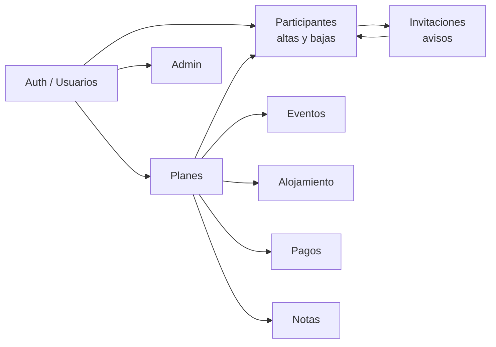

# Sistema de procesos — Planazoo

> **Puerta de entrada** a cómo trabajamos dominio a dominio.  
> Objetivo: una sola jerarquía clara para analizar → acordar → implementar → probar → documentar.

---

## 1. Jerarquía (fuente de verdad)

| Capa | Pregunta | Dónde vive | Regla |
|------|----------|------------|-------|
| **1. Proceso** | ¿Cómo debe comportarse? | Contrato Mermaid / checklist «Acordado» en `docs/flujos/` | **Manda** sobre código y tareas |
| **2. Trabajo** | ¿Qué hacemos ahora? | `docs/tareas/TASKS.md` + `Txxx_*.md` si hay decisiones | La tarea **cita** el proceso |
| **3. Prueba** | ¿Qué validamos / bugs? | `docs/testing/LISTA_PUNTOS_CORREGIR_APP.md` (+ checklist corto del dominio si existe) | Hallazgos nuevos → LISTA; no duplicar en prosa |
| **4. Referencia** | ¿Campos, reglas, arquitectura? | `docs/especificaciones/`, `docs/producto/`, `docs/arquitectura/` | Detalle técnico; no sustituye al proceso |

**WIP:** como mucho **1 dominio activo** a la vez (más un bug urgente si hace falta).

**Al cerrar un cambio:** actualizar el **contrato de proceso** si el comportamiento cambió; luego la tarea; luego la LISTA/checklist.

Histórico largo (CRUD enciclopédicos, etc.): `docs/flujos/archivo/` — **no** usar como contrato vivo.

---

## 2. Mapa de dominios

| Dominio | Contrato vivo (proceso) | Referencia / spec | Trabajo |
|---------|-------------------------|-------------------|---------|
| **Participantes / altas-bajas / invitaciones** | **[DIAGRAMA_ALTAS_BAJAS_PLAN.md](./DIAGRAMA_ALTAS_BAJAS_PLAN.md)** | Stub [FLUJO_GESTION_PARTICIPANTES.md](./FLUJO_GESTION_PARTICIPANTES.md) | T268, T269, T259… en TASKS |
| Notificaciones (producto) | (mismo diagrama §1.1 + campana) | [NOTIFICACIONES_ESPECIFICACION.md](../producto/NOTIFICACIONES_ESPECIFICACION.md) | |
| Planes | Stub [FLUJO_CRUD_PLANES.md](./FLUJO_CRUD_PLANES.md) · estados: stub [FLUJO_ESTADOS_PLAN.md](./FLUJO_ESTADOS_PLAN.md) | [PLAN_FORM_FIELDS.md](../especificaciones/PLAN_FORM_FIELDS.md) | |
| Eventos | Stub [FLUJO_CRUD_EVENTOS.md](./FLUJO_CRUD_EVENTOS.md) | [EVENT_FORM_FIELDS.md](../especificaciones/EVENT_FORM_FIELDS.md) · [T273 ✅](../tareas/archivo/T273_RESERVA_CANCELACION_DEPOSITO.md) | |
| Alojamientos | Stub [FLUJO_CRUD_ALOJAMIENTOS.md](./FLUJO_CRUD_ALOJAMIENTOS.md) | [ACCOMMODATION_FORM_FIELDS.md](../especificaciones/ACCOMMODATION_FORM_FIELDS.md) · T273 ✅ | |
| Pagos | Stub [FLUJO_PRESUPUESTO_PAGOS.md](./FLUJO_PRESUPUESTO_PAGOS.md) | [PAGOS_MVP.md](../producto/PAGOS_MVP.md) · T273 garantía ✅ | |
| Notas del plan | [FLUJO_NOTAS_PLAN.md](./FLUJO_NOTAS_PLAN.md) | [T262](../tareas/T262_NOTAS_PLAN_COMUNES_PERSONALES.md) | T262 |
| Usuarios / auth | Stub [FLUJO_CRUD_USUARIOS.md](./FLUJO_CRUD_USUARIOS.md) | | |
| Config app | Stub [FLUJO_CONFIGURACION_APP.md](./FLUJO_CONFIGURACION_APP.md) | | |
| Validación | Stub [FLUJO_VALIDACION.md](./FLUJO_VALIDACION.md) | | |

---

## 3. Dominios piloto (plantilla)

1. **Altas / bajas** — contrato: `DIAGRAMA_ALTAS_BAJAS_PLAN.md` (**WIP siguiente** recomendado: §1.3 / T269).
2. **Reserva / cancelación** — **cerrado** (T273 ✅ Ago 2026). Spec: `docs/tareas/archivo/T273_RESERVA_CANCELACION_DEPOSITO.md`.

---

## 4. Cómo trabajar con la IA

1. Abrir este mapa → elegir **dominio**.
2. Leer / editar el **contrato** (capa 1). Marcar «Acordado».
3. Crear/actualizar fila en **TASKS** citando el contrato.
4. Implementar. Probar → **LISTA** si hay hallazgo.
5. Actualizar contrato si el código cambió el proceso.
6. No reabrir prosa de `docs/flujos/archivo/` salvo consulta histórica.

---

## 5. Qué se archivó (Ago 2026)

Prosa larga sustituida por stubs + este mapa:

- `archivo/FLUJO_CRUD_*.md`, `FLUJO_GESTION_PARTICIPANTES.md`, `FLUJO_INVITACIONES_NOTIFICACIONES.md`, `FLUJO_PRESUPUESTO_PAGOS.md`, `FLUJO_ESTADOS_PLAN.md`, `FLUJO_VALIDACION.md`, `FLUJO_CONFIGURACION_APP.md`
- Testing: `docs/testing/archivo/ACCIONES_PENDIENTES_APP.md` (cerrado / subsumido)
- `docs/archivo/PROPUESTA_OPTIMIZACION_Y_SINCRONIZACION.md`
