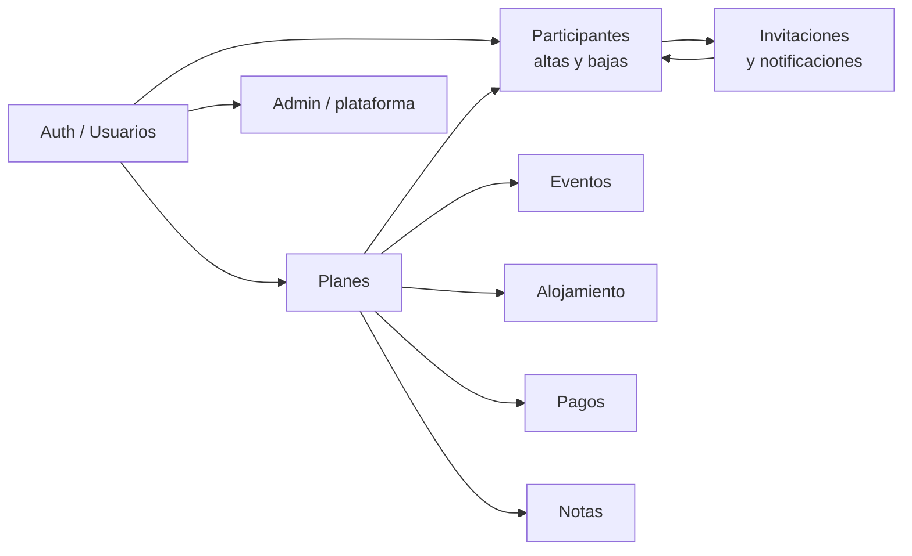

# Mapa de flujos — Planazoo

> Índice visual ligero. El detalle vive en cada `FLUJO_*.md` / `DIAGRAMA_*.md`.  
> **Convención:** un dominio = un documento de contrato; este mapa solo enlaza.

## Documentos por dominio

| Dominio | Prosa | Diagrama contrato |
|---------|-------|-------------------|
| Participantes / altas-bajas | [FLUJO_GESTION_PARTICIPANTES.md](./FLUJO_GESTION_PARTICIPANTES.md) | **[DIAGRAMA_ALTAS_BAJAS_PLAN.md](./DIAGRAMA_ALTAS_BAJAS_PLAN.md)** ← §1 altas, §1.1 avisos, §1.2 casos raros, **§1.3 Mis invitaciones**, §2 email, §3 bajas |
| Invitaciones + notificaciones | [FLUJO_INVITACIONES_NOTIFICACIONES.md](./FLUJO_INVITACIONES_NOTIFICACIONES.md) | (pendiente extraer Mermaid) |
| CRUD planes | [FLUJO_CRUD_PLANES.md](./FLUJO_CRUD_PLANES.md) | |
| Estados del plan | [FLUJO_ESTADOS_PLAN.md](./FLUJO_ESTADOS_PLAN.md) | |
| Eventos | [FLUJO_CRUD_EVENTOS.md](./FLUJO_CRUD_EVENTOS.md) | |
| Alojamientos | [FLUJO_CRUD_ALOJAMIENTOS.md](./FLUJO_CRUD_ALOJAMIENTOS.md) | |
| Usuarios | [FLUJO_CRUD_USUARIOS.md](./FLUJO_CRUD_USUARIOS.md) | |
| Pagos | [FLUJO_PRESUPUESTO_PAGOS.md](./FLUJO_PRESUPUESTO_PAGOS.md) | |
| Notas | [FLUJO_NOTAS_PLAN.md](./FLUJO_NOTAS_PLAN.md) | |
| Config app | [FLUJO_CONFIGURACION_APP.md](./FLUJO_CONFIGURACION_APP.md) | |
| Validación | [FLUJO_VALIDACION.md](./FLUJO_VALIDACION.md) | |

## Cómo trabajar con la IA

1. Abrir / editar el **diagrama** del dominio.  
2. Marcar checklist “Acordado”.  
3. Pedir implementación citando el archivo (`DIAGRAMA_…`).  
4. Tras el cambio, actualizar diagrama si el código diverge.
