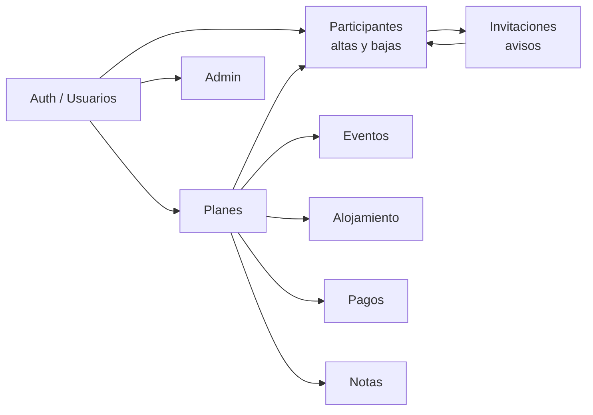

# Sistema de procesos — Planazoo

> **Puerta de entrada** a cómo trabajamos dominio a dominio.  
> Objetivo: una sola jerarquía clara para analizar → acordar → implementar → probar → documentar.  
> **Orden definitivo de trabajo:** [`ORDEN_POR_DOMINIOS.md`](./ORDEN_POR_DOMINIOS.md) (secuencia #1→#9; 1 WIP).

---

## 1. Jerarquía (fuente de verdad)

| Capa | Pregunta | Dónde vive | Regla |
|------|----------|------------|-------|
| **1. Proceso** | ¿Cómo debe comportarse? | Contrato Mermaid / checklist «Acordado» en `docs/flujos/` | **Manda** sobre código y tareas |
| **2. Trabajo** | ¿Qué hacemos ahora? | `docs/tareas/TASKS.md` + `Txxx_*.md` si hay decisiones | La tarea **cita** el proceso |
| **3. Prueba** | ¿Qué validamos / bugs? | `docs/testing/LISTA_PUNTOS_CORREGIR_APP.md` (+ checklist corto del dominio si existe) | Hallazgos nuevos → LISTA; no duplicar en prosa |
| **4. Referencia** | ¿Campos, reglas, arquitectura? | `docs/especificaciones/`, `docs/producto/`, `docs/arquitectura/` | Detalle técnico; no sustituye al proceso |

**WIP:** como máximo **1 dominio activo** a la vez (más un bug urgente si hace falta).  
**Orden:** seguir [`ORDEN_POR_DOMINIOS.md`](./ORDEN_POR_DOMINIOS.md); al cerrar/aparcar, pasar al siguiente número.

**Barra de calidad (producto):** la app vive de la **interacción multi-usuario** y de que la gente **esté informada**. CRUD + invitaciones/aceptar-rechazar + notificaciones han de ser de lo más estable; ver criterio en [`TIMELINE_LANZAMIENTO.md`](../producto/TIMELINE_LANZAMIENTO.md). Prueba de recorrido: [`PLAN_PRUEBAS_E2E_TRES_USUARIOS.md`](../testing/PLAN_PRUEBAS_E2E_TRES_USUARIOS.md). **Ronda corta actual:** [`SESION_A_USUARIOS_PLAN_INVITACIONES.md`](../testing/SESION_A_USUARIOS_PLAN_INVITACIONES.md) (fases 0–2).

**Al cerrar un cambio:** actualizar el **contrato de proceso** si el comportamiento cambió; luego la tarea; luego la LISTA/checklist.

Histórico largo (CRUD enciclopédicos, etc.): `docs/flujos/archivo/` — **no** usar como contrato vivo.

---

## 2. Mapa de dominios

| Dominio | Estado contrato | Contrato / stub | Referencia | Trabajo (TASKS) |
|---------|-----------------|-----------------|------------|-----------------|
| **Participantes / altas-bajas / invitaciones** | **Contrato vivo** · **cerrado** (2026-08-27) | [DIAGRAMA_ALTAS_BAJAS_PLAN.md](./DIAGRAMA_ALTAS_BAJAS_PLAN.md) · stub [FLUJO_GESTION_PARTICIPANTES.md](./FLUJO_GESTION_PARTICIPANTES.md) · stub [FLUJO_INVITACIONES_NOTIFICACIONES.md](./FLUJO_INVITACIONES_NOTIFICACIONES.md) | [NOTIFICACIONES_ESPECIFICACION.md](../producto/NOTIFICACIONES_ESPECIFICACION.md) · [ROLES_Y_TIPOS_USUARIO.md](../configuracion/ROLES_Y_TIPOS_USUARIO.md) | T269 ✅, T276 ✅, T259 iOS ✅, T268 aplazada; restos T224/T233/… fuera de WIP |
| **Planes (+ estados)** | Stub · **WIP** | [FLUJO_CRUD_PLANES.md](./FLUJO_CRUD_PLANES.md) · estados [FLUJO_ESTADOS_PLAN.md](./FLUJO_ESTADOS_PLAN.md) | [PLAN_FORM_FIELDS.md](../especificaciones/PLAN_FORM_FIELDS.md) | **T277**, T122, T204, T205, T237, T243*, T261* |
| Notificaciones (campana / producto) | Cubierto por diagrama §1.1 + spec | Mismo DIAGRAMA | [NOTIFICACIONES_ESPECIFICACION.md](../producto/NOTIFICACIONES_ESPECIFICACION.md) · [NOTIFICACIONES_PLAN_CODIFICACION.md](../producto/NOTIFICACIONES_PLAN_CODIFICACION.md) | Empujones con participantes; FCM ↔ T267 |
| Eventos (+ calendario) | Stub (+ T273 cerrado) | [FLUJO_CRUD_EVENTOS.md](./FLUJO_CRUD_EVENTOS.md) | [EVENT_FORM_FIELDS.md](../especificaciones/EVENT_FORM_FIELDS.md) · [CALENDAR_CAPABILITIES.md](../especificaciones/CALENDAR_CAPABILITIES.md) · [T273 ✅](../tareas/archivo/T273_RESERVA_CANCELACION_DEPOSITO.md) · mail [COMUNICACIONES_MAIL_PLAN.md](../producto/COMUNICACIONES_MAIL_PLAN.md) | T35, T37–T38, T88, T96–T99, T182, T208, T210–T212, T215, T225, T238, T242, T246–T247, T250–T251, T270–T272, **T278**, **T134** |
| Alojamientos | Stub (+ T273 cerrado) | [FLUJO_CRUD_ALOJAMIENTOS.md](./FLUJO_CRUD_ALOJAMIENTOS.md) | [ACCOMMODATION_FORM_FIELDS.md](../especificaciones/ACCOMMODATION_FORM_FIELDS.md) | T121, T225, T251, T271 |
| Pagos | Stub | [FLUJO_PRESUPUESTO_PAGOS.md](./FLUJO_PRESUPUESTO_PAGOS.md) | [PAGOS_MVP.md](../producto/PAGOS_MVP.md) | T222, T260 |
| Notas del plan | Flujo vivo (ligero) | [FLUJO_NOTAS_PLAN.md](./FLUJO_NOTAS_PLAN.md) | [T262](../tareas/T262_NOTAS_PLAN_COMUNES_PERSONALES.md) | **T262** |
| Auth / usuarios / perfil | Stub | [FLUJO_CRUD_USUARIOS.md](./FLUJO_CRUD_USUARIOS.md) | [USUARIOS_PRUEBA.md](../configuracion/USUARIOS_PRUEBA.md) | T159–T162, T173–T174, T227–T228, T232, T166–T172 |
| Admin | Sin Mermaid | — | `docs/admin/` | T183–T188, T191, T223, T270, T165 |
| Config app | Stub | [FLUJO_CONFIGURACION_APP.md](./FLUJO_CONFIGURACION_APP.md) | [CONFIGURACIONES_PROYECTO.md](../configuracion/CONFIGURACIONES_PROYECTO.md) | — |
| Validación | Stub | [FLUJO_VALIDACION.md](./FLUJO_VALIDACION.md) | Specs de formularios | — |

\* Tarea compartida entre dominios (citar ambos contratos al tocarla).

### Transversales (índice, no son dominio de proceso)

| Área | Trabajo / docs |
|------|----------------|
| Offline | T56–T62, T265 · [TESTING_OFFLINE_FIRST.md](../testing/TESTING_OFFLINE_FIRST.md) |
| Chat | T190, T253 |
| Plataforma / release | T256–T258, T267 · Fastlane docs |
| UI transversal | T194–T214, T226, T231, T237, T244, T249, T251 · [GUIA_UI.md](../guias/GUIA_UI.md) |
| Timezones | T40–T45 · [GESTION_TIMEZONES.md](../guias/GESTION_TIMEZONES.md) |
| Permisos (plan) | T64, T66, T67 · [ROLES_Y_TIPOS_USUARIO.md](../configuracion/ROLES_Y_TIPOS_USUARIO.md) |
| Producto / ayuda / legal web | T135–T136, T150, T157–T158, T192, T254, T263–T266 |
| Import / export / IA | T131, T133–T134, T181, T266 · **Mail launch:** [`COMUNICACIONES_MAIL_PLAN.md`](../producto/COMUNICACIONES_MAIL_PLAN.md) (no es dominio #10; T134) |

Índice completo de códigos: [`TASKS.md` § Índice por dominio](../tareas/TASKS.md#índice-por-dominio).

---

## 3. Dominios piloto (plantilla)

Plantilla reusable para cualquier dominio: [`PLANTILLA_DOMINIO.md`](./PLANTILLA_DOMINIO.md)

1. **Altas / bajas** — contrato: `DIAGRAMA_ALTAS_BAJAS_PLAN.md` (**cerrado** 2026-08-27; T269/T276/T259 iOS ✅; T268 aplazada).
2. **Reserva / cancelación** — **cerrado** (T273 ✅ Ago 2026). Spec: `docs/tareas/archivo/T273_RESERVA_CANCELACION_DEPOSITO.md`.

---

## 4. Cómo trabajar con la IA

1. Abrir [`ORDEN_POR_DOMINIOS.md`](./ORDEN_POR_DOMINIOS.md) → dominio **WIP** (# actual).
2. Leer / editar el **contrato** (capa 1). Marcar «Acordado».
3. Crear/actualizar fila en **TASKS** citando el contrato.
4. Implementar. Probar → **LISTA** si hay hallazgo.
5. Actualizar contrato si el código cambió el proceso.
6. No reabrir prosa de `docs/flujos/archivo/` salvo consulta histórica.
7. Al cerrar el dominio WIP → siguiente número del orden definitivo.

---

## 5. Qué se archivó (Ago 2026)

Prosa larga sustituida por stubs + este mapa:

- `archivo/FLUJO_CRUD_*.md`, `FLUJO_GESTION_PARTICIPANTES.md`, `FLUJO_INVITACIONES_NOTIFICACIONES.md`, `FLUJO_PRESUPUESTO_PAGOS.md`, `FLUJO_ESTADOS_PLAN.md`, `FLUJO_VALIDACION.md`, `FLUJO_CONFIGURACION_APP.md`
- Testing: `docs/testing/archivo/ACCIONES_PENDIENTES_APP.md` (cerrado / subsumido)
- `docs/archivo/PROPUESTA_OPTIMIZACION_Y_SINCRONIZACION.md`
