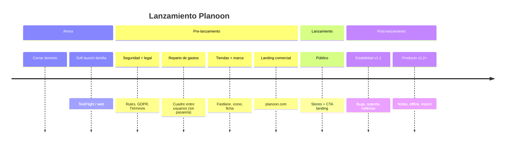

# Timeline de lanzamiento — Planoon / Planazoo

**Objetivo:** ordenar qué hacer **antes** y **después** del lanzamiento público.  
**Complementa:** T150 (`TASKS.md`), [PAGOS_MVP.md](./PAGOS_MVP.md), [GUIA_ASPECTOS_LEGALES.md](../guias/GUIA_ASPECTOS_LEGALES.md), [DOMINIO_PLANOON.md](../configuracion/DOMINIO_PLANOON.md), [ORDEN_POR_DOMINIOS.md](../flujos/ORDEN_POR_DOMINIOS.md).

**Tus 3 pilares pre-lanzamiento (acordados):** (1) seguridad adecuada, (2) **reparto/cuadre de gastos** entre usuarios (sin dinero real en la app), (3) web comercial.

**Definición de “lanzamiento público”:** app en App Store y/o Play Store (o web abierta sin allowlist) + landing en `planoon.com` + términos/privacidad + flujo núcleo estable (registro → plan → invitar → usar) + cuadre de gastos usable.

### Criterio de calidad (prioridad de producto)

Esta app se basa en que **los usuarios interactúan entre sí** y **quedan informados de los cambios**. Por tanto, antes que features nuevas o polish visual:

1. **CRUD estable** de los objetos del viaje: usuarios/perfil, planes, participantes, invitaciones, eventos, alojamientos, notificaciones (campana/push/email donde aplique), y más adelante pagos/notas.
2. **Multi-usuario fiable:** lo que hace A se ve en B/C; aceptar/rechazar/salir/expulsar/editar no deja estados fantasma.
3. **Avisos coherentes:** la persona correcta se entera (campana + push + email según el caso), sin ruido ni silencios raros.

**Cómo lo operamos:** guion de prueba = fases del E2E (`PLAN_PRUEBAS_E2E_TRES_USUARIOS.md`) con UA/UB/UC multiplataforma; WIP desarrollo = `ORDEN_POR_DOMINIOS.md` (#1 participantes/invitaciones primero). Hallazgos → `LISTA_PUNTOS_CORREGIR_APP.md`. Un CRUD “muy estable” = fase E2E pasada en los 3 clientes sin ❌ críticos.

> Las semanas son **orientativas** (secuencia relativa). Ajustar fechas reales cuando se fije el día de lanzamiento.

---

## Gestión del alcance (cómo decidimos qué entra)

### Lista congelada = solo las fases 0 → 4 + día L

Los ítems de las tablas **Fase 0–4** y el checklist del **día L** son lo que **hay que tener cerrado** para lanzar.  
Todo lo demás (P1/P2/P3, backlog de `TASKS.md`, ideas nuevas) **espera** salvo que pase el filtro de abajo.

### Cuando aparezca algo nuevo → triage en 30 segundos

Preguntar solo esto:

1. **¿Es bug / bloqueo** que rompe el flujo núcleo o la seguridad en producción? → **Pre** (arreglar ya; no “feature nueva”).
2. **¿Encaja en un pilar ya fijado** (seguridad/legal, cuadre de gastos, stores/marca, landing, soft launch #1)? → **Pre**, añadirlo a la fase correspondiente de este doc (acuerdo explícito).
3. **¿Puede esperar** sin impedir que un desconocido use la app con confianza? → **Post** (P1 hotfixes / P2 producto / P3 más adelante) + fila en `TASKS.md` si hace falta código Txxx.

Frase de trabajo:  
**«¿Esto es gate de lanzamiento o es para luego?»**

### Reglas fijas

| Regla | Detalle |
|-------|---------|
| **No hinchar el MVP** | Nada de P2/P3 pasa a pre sin decirlo en chat y actualizar esta sección. |
| **Una fuente de verdad pre** | Este archivo (fases 0–4). No duplicar listas largas en otros sitios. |
| **WIP de dominio** | Seguimos 1 dominio a la vez; lo pre-lanzamiento **fuera de dominio** (legal, stores, landing) se hace como “capa” acordada, no abre 3 dominios a la vez. |
| **Hallazgos de prueba** | Bugs → `LISTA_PUNTOS_CORREGIR_APP.md`. Si es gate → fase 0/1; si no → post o baja prioridad. |
| **Estado** | En cada fila: Pendiente / En curso / Hecho (+ fecha corta). |

### Dónde aparcar lo “para luego”

| Destino | Qué va ahí |
|---------|------------|
| **P1** | Estabilidad tras lanzar (bugs, onboarding, costes) |
| **P2** | Features de producto (notas, offline amplio, import…) |
| **P3** | Cobros reales, monetización, 2FA enterprise… |
| **`TASKS.md`** | Código Txxx concreto cuando haya que implementarlo |
| **No crear tarea** | Ideas vagas: solo una línea en P2/P3 hasta priorizar |

### Ritual mínimo

Al empezar trabajo de launch (o al cerrar un ítem):

1. Abrir este doc → mirar la **siguiente fila Pendiente** de fases 0–4.
2. Si surge algo nuevo → triage 1/2/3 arriba; actualizar **una** fila aquí o en P1–P3.
3. No tocar el orden de dominios salvo excepción ya documentada (cuadre de gastos / legal).

---

## Vista rápida

| Fase | Nombre | Cuándo (relativo) | Criterio de salida |
|------|--------|-------------------|--------------------|
| **0** | Cierre núcleo + soft launch | Ahora | Invitaciones/deep links OK; familia usa sin crash sistemático |
| **1** | Seguridad + cumplimiento | Antes de tiendas | Rules auditadas; borrado cuenta; privacidad/términos |
| **2** | Reparto de gastos (cuadre entre usuarios) | Antes o en paralelo a tiendas | Móvil = web; E2E; copy “la app no mueve dinero” |
| **3** | Release stores + marca | Justo antes de público | TestFlight/Play interna → producción; icono; metadata |
| **4** | Web comercial | Justo antes / día 0 | `planoon.com` con CTA a app |
| **L** | Lanzamiento público | Día 0 | Stores live + landing + soporte respondiendo |
| **P1** | Post v1.1 | +2–6 semanas | Estabilidad, feedback, hotfixes |
| **P2** | Post v1.2+ | +2–6 meses | Features de valor (notas, offline amplio, etc.) |
| **P3** | Más adelante | Cuando el núcleo pague | Pasarela real, monetización, admin avanzado |

---

## Fase 0 — Ahora (antes de “preparar tiendas”)

**Meta:** producto usable con usuarios reales cerrados (familia / amigos).

| # | Qué | Refs / notas | Estado |
|---|-----|--------------|--------|
| 0.1 | Cerrar dominio **#1** (participantes / invitaciones) | T259 QA; T224; **LISTA 124** (idempotencia — validar en dispositivo); guion: [`SESION_A_USUARIOS_PLAN_INVITACIONES.md`](../testing/SESION_A_USUARIOS_PLAN_INVITACIONES.md) | En curso |
| 0.1b | Estética de emails (invitación / avisos): plantilla más clara y alineada a marca | Mail invitación: ficha plan (desc/fechas) + branding Planoon (**hecho** Ago 2026); otros avisos pendientes | Parcial |
| 0.2 | Soft launch: TestFlight + web `app.planoon.com` | [EVALUACION_PRIMERAS_PRUEBAS_FAMILIA.md](../configuracion/EVALUACION_PRIMERAS_PRUEBAS_FAMILIA.md) | Pendiente |
| 0.3 | Matriz UA iPhone / UB Android / UC web en flujos núcleo | [USUARIOS_PRUEBA.md](../configuracion/USUARIOS_PRUEBA.md) | Parcial |
| 0.4 | Paridad iOS vs web en lo diario (plan, calendario, chat, notifs) | T257 | Pendiente |
| 0.5 | Cancelar plan + avisar participantes | T261 | Pendiente |
| 0.7 | **Contrato comercial C1–C3:** offline usable en iOS/Android; timezones en vuelos/perspectiva; invitar participante/observador | [`WEB_COMERCIAL.md`](./WEB_COMERCIAL.md) § contrato · T259 · T40–T45 · ítem 58 | Parcial |
| 0.8 | **Contrato C4:** exportar itinerario (propio y del plan) sin que el destinatario tenga la app | T133, T252 §6 | Pendiente |

**No bloquea soft launch (familia):** 2FA, pasarela de pago, landing comercial completa, export PDF pulido (**C4**).  
**Sí bloquea lanzamiento público:** el [contrato web → app](./WEB_COMERCIAL.md#contrato-web--app-sí-o-sí) (**C1** offline móvil, **C2** zonas horarias, **C3** invitar, **C4** exportar itinerario).

---

## Fase 1 — Seguridad y cumplimiento (bloqueante público)

**Meta:** dormir tranquilos con usuarios desconocidos.

| # | Qué | Refs | Estado |
|---|-----|------|--------|
| 1.1 | Auditoría **Firestore + Storage rules** + deploy | `firestore.rules`, `storage.rules` | Pendiente |
| 1.2 | Revisar Cloud Functions (auth, rate limits, datos ajenos) | `functions/` | Pendiente |
| 1.3 | Logs sin PII (emails, tokens) | T170 | Pendiente |
| 1.4 | Borrado de cuenta / datos (GDPR) | T187 | Pendiente |
| 1.5 | **Términos de uso + Política de privacidad** (app + web) | T171, [GUIA_ASPECTOS_LEGALES.md](../guias/GUIA_ASPECTOS_LEGALES.md) | Pendiente |
| 1.6 | Secretos en gestor; rotación keys (Places, etc.) | [ACCESOS_Y_CUENTAS.md](../configuracion/ACCESOS_Y_CUENTAS.md) | Parcial |
| 1.7 | Crash / error monitoring (Crashlytics o similar) | — | Pendiente |
| 1.8 | Auth sólido: verificación email, reset password UX | T228, T172 | Parcial |

**Puede esperar post-lanzamiento:** 2FA (T166), device trust (T168), cifrado campo a campo (T169).

---

## Fase 2 — Reparto de gastos / cuadre entre usuarios (sin dinero real)

**Aclaración de producto:** “Pagos” en la app = **quién ha puesto qué y quién debe a quién** (balances, sugerencias de transferencia **entre personas**).  
La app **no procesa cobros**, no hay pasarela ni movimiento de dinero a través de Planoon. Ver [PAGOS_MVP.md](./PAGOS_MVP.md).

**Meta:** ese apartado es útil en móvil y web antes del público.

| # | Qué | Refs | Estado |
|---|-----|------|--------|
| 2.1 | Sustituir “Próximamente” en móvil por el mismo flujo que web | [PAGOS_MVP.md](./PAGOS_MVP.md) §3.2 | Pendiente |
| 2.2 | Cerrar permisos por rol (quién registra un gasto/pago anotado) | T218 / PAGOS_MVP | Pendiente |
| 2.3 | Aviso UI + legal: solo anotación/cuadre; no cobros | T220 | Pendiente |
| 2.4 | Decidir bote común: entra o no en v1 | T219 | Pendiente |
| 2.5 | Ejecutar E2E del apartado + PAY-* | T222 | Pendiente |

**Fuera de alcance del lanzamiento (y no es “pagos” en sentido bancario):** Stripe, Bizum, cobros in-app, etc. Solo valorar mucho más adelante si el modelo de negocio lo pide (P3).

---

## Fase 3 — Tiendas, marca y release

**Meta:** builds firmados y fichas listas para revisión.

| # | Qué | Refs | Estado |
|---|-----|------|--------|
| 3.1 | Apple Developer + App Store Connect (app, metadata, privacy labels) | [FASTLANE_IOS_CHECKLIST.md](../configuracion/FASTLANE_IOS_CHECKLIST.md) | Parcial |
| 3.2 | Fastlane / pipeline TestFlight → release | T256 | Pendiente |
| 3.3 | Android: **keystore release** (hoy debug en release) + Play Console | [CONFIGURACIONES_PROYECTO.md](../configuracion/CONFIGURACIONES_PROYECTO.md) | Pendiente |
| 3.4 | Icono + splash coherentes con marca | T258, T263 | Pendiente |
| 3.5 | **Rebrand completo a Planoon** (antes del lanzamiento) | Toda la app + tiendas + mails: textos UI/l10n, logos, splash, Bundle ID / applicationId si aplica, `FROM_EMAIL`, subjects CF, docs visibles al usuario, ficha App Store/Play. Sustituir residuos «Planazoo» / `planazoo.app` donde el usuario los vea. | Pendiente |
| 3.6 | Capturas de tienda (ES + EN si aplica) | — | Pendiente |
| 3.7 | Canal de soporte (email / form) visible en app y tiendas | — | Pendiente |
| 3.8 | Compilación limpia: sin avisos al build (CocoaPods, Xcode, Flutter/Android) | Warnings de `pod install` / build iOS-Android; dejar release sin ruido | Pendiente |

---

## Fase 4 — Web comercial

**Meta:** `planoon.com` explica el producto y lleva a la app.

| # | Qué | Notas | Estado |
|---|-----|-------|--------|
| 4.1 | Landing en **`planoon.com` / www** (no mezclar con `app.`) | Brief + contrato: [`WEB_COMERCIAL.md`](./WEB_COMERCIAL.md) · código [`marketing/`](../../marketing/) · deploy Cloudflare Pages | En curso (maqueta; C1–C4 en el relato) |
| 4.2 | CTA → App Store / Play / `app.planoon.com` | | Pendiente |
| 4.3 | Enlaces legales (mismos textos que en app) | T171 | Pendiente |
| 4.4 | SEO mínimo + favicon / OG image | | Pendiente |
| 4.5 | Mantener `app.planoon.com` solo para producto | [DOMINIO_PLANOON.md](../configuracion/DOMINIO_PLANOON.md) | Hecho (app) |

---

## Día L — Lanzamiento público

Checklist corto:

- [ ] App Store / Play (o al menos una plataforma + web) **en producción**
- [ ] Landing publicada con CTA correcto
- [ ] Términos + Privacidad accesibles
- [ ] Soporte con bandeja vigilada
- [ ] Monitoring de crashes activo
- [ ] Anuncio (lista, redes, etc.) preparado
- [ ] Plan de rollback: build anterior / feature flags si existen

---

## Post-lanzamiento P1 — Estabilidad (v1.1, ~2–6 semanas)

**Meta:** no añadir features grandes; absorber feedback real.

| # | Qué |
|---|-----|
| P1.1 | Triage bugs por gravedad; hotfixes de tienda |
| P1.2 | Métricas básicas: installs, retención D1/D7, crash-free |
| P1.3 | Mejoras onboarding según confusión real |
| P1.4 | Cerrar gaps de paridad web/iOS que salgan en reviews |
| P1.5 | Costes Firebase / Places bajo control |
| P1.6 | Upgrade runtime Functions (Node 20 → soportado) antes de deadline GCP |

---

## Post-lanzamiento P2 — Producto (v1.2+, ~2–6 meses)

Seguir el **orden de dominios** cuando se retome desarrollo profundo ([ORDEN_POR_DOMINIOS.md](../flujos/ORDEN_POR_DOMINIOS.md)):

| Prioridad sugerida | Qué | Refs |
|--------------------|-----|------|
| Alta | Notas / preparación (cerrar valor diferencial) | T262 |
| Alta | Offline usable más amplio (si usuarios lo piden) | T265, T56–T62 |
| Media | Audiencias de avisos por fase | T275 |
| Media | Unidades métrico/imperial | T274 |
| Media | Ayuda contextual / accesibilidad | T157, T192 |
| Media | Import eventos desde correo / vuelo por número | T134, T246 |
| Baja | Chat avanzado, UI calendario profunda | T190, T88… |

---

## Post-lanzamiento P3 — Más adelante (cuando el núcleo aguante)

| # | Qué |
|---|-----|
| P3.1 | Pasarela de cobros reales (**solo si** el modelo de negocio lo pide; no confundir con el apartado de reparto de gastos) |
| P3.2 | Monetización / planes freemium / agencias | docs producto futuros |
| P3.3 | Admin operativo completo (T183–T188) |
| P3.4 | 2FA y seguridad “enterprise” |
| P3.5 | Multi-idioma más allá de ES/EN |

---

## Relación con el WIP por dominios

El orden #1→#9 **sigue** para el trabajo de producto diario.  
Esta timeline **no sustituye** ese orden: indica qué capas (seguridad, legal, stores, landing) hay que intercalarse **antes del público**, aunque el dominio WIP sea otro.

Excepción razonable pre-lanzamiento: saltar a **#5 Pagos** = **reparto/cuadre de gastos** (fase 2 de esta timeline; sin dinero real) y a **auth/legal** sin cerrar todos los dominios intermedios, si el núcleo #1–#3 ya es estable en soft launch.

---

## Cómo mantener este documento

1. Cerrar ítem → **Hecho** + fecha.  
2. Idea nueva → triage (sección *Gestión del alcance*); no meter en pre “por si acaso”.  
3. Cambio de alcance del MVP → actualizar pilares + definición de lanzamiento + acuerdo en chat.  
4. Tareas de implementación → `TASKS.md` con enlace a la fase de este doc.
---

## Referencias rápidas

| Tema | Doc |
|------|-----|
| Dominio / DNS / app URL | [DOMINIO_PLANOON.md](../configuracion/DOMINIO_PLANOON.md) |
| Pagos MVP | [PAGOS_MVP.md](./PAGOS_MVP.md) |
| Legal | [GUIA_ASPECTOS_LEGALES.md](../guias/GUIA_ASPECTOS_LEGALES.md) |
| iOS publish | [FASTLANE_IOS_CHECKLIST.md](../configuracion/FASTLANE_IOS_CHECKLIST.md) |
| Orden dominios | [ORDEN_POR_DOMINIOS.md](../flujos/ORDEN_POR_DOMINIOS.md) |
| Tareas | [TASKS.md](../tareas/TASKS.md) (T150, T171, T222, T256, T257, T259…) |
