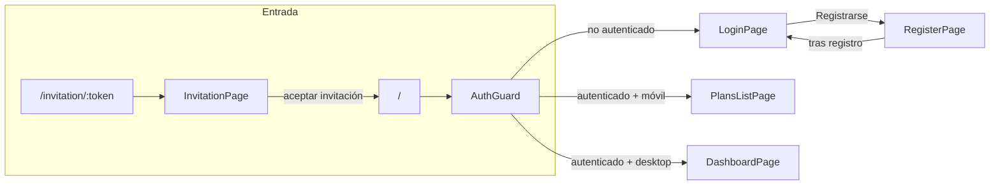
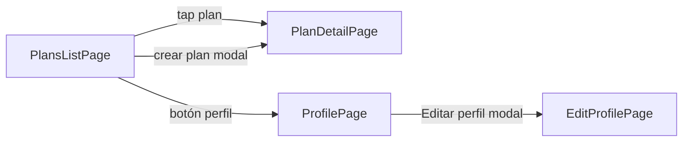
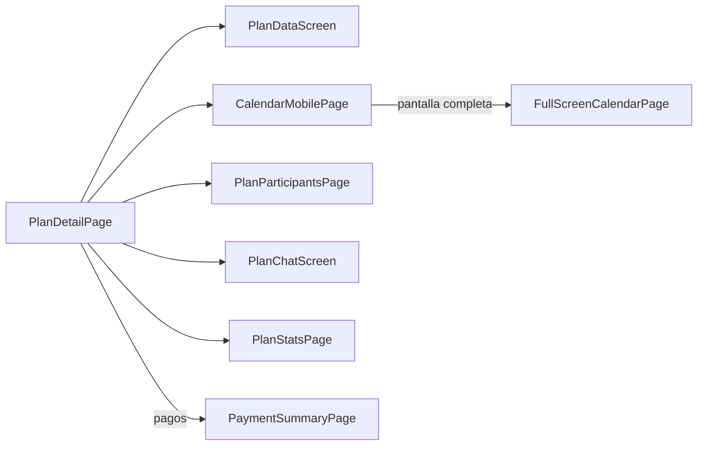
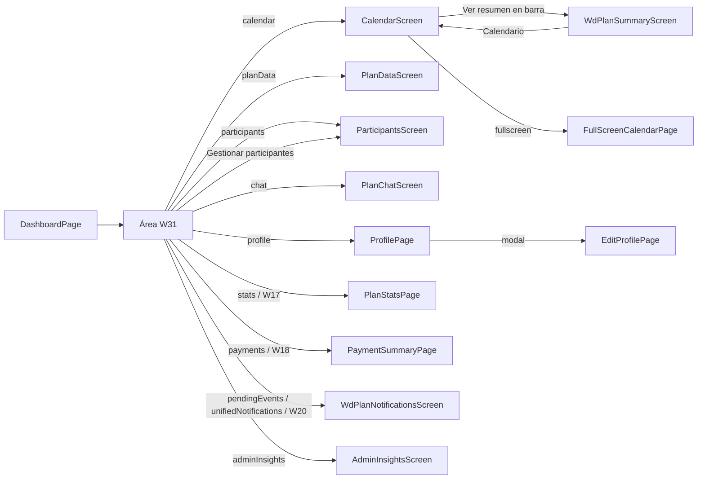

# ÍNDICE DE PÁGINAS - UNP CALENDARIO

> ⚠️ Nota de gobernanza UI: los documentos de este directorio (`docs/ux/pages/`) son descriptivos e históricos de pantallas concretas.  
> No son fuente normativa de reglas visuales. La única fuente canónica de UI es `docs/guias/GUIA_UI.md`.

## 📋 Descripción General
Este directorio contiene la documentación técnica y funcional de todas las páginas de la aplicación UNP Calendario. Cada documento incluye especificaciones detalladas de diseño, funcionalidad, validaciones y aspectos técnicos de implementación.

---

## 📄 Páginas Documentadas

### 🔐 **login_page.md** - Página de Inicio de Sesión
**Versión:** 2.2 | **Última actualización:** Febrero 2026  
**Código:** `lib/features/auth/presentation/pages/login_page.dart` → `LoginPage`

**Descripción:** Primera página que ve el usuario al entrar en la aplicación. Permite la autenticación con credenciales de email y contraseña, incluyendo verificación obligatoria de email y funcionalidades de recuperación de contraseña.

**Características principales:**
- Layout con barra superior y formulario en recuadro centrado
- Validación en tiempo real de email y contraseña
- Verificación obligatoria de email antes del acceso
- Funcionalidad de recuperación de contraseña
- Botón de reenvío de verificación de email
- Manejo de errores con SnackBars flotantes
- Diseño responsivo y accesible

**Tecnologías:** Firebase Auth, Firestore, Riverpod, Flutter

---

### 📝 **register_page.md** - Página de Registro de Usuario
**Versión:** 1.0 | **Última actualización:** Febrero 2026  
**Código:** `lib/features/auth/presentation/pages/register_page.dart` → `RegisterPage`

**Descripción:** Página para crear una nueva cuenta de usuario. Incluye formulario completo con validaciones, verificación automática de email y redirección al login tras el registro exitoso.

**Características principales:**
- Formulario con 4 campos: nombre, email, contraseña y confirmación
- Validaciones en tiempo real para todos los campos
- Envío automático de email de verificación
- Cierre automático de sesión tras el registro
- Checkbox obligatorio de términos y condiciones
- Prevención de sugerencias de guardar contraseña
- Redirección automática al login con mensaje de confirmación

**Tecnologías:** Firebase Auth, Firestore, Riverpod, Flutter

---

### 👤 **profile_page.md** - Página de Perfil de Usuario
**Versión:** 2.0 | **Última actualización:** Febrero 2026  
**Código:** `lib/pages/pg_profile_page.dart` → `ProfilePage`

**Descripción:** Página para visualizar y gestionar el perfil del usuario autenticado. Muestra información del usuario, foto de perfil, y acceso a opciones de configuración.

**Características principales:**
- Top bar con flecha de retroceso y @username
- Header con foto de perfil (80x80px) y datos del usuario
- Secciones de opciones organizadas en cards
- Acceso a configuración de cuenta y preferencias
- Diseño consistente con login/registro

**Tecnologías:** Firebase Auth, Firestore, Riverpod, Flutter

---

### 💬 **plan_chat_screen.md** - Chat del plan
**Última actualización:** Febrero 2026  
**Código:** `lib/widgets/screens/wd_plan_chat_screen.dart` → `PlanChatScreen`

**Descripción:** Pantalla de chat del plan tipo WhatsApp (T190). Mensajería en tiempo real entre participantes del plan.

**Características principales:**
- Acceso en **móvil** desde PlanDetailPage (pestaña Chat) y en **web** desde Dashboard (botón W19)
- Lista de mensajes con burbujas (propios/otros), campo de envío y scroll al final
- Mensajes persistidos en Firestore; resolución de nombres de usuario vía `UserService`

**Tecnologías:** Firestore, Riverpod, Flutter (chat feature)

---

### 📩 **Página de Invitación (InvitationPage)**
**Última actualización:** Febrero 2026  
**Código:** `lib/pages/pg_invitation_page.dart` → `InvitationPage`

**Descripción:** Página para aceptar o rechazar una invitación a un plan. Se accede mediante un link que incluye un token único (ej. `/invitation/:token`). El link puede incluir el query param `?action=accept`. La actualización del estado de la invitación a "accepted" se realiza mediante la Cloud Function `markInvitationAccepted`.

**Características principales:**
- Visualización de detalles del plan (nombre, organizador, fechas)
- Botones "Aceptar" y "Rechazar"
- Si el usuario no está autenticado: login o registro antes de confirmar
- Tras aceptar: creación de participación y acceso al plan; banner de invitación pendiente desaparece

**Tecnologías:** Firestore, Firebase Auth, Cloud Functions, Riverpod, Flutter

---

### 📋 **Resumen del plan (T193)**
**Última actualización:** Febrero 2026  
**Código:** `lib/widgets/plan/plan_summary_button.dart`, `lib/widgets/dialogs/plan_summary_dialog.dart`, `lib/widgets/screens/wd_plan_summary_screen.dart`; uso en card, PlanDataScreen (info) y barra del calendario.

**Descripción:** Funcionalidad que genera un resumen en texto del plan (eventos, alojamientos, fechas) y permite copiarlo al portapapeles.

**Características principales:**
- **Card del plan e Info del plan (PlanDataScreen):** icono/botón "Resumen" abre el **diálogo** (PlanSummaryDialog): carga, texto formateado, Copiar y Cerrar.
- **Pestaña Calendario (W31):** en la barra del calendario hay un botón "Ver resumen" que cambia el contenido de W31 a la **vista de resumen** (WdPlanSummaryScreen). Desde esa vista, el botón "Calendario" vuelve a la cuadrícula. El resumen en W31 solo se muestra desde la pestaña Calendario (no hay pestaña "Resumen" ni bloque de resumen en la página de info).
- Diálogo y vista W31: indicador de carga ("Generando resumen..."), texto formateado, botón Copiar con SnackBar de confirmación.

**Tecnologías:** Riverpod, PlanSummaryService, Flutter

---

### 🎨 **Widgets del Dashboard (Web)**

**Código:** Todos los widgets W1–W30 viven en `lib/pages/pg_dashboard_page.dart` (clase `DashboardPage`), métodos `_buildW1` … `_buildW30`.

#### **w1_sidebar.md** - Barra Lateral Izquierda
**Descripción:** Barra lateral izquierda del dashboard web con navegación y acceso a funcionalidades principales.

#### **w2_logo.md** - Logo de la Aplicación
**Descripción:** Widget del logo de Planazoo en el dashboard.

#### **w3_create_button.md** - Botón de Crear Plan
**Descripción:** Botón para crear nuevos planes desde el dashboard.

#### **w5_plan_image.md** - Imagen del Plan Seleccionado
**Descripción:** Widget circular que muestra la imagen del plan seleccionado (v1.6).

#### **w6_plan_info.md** - Información del Plan
**Descripción:** Widget que muestra información detallada del plan seleccionado.

#### **w13_plan_search.md** - Búsqueda de Planes
**Descripción:** Campo de búsqueda para filtrar planes en el dashboard.

#### **w14_plan_info_access.md** - Acceso a Información del Plan
**Descripción:** Widget de acceso rápido a la información del plan.

#### **w15_calendar_access.md** - Acceso al Calendario
**Descripción:** Widget de acceso rápido al calendario del plan.

#### **w16_participants_access.md** - Acceso a Participantes
**Descripción:** Widget de acceso rápido a la gestión de participantes.

#### **w26_filter_buttons.md** - Botones de Filtro
**Descripción:** Botones para filtrar planes por diferentes criterios.

#### **w27_auxiliary_widget.md** - Widget Auxiliar
**Descripción:** Widget auxiliar del dashboard con funcionalidades adicionales.

#### **w28_plan_list.md** - Lista de Planes
**Descripción:** Lista de planes del usuario con cards interactivas.

#### **w29_advertising_footer.md** - Pie de Publicidad
**Descripción:** Footer con publicidad o información promocional.

#### **w30_app_info_footer.md** - Pie de Información de la App
**Descripción:** Footer con información sobre la aplicación.

---

## 🏗️ **Estructura de Documentación**

Cada documento de página sigue un formato estándar que incluye:

### **Secciones Comunes:**
- **Propósito**: Descripción del objetivo de la página
- **Layout General**: Estructura visual y disposición de elementos
- **Elementos de la Interfaz**: Detalles específicos de cada componente
- **Flujo de Navegación**: Rutas y transiciones entre páginas
- **Estados de la Página**: Diferentes estados y comportamientos
- **Validaciones**: Reglas de validación de formularios
- **Diseño Visual**: Paleta de colores, tipografía y estilos
- **Funcionalidades Implementadas**: Características y mejoras
- **Detalles Técnicos**: Implementación, servicios y arquitectura
- **Código de Ejemplo**: Fragmentos clave de implementación

### **Especificaciones Técnicas:**
- **Colores**: Códigos exactos de la paleta de la aplicación
- **Tipografía**: Tamaños, pesos y estilos de fuente
- **Espaciado**: Padding, márgenes y dimensiones
- **Animaciones**: Transiciones y efectos visuales
- **Responsive**: Comportamiento en diferentes dispositivos

---

## 🎯 **Objetivos de la Documentación**

### **Para Desarrolladores:**
- Guía completa para implementar o modificar páginas
- Especificaciones técnicas detalladas
- Código de ejemplo para referencia
- Patrones de diseño y arquitectura

### **Para Diseñadores:**
- Especificaciones visuales exactas
- Paleta de colores y tipografía
- Layout y disposición de elementos
- Guías de UX y accesibilidad

### **Para QA/Testing:**
- Casos de validación documentados
- Flujos de navegación esperados
- Estados y comportamientos de la aplicación
- Criterios de aceptación claros

---

## 📚 **Convenciones de Documentación**

### **Nomenclatura:**
- **Archivos**: `nombre_pagina.md` (snake_case)
- **Versiones**: Formato `vX.Y` (semver)
- **Actualizaciones**: Fecha en formato `[Mes Año]`

### **Estructura:**
- **Headers**: Nivel 1 para títulos principales
- **Subheaders**: Nivel 2-3 para secciones
- **Código**: Bloques de código con sintaxis highlighting
- **Listas**: Bullet points para características y especificaciones

### **Mantenimiento:**
- **Actualización**: Documentar cambios en cada modificación
- **Versionado**: Incrementar versión en cambios significativos
- **Consistencia**: Mantener formato estándar en todos los documentos

---

## 📂 **Páginas / Pantallas en Código (sin doc detallado en este directorio)**

Listado alineado con el código actual. Las que tienen ficha en este directorio están arriba (login, register, profile, w1–w30).

| Página / Pantalla   | Archivo | Notas |
|--------------------|---------|--------|
| **PlansListPage**  | `lib/pages/pg_plans_list_page.dart` | Lista de planes; post-login en app (equiv. “main”). |
| **DashboardPage**  | `lib/pages/pg_dashboard_page.dart` | Dashboard web; contiene W1–W30 y `PlanDataScreen` embebido. |
| **PlanDetailPage** | `lib/pages/pg_plan_detail_page.dart` | Contenedor que muestra `PlanDataScreen` (datos del plan). |
| **PlanDataScreen** | `lib/widgets/screens/wd_plan_data_screen.dart` | Formulario/detalle del plan (info, estado, participantes, etc.). |
| **CalendarMobilePage** | `lib/pages/pg_calendar_mobile_page.dart` | Vista calendario móvil. |
| **CalendarScreen** | `lib/widgets/screens/wd_calendar_screen.dart` | Vista calendario (widget). |
| **FullScreenCalendarPage** | `lib/widgets/screens/fullscreen_calendar_page.dart` | Calendario a pantalla completa. |
| **InvitationPage** | `lib/pages/pg_invitation_page.dart` | Aceptar invitación por token (link de email). |
| **PlanParticipantsPage** | `lib/pages/pg_plan_participants_page.dart` | Página de participantes del plan. |
| **ParticipantsScreen** | `lib/widgets/screens/wd_participants_screen.dart` | Pantalla de gestión de participantes. |
| **ParticipantGroupsPage** | `lib/pages/pg_participant_groups_page.dart` | Grupos de participantes. |
| **PlanStatsPage** | `lib/features/stats/presentation/pages/plan_stats_page.dart` | **W17 Estadísticas:** presupuesto del plan (T101), coste total, desglose por tipo de evento/alojamiento, por participante. |
| **PaymentSummaryPage** | `lib/features/payments/presentation/pages/payment_summary_page.dart` | **W18 Pagos:** resumen de pagos (T102), balances por participante, bote común (aportaciones/gastos), sugerencias de transferencias, aviso "La app no procesa cobros". Diálogos: PaymentDialog, KittyContributionDialog, KittyExpenseDialog. |
| **PlanChatScreen** | `lib/widgets/screens/wd_plan_chat_screen.dart` | Chat del plan (W19). Ver **plan_chat_screen.md**. |
| **WdPlanNotificationsScreen** | `lib/widgets/screens/wd_plan_notifications_screen.dart` | Notificaciones del plan seleccionado (W20): invitaciones, avisos, eventos desde correo. Dashboard: `currentScreen` 'pendingEvents' o 'unifiedNotifications'. |
| **AdminInsightsScreen** | `lib/widgets/screens/wd_admin_insights_screen.dart` | Panel admin (insights). Dashboard: `currentScreen` 'adminInsights'. |
| **EditProfilePage** | `lib/features/auth/presentation/pages/edit_profile_page.dart` | Edición de perfil (modal/diálogo). |
| **UIShowcasePage** | `lib/pages/pg_ui_showcase_page.dart` | Showcase de componentes UI (desarrollo). |

**Diálogos** (abiertos desde pantallas; no son rutas propias): `PaymentDialog` (registrar/editar pago), `KittyContributionDialog` (aportación al bote), `KittyExpenseDialog` (gasto del bote, solo organizador), `PlanSummaryDialog` (resumen del plan), `EditProfilePage` (modal desde perfil).

**No existen como página:** `AccountSettingsPage` (eliminado; opciones en perfil). Creación de planes: modal/diálogo desde dashboard, no página dedicada.

---

## 🗺️ **Visualización: Páginas y conexiones**

Flujo de navegación según el código actual. Las flechas indican “desde → hacia” (push, cambio de pantalla o contenido).

### Entrada de la app y auth

```mermaid
flowchart LR
  subgraph Entrada
    RUTA["/"] --> AUTH[AuthGuard]
    INV["/invitation/:token"] --> IP[InvitationPage]
  end
  AUTH -->|no autenticado| LOGIN[LoginPage]
  AUTH -->|autenticado + móvil| PLP[PlansListPage]
  AUTH -->|autenticado + desktop| DASH[DashboardPage]
  LOGIN -->|Registrarse| REG[RegisterPage]
  REG -->|tras registro| LOGIN
  IP -->|aceptar invitación| RUTA
```

### Desde PlansListPage (móvil)

```mermaid
flowchart LR
  PLP[PlansListPage] -->|tap plan| PDP[PlanDetailPage]
  PLP -->|botón perfil| PROF[ProfilePage]
  PLP -->|crear plan modal| PDP
  PROF -->|Editar perfil modal| EP[EditProfilePage]
```

### PlanDetailPage (móvil): pestañas internas

```mermaid
flowchart LR
  PDP[PlanDetailPage] --> PDATA[PlanDataScreen]
  PDP --> CAL[CalendarMobilePage]
  PDP --> PART[PlanParticipantsPage]
  PDP --> CHAT[PlanChatScreen]
  PDP --> STATS[PlanStatsPage]
  PDP -->|pagos| PAY[PaymentSummaryPage]
  CAL -->|pantalla completa| FSC[FullScreenCalendarPage]
```

### Dashboard (web): pantallas en W31

```mermaid
flowchart LR
  DASH[DashboardPage] --> W31["Área W31"]
  W31 -->|calendar| CALW[CalendarScreen]
  CALW -->|Ver resumen en barra| SUMW[WdPlanSummaryScreen]
  SUMW -->|Calendario| CALW
  W31 -->|planData| PDATA[PlanDataScreen]
  W31 -->|participants| PSCR[ParticipantsScreen]
  W31 -->|chat| CHAT[PlanChatScreen]
  W31 -->|profile| PROF[ProfilePage]
  W31 -->|stats / W17| STATS[PlanStatsPage]
  W31 -->|payments / W18| PAY[PaymentSummaryPage]
  W31 -->|pendingEvents / unifiedNotifications / W20| NOTIF[WdPlanNotificationsScreen]
  W31 -->|adminInsights| ADMIN[AdminInsightsScreen]
  W31 -->|Gestionar participantes| PSCR
  CALW -->|fullscreen| FSC[FullScreenCalendarPage]
  PROF -->|modal| EP[EditProfilePage]
```

*W17 (Estadísticas)* = presupuesto del plan; *W18 (Pagos)* = resumen de pagos y bote común. *Calendario:* en W31 se puede alternar entre CalendarScreen y WdPlanSummaryScreen (botón "Ver resumen" / "Calendario" en la barra). *Chat:* en web desde W19; en móvil desde la barra de pestañas de **PlanDetailPage**. *Notificaciones del plan:* W20 → WdPlanNotificationsScreen.

### Leyenda

| Símbolo | Significado |
|--------|-------------|
| `→` / flecha | Navegación (push, cambio de pantalla o de `currentScreen`) |
| modal | Diálogo o overlay sobre la misma pantalla |
| W31 | Zona principal del dashboard donde se muestran calendario, datos del plan, participantes, etc. |

*Generado a partir del código (app.dart, AuthGuard, PlansListPage, DashboardPage, PlanDetailPage). Febrero 2026.*

---

## 📞 **Contacto y Contribución**

Para sugerencias, correcciones o nuevas páginas a documentar, contactar con el equipo de desarrollo.

**Mantenedor:** Equipo de Desarrollo UNP Calendario  
**Última actualización del índice:** Febrero 2026

---

*Este índice se actualiza automáticamente con cada nueva página documentada.*
